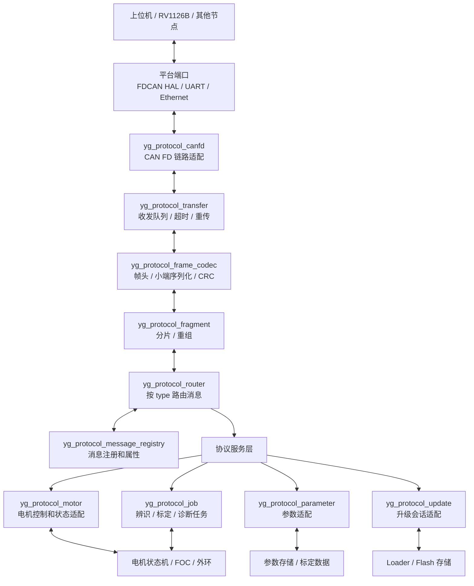
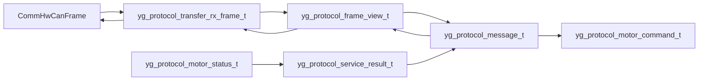
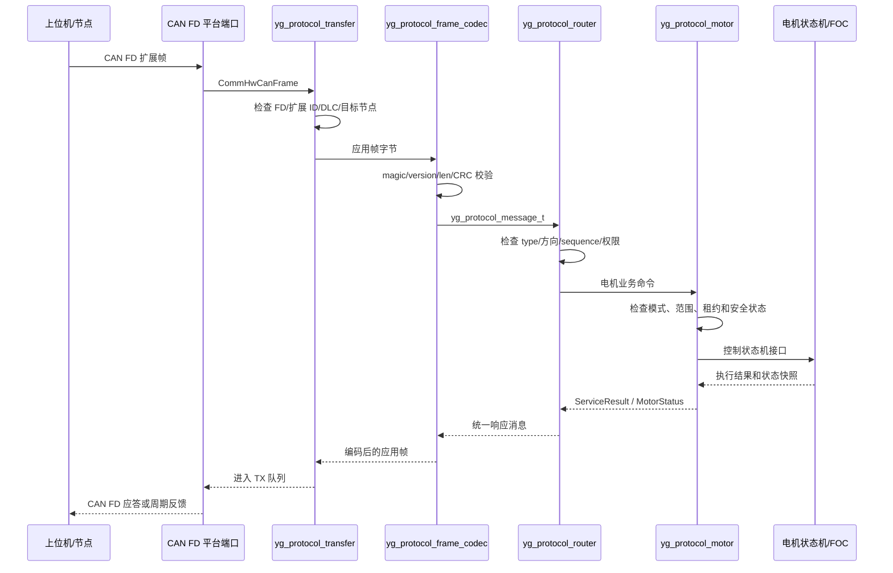

# 电机通信协议重构技术实现规范 v1.0

日期：2026-09-20  
用途：作为 AI、固件开发者和评审人员执行通信协议重构的统一输入。  
状态：顶层设计与迁移规范；新公司 CAN FD 协议尚未替换当前固件运行路径。

命名约定（2026-09-21）：新协议模块、函数和类型统一采用 `yg_protocol_` 前缀，
例如 `yg_protocol_frame_codec`、`yg_protocol_frame_t` 和 `yg_protocol_header_t`。
已有来源记录和历史示例的文件名保留，引用指向实际文件。

## 0. 文档使用说明

2026-09-21 核心接口以 [核心接口契约 v0.1](../protocols/yg_protocol_core_interfaces_v0_1.md)
为当前实现索引：包含实际文件、调用顺序、所有权及待完成项；下文目标图不代表已完成实机迁移。

2026-09-21 实现补充：[CAN FD 适配契约 v0.1](../protocols/yg_protocol_canfd_adapter_v0_1.md)
记录实际接口、所有权、DLC/填充规则和兼容边界。当前仅离线串联验证，新协议尚未挂入 MCU 调度。
下文图中的队列跨中断使用是目标设计；当前 `yg_protocol_transfer` 仅允许串行访问，需要完成并发
同步与硬件滤波集成后才能用于 RX ISR。CAN 元数据结构不能直接用于其他链路。

本文件把三个来源合并为一个可执行的技术规范，但不把它们混成同一层级：

| 来源 | 本文件中的作用 |
| --- | --- |
| ChatGPT 会话《通信协议框架设计》 | 提供硬件无关的分层、服务和迁移思路 |
| 飞书《通信协议设计 副本》及关联消息表 | 提供公司统一帧、节点、校验和传输方向的协议基线 |
| 当前仓库代码 | 提供真实的旧协议、调用关系、调度和硬件边界 |

当三个来源冲突时，按以下顺序处理：

1. 公司已正式批准的协议条款和消息注册表；
2. 本文已经明确标注并通过评审的项目决策；
3. 当前代码的真实行为；
4. ChatGPT 会话中的建议；
5. AI 或开发者的临时推测不得作为协议定义。

当前必须记住：**仓库中现有的 FDCAN 外设代码不等于已经实现公司 CAN FD 应用协议。**当前固件
仍然运行旧的 11 位标准 CAN 参数协议和 48 字节状态流。本文描述的是重构目标和安全迁移方法。

## 1. 通信协议是什么

通信协议是两个或多个节点对以下内容的共同约定：

- 如何识别一条消息；
- 谁发送、谁接收、是否广播；
- 消息表示什么业务；
- 字段的顺序、长度、单位、端序和缩放；
- 消息何时发送、是否需要响应或确认；
- 丢包、重复、乱序、超时、校验错误时如何处理；
- 设备处于什么状态时允许执行；
- 升级、参数保存和故障恢复如何保证安全。

协议不是 CAN 控制器寄存器，也不是某个 C 结构体，更不是一组随意的命令号。协议至少包含四
个相互独立的概念：

```text
业务语义：设置位置、读取状态、启动标定、升级固件
消息格式：type、src、dst、seq、flags、payload、CRC
传输承载：CAN FD、RS485、以太网、USB
执行对象：电机状态机、参数服务、loader
```

### 1.1 本项目的协议边界

本项目采用“硬件无关的应用协议 + 可替换的传输适配层”：

```text
电机业务消息
      ↓
公司统一应用帧
      ↓
传输抽象
      ↓
CAN FD / RS485 / Ethernet adapter
      ↓
硬件端口
```

因此：

- “设置电机位置”属于应用协议和电机控制服务；
- 29 位 CAN ID、DLC、FD、BRS 属于 CAN FD 适配层；
- RS485 的主从轮询属于 RS485 适配层；
- 以太网的 TCP/UDP 会话属于以太网适配层；
- 电机控制算法不应该知道消息来自 CAN FD 还是其他链路。

### 1.2 公司统一应用帧基线

飞书协议给出的统一外层为：

```text
统一应用帧 = 16 字节帧头 + payload + 2 字节 CRC16
```

当前已读到的字段布局如下，最终实现必须以公司评审后的正式版本为准：

| 偏移 | 字段 | 长度 | 说明 |
| ---: | --- | ---: | --- |
| 0 | magic | 2 | `0xA55A`，帧同步 |
| 2 | version | 1 | 协议版本，当前基线为 `0x01` |
| 3 | flags | 1 | 分片、ACK、请求/响应、上报、重传等 |
| 4 | src_id | 1 | 源节点 |
| 5 | dst_id | 1 | 目的节点，`0xFF` 为广播 |
| 6 | type | 2 | 公司消息类型，小端 |
| 8 | seq_id | 2 | 事务或分片序号，小端 |
| 10 | len | 4 | 当前定义为 payload 长度，需公司确认 |
| 14 | reserved | 1 | 预留 |
| 15 | header_crc8 | 1 | 帧头 CRC8 |
| 16 | payload | 可变 | 业务消息体 |
| 16+len | frame_crc16 | 2 | 帧尾 CRC16 |

统一规则基线：

- 多字节字段采用小端序；
- CAN FD 单帧最大数据区为 64 字节；
- 16 字节帧头和 2 字节 CRC16 占用 18 字节，因此单帧 payload 上限为 46 字节；
- 实时控制消息必须单帧，禁止分片；
- 参数、日志、标定数据和升级数据可以使用分片；
- CRC8 基线参数：poly `0x9B`、init `0x00`、xorout `0x00`、非反射；
- CRC16 基线参数：poly `0xBAAD`、init `0xFFFF`、xorout `0x0000`、非反射；
- 应用 CRC 与 CAN FD 控制器硬件 CRC 分开，不能互相替代。

### 1.3 尚未冻结的协议事项

以下事项不能由 AI 自行决定：

| 事项 | 当前问题 | 实施要求 |
| --- | --- | --- |
| flags 位 5/4 | ACK 请求和 ACK 响应的描述存在重叠 | 先形成位图和示例，再冻结 |
| CRC8 覆盖范围 | 是否覆盖 magic、是否排除 CRC8 自身未完全明确 | 用伪代码和黄金向量确认 |
| CRC16 覆盖范围 | 是否包含完整帧头和 header_crc8 需要确认 | 不能凭名称推断 |
| len 语义 | 字段偏移和文字说明存在冲突 | 明确为 payload 长度或其他定义 |
| type 100～199 | 电机段已预留但具体消息为空 | 取得公司登记后才能使用 |
| 分片并发 | `(src_id,type)` 和 seq 的并发规则不完整 | 首版限制单通道单会话并明确超时 |
| CAN ID | 节点与优先级映射尚未形成公司正式表 | 项目候选必须标注为候选 |
| RS485/以太网 | 主文档没有完整承载规范 | 后续按传输契约补充 |

在这些项目冻结前，可以实现 codec 骨架、错误处理、测试框架和模拟器，但不能把候选定义接入正式
电机控制路径。

## 2. 通信框架如何设计

目标框架分为六层。每层只拥有自己的状态和职责，层之间通过窄接口交换值对象。

### 2.0 重构后的整体框架图



图中最重要的依赖方向是：

```text
硬件端口 → CAN FD 适配 → 协议传输 → 帧编解码 → 消息路由 → 业务服务 → 电机/参数/Loader
```

业务服务不能反向依赖 CAN FD 适配器；电机算法不能依赖协议帧；协议编解码不能依赖任何 HAL。

模块命名约定：

| 模块 | 推荐文件 | 主要职责 |
| --- | --- | --- |
| 统一类型 | `yg_protocol_wire_types.h/.c` | 版本、flags、错误码、长度上限 |
| CRC | `yg_protocol_crc.h/.c` | CRC8、CRC16 |
| 帧编解码 | `yg_protocol_frame_codec.h/.c` | 16B 头、payload、CRC、长度和版本 |
| CAN ID | `yg_protocol_can_id.h/.c` | 29 位 CAN ID 的编解码和优先级 |
| 分片 | `yg_protocol_fragment.h/.c` | 固定缓存、分片重组和超时 |
| 传输 | `yg_protocol_transfer.h/.c` | RX/TX 队列、ACK、重试和统计 |
| 消息注册 | `yg_protocol_message_registry.h/.c` | type、方向、周期、是否允许分片 |
| 消息路由 | `yg_protocol_router.h/.c` | 将完整消息送到对应服务 |
| CAN FD 适配 | `yg_protocol_canfd.h/.c` | FD、BRS、DLC、过滤和硬件帧转换 |
| 端点组装 | `yg_protocol_endpoint.h/.c` | 队列、分片、路由和自动应答的串行组合入口 |
| 只读服务 | `yg_protocol_readonly.h/.c` | 协议、设备、能力和电机状态查询的提供者接口 |
| 只读 payload | `yg_protocol_readonly_payload.h/.c` | GET_INFO、GET_CAPS、GET_MOTOR_STATE 的显式小端字段编码 |
| 服务契约 | `yg_protocol_service.h` | 内部业务结果和异步 token，不直接映射线上枚举 |
| 电机服务 | `yg_protocol_motor.h/.c` | MotorCommand、MotorStatusSnapshot 转换 |
| 参数服务 | `yg_protocol_parameter.h/.c` | 参数读写、事务和保存请求 |
| 任务服务 | `yg_protocol_job.h/.c` | 辨识、标定、诊断任务 |
| 升级服务 | `yg_protocol_update.h/.c` | 升级会话和 loader 接口 |

第一阶段不必一次创建全部文件。建议先实现 `wire_types`、`crc`、`frame_codec`、`canfd`、`router` 和
对应测试，确认真实调用关系后再增加只读服务、参数、Job 和升级模块。

### 2.1 模块之间的接口形状



推荐的接口只交换值和受限缓冲区：

```c
yg_protocol_result_t yg_protocol_frame_decode(
    const uint8_t *bytes,
    size_t length,
    yg_protocol_frame_view_t *out_frame);

yg_protocol_result_t yg_protocol_frame_encode(
    const yg_protocol_message_t *message,
    uint8_t *bytes,
    size_t capacity,
    size_t *out_length);

yg_protocol_result_t yg_protocol_router_handle(
    const yg_protocol_router_t *router,
    const yg_protocol_message_t *message,
    yg_protocol_service_result_t *out_result);

yg_protocol_result_t yg_protocol_router_build_response(
    const yg_protocol_message_t *request,
    const yg_protocol_service_result_t *service_result,
    yg_protocol_message_t *out_response);

yg_protocol_result_t yg_protocol_endpoint_send(
    yg_protocol_endpoint_t *endpoint,
    const yg_protocol_message_t *message,
    uint8_t priority);
```

这些接口的语义必须固定：输入缓冲区由调用方拥有；跨周期数据复制到模块自己的固定存储；发送成功
只表示进入 TX 队列；电机命令执行结果必须通过 `service_result` 或状态反馈确认。路由 handler 接收
显式 `context`，只读服务通过 provider 回调填充固定的 46 字节响应缓冲区；路由器只负责初始化响应
元数据和封装消息视图，不拥有业务状态，也不直接访问电机或 HAL。

### 2.2 重构后的信息流程图



接收中断只执行 `H → T` 的硬件取帧和有界入队；`T → C → R → M → F` 在通信任务或规定的 1 kHz/2 kHz
调度点运行。反馈方向则从 `F` 产生快照，经 `M → R → C → T → H` 返回。

```text
┌─────────────────────────────────────────────┐
│ 1. 电机业务对象层                            │
│ MotorCommand / MotorStatus / Parameter / Job │
│ UpgradeSession                               │
└──────────────────────┬──────────────────────┘
                       ↓
┌─────────────────────────────────────────────┐
│ 2. 应用服务层                                │
│ Control / Status / Parameter / Diagnostic    │
│ Calibration / Identification / Upgrade       │
└──────────────────────┬──────────────────────┘
                       ↓
┌─────────────────────────────────────────────┐
│ 3. 公司协议编码层                            │
│ Header / Type / Flags / Sequence / CRC       │
│ Encode / Decode / Fragment / Reassemble      │
└──────────────────────┬──────────────────────┘
                       ↓
┌─────────────────────────────────────────────┐
│ 4. 传输抽象层                                │
│ Frame queue / timeout / retry / ACK / stats  │
└──────────────────────┬──────────────────────┘
                       ↓
┌─────────────────────────────────────────────┐
│ 5. 链路适配层                                │
│ CAN FD / RS485 / Ethernet                   │
└──────────────────────┬──────────────────────┘
                       ↓
┌─────────────────────────────────────────────┐
│ 6. 平台和物理层                              │
│ FDCAN HAL / UART+DE-RE / MAC+socket         │
└─────────────────────────────────────────────┘
```

### 2.1 业务对象层

业务对象描述电机系统真正关心的值，不描述 CAN 帧：

```c
typedef struct
{
    uint8_t source_node;
    uint8_t target_node;
    uint16_t sequence;
    uint8_t mode;
    bool enable;
    float position_rad;
    float velocity_rad_s;
    float torque_nm;
    float voltage_v;
    uint32_t lease_ms;
} MotorCommand;

typedef struct
{
    uint32_t timestamp_us;
    uint8_t state;
    uint8_t mode;
    uint16_t fault_code;
    float position_rad;
    float velocity_rad_s;
    float current_a;
    float torque_nm;
    float temperature_c;
    float bus_voltage_v;
    uint16_t applied_sequence;
} MotorStatusSnapshot;
```

这类对象不能包含：

- STM32 HAL 类型；
- `FDCAN_HandleTypeDef`；
- CAN ID；
- 发送缓冲区指针；
- 指向可变全局变量的隐式指针；
- 依赖当前编译器布局的 packed struct。

线路单位和定点缩放必须在协议 codec 或消息定义中集中处理，不能让电机控制算法直接接收线路
整数或哨兵值。

### 2.2 应用服务层

服务按业务划分，不能把所有命令写成一个巨大 switch：

| 服务 | 作用 | 实时性 |
| --- | --- | --- |
| Control Service | 使能、停机、模式、位置/速度/力矩/电压目标、watchdog | 高 |
| Status Service | 周期反馈、状态快照、故障和心跳 | 高 |
| Parameter Service | GET、SET、SAVE、DEFAULT、事务和回滚 | 低 |
| Diagnostic Service | 故障、统计、日志、版本和能力 | 中 |
| Job Service | 辨识、标定、实验、结果下载 | 中低 |
| Upgrade Service | 镜像传输、校验、激活和回滚 | 低但可靠性最高 |

实时控制服务不能被参数保存、日志传输或升级数据阻塞。升级期间必须进入明确的安全状态，禁止
电机输出。

### 2.3 消息语义

统一消息至少支持以下语义：

```text
Request       请求执行或读取
Response      对请求的处理结果
Periodic      周期控制或周期状态
Event         异步故障、告警、完成事件
JobResult     长任务状态和结果
```

请求和响应需要通过 `src_id`、`dst_id`、`type`、`seq_id` 和 flags 关联。长任务不能让请求一直
阻塞，必须返回 job id，再用 `GET_JOB_STATUS` 查询。

### 2.4 CAN FD 映射

CAN FD 是第一条实现链路，但不应把 CAN FD 字段泄漏到应用对象层。

当前项目可以采用下面的 **候选** 29 位 ID 映射进行评审：

```text
bits 28..26 : priority
bit  25     : R = 0
bit  24     : DP = 0
bits 23..16 : PF = 0xEF
bits 15..8  : destination node
bits  7..0  : source node
```

候选公式：

```c
can_id = (priority << 26) | (0xEFu << 16) |
         ((uint32_t)destination << 8) | source;
```

这只是项目候选映射，不能写成公司已经批准的命令定义。应用 `type`、`sequence` 和 `payload len`
仍然属于公司统一帧头，不能用 CAN PF 再复制一套命令编号体系。

CAN FD 数据区的约束为：

```text
64B data = 16B company header + payload + 2B CRC16
payload ≤ 46B
```

实时控制命令和快速状态反馈必须在单帧内完成。升级、日志、标定表等使用统一分片机制。

## 3. 程序流是什么

### 3.1 接收程序流

目标接收流程如下：

```text
FDCAN RX FIFO / 中断
        ↓
platform CAN port
        ↓
CommHwCanFrame
        ↓
有限 RX ring
        ↓
CAN FD transport
  - 检查帧类型
  - 检查扩展 ID
  - 检查 DLC/长度
  - 检查目标节点
  - 统计丢帧和硬件错误
        ↓
yg_protocol_frame_codec
  - 检查 magic
  - 检查 version
  - 检查 len
  - 检查 header CRC8
  - 检查 payload CRC16
        ↓
Fragment reassembler（仅分片消息）
        ↓
yg_protocol_router（消息路由器）
  - 检查 src/dst
  - 检查 type
  - 检查 sequence
  - 检查权限和方向
        ↓
Application service
  - 校验单位、范围、模式和状态
  - 生成 MotorCommand / ServiceResult / Job
        ↓
Motor state machine / Parameter service / Loader
```

中断上下文只允许完成硬件取帧和有限入队，不允许：

- 解析长消息；
- 调用电机控制状态机；
- 写 Flash；
- 动态分配内存；
- 等待 TX 空间；
- 阻塞重传。

### 3.2 控制命令程序流

控制命令建议按以下顺序接入：

```text
STOP / DISABLE
        ↓
ENABLE
        ↓
SET_MODE
        ↓
SET_TARGET
        ↓
CONTROL_WATCHDOG / LEASE
        ↓
Motor state machine
        ↓
FOC / position / velocity loop
```

安全规则：

- `SET_TARGET` 不能隐式使能电机；
- 模式切换必须由状态机判断是否允许；
- 命令必须经过范围、单位、序号和租约检查；
- 重复命令不能重复产生危险副作用；
- 目标更新超时必须进入预定义的停止或降级状态；
- `STOP`、`DISABLE` 和安全故障的优先级高于普通控制目标。

### 3.3 状态反馈程序流

```text
FOC / 位置环 / 速度环
        ↓
MotorStatusSnapshot
        ↓
Status service
  - 读取一致快照
  - 加时间戳
  - 加已应用 sequence
  - 加故障和状态字
        ↓
yg_protocol_frame_codec（编码）
        ↓
CAN FD TX queue
        ↓
FDCAN TX FIFO
```

位置、速度、电流/力矩应属于同一个快照，避免三个独立帧造成时间不同步。若带宽不足，必须进行
测量后再决定压缩字段、降低慢速字段频率或分组反馈。

### 3.4 参数程序流

```text
GET/SET_PARAMETER
        ↓
Parameter registry
        ↓
类型、单位、范围、权限检查
        ↓
RAM working value
        ↓
VALIDATE / COMMIT
        ↓
受控 Flash 服务
        ↓
SAVE_RESULT
```

RAM 当前值、Flash 保存值、默认值和工厂标定值必须分开。通信 ISR 不得直接操作 Flash。

### 3.5 升级程序流

```text
QUERY_CAPABILITIES
        ↓
BEGIN_UPDATE
        ↓
校验产品/硬件/版本/权限
        ↓
ERASE/PREPARE
        ↓
WRITE_DATA(offset, block)
        ↓
块校验、重传、断点记录
        ↓
FINALIZE
        ↓
整镜像 hash / signature 校验
        ↓
MARK_PENDING
        ↓
REBOOT
        ↓
CONFIRM_IMAGE 或 ROLLBACK
```

分片 CRC 只能证明链路帧正确，不能替代整镜像 hash、签名、防回滚和启动确认。

## 4. 底层逻辑如何和硬件解耦

### 4.1 解耦原则

通信协议核心只能依赖：

- `stdint.h`、`stdbool.h`、`stddef.h` 等标准类型；
- 明确的数据缓冲区和长度；
- 由调用方提供的时间、队列和存储接口；
- 纯函数式的 CRC、编解码和状态转换。

通信协议核心不能依赖：

- `HAL_FDCAN_*`；
- `FDCAN_HandleTypeDef`；
- `hfdcan1`；
- GPIO、寄存器、DMA、NVIC；
- `MotorControl`、FOC 全局变量；
- 某个具体板卡的节点配置；
- 阻塞式 delay 或任意地址 Flash 写入。

### 4.2 平台能力接口

平台层只描述能力，不暴露实现细节。例如：

```c
typedef struct
{
    uint32_t identifier;
    uint8_t length;
    bool extended;
    bool remote;
    bool fd;
    bool brs;
    uint8_t data[64];
} CommHwCanFrame;

bool comm_hw_can_receive(CommHwCanFrame *frame);
bool comm_hw_can_try_send(const CommHwCanFrame *frame);
void comm_hw_can_start(uint8_t node);
bool comm_hw_can_service_bus_off(void);
```

协议层只调用这些能力。STM32 端口负责把它们翻译成 HAL 调用；native 测试使用 mock 实现。

当前仓库的 `CommHwCanFrame` 已有 `identifier`、`length`、`extended`、`remote` 和 64 字节数据，
但发送 API 仍带有旧标准帧和旧长度语义。迁移时应采用增量扩展或版本化接口，不能悄悄改变旧函数的
参数含义。

### 4.3 时间、队列和存储也要抽象

协议核心不能自己读取系统时钟或直接创建队列。通过参数传入或平台服务提供：

```c
uint32_t protocol_now_ms(void);
bool protocol_rx_push(const CommHwCanFrame *frame);
bool protocol_tx_push(const CommHwCanFrame *frame);
bool update_storage_write(uint32_t offset, const uint8_t *data, size_t length);
```

这些接口只描述行为和失败结果。具体使用 TIM、FreeRTOS、裸机 Ring、内部 Flash 还是外部存储，留在
平台或组合层。

### 4.4 结构体和序列化规则

禁止把线路缓冲区强制转换为 C 结构体：

```c
/* 禁止：受端序、padding、对齐和编译器 ABI 影响 */
const yg_protocol_header_t *header = (const yg_protocol_header_t *)buffer;
```

使用显式偏移读写：

```c
uint16_t read_le16(const uint8_t *p);
uint32_t read_le32(const uint8_t *p);
void write_le16(uint8_t *p, uint16_t value);
void write_le32(uint8_t *p, uint32_t value);
```

每个消息 payload 都要明确：字段偏移、字段长度、端序、单位、缩放、范围、无效值和版本。

## 5. 当前代码框架与目标代码框架

### 5.1 当前实际代码

```text
firmware/platform/stm32g4/ports/comm/
  comm_control_stm32g4.c   FDCAN HAL、滤波、启动、发送
  comm_status_stm32g4.c    状态发送端口
          ↓
firmware/platform/api/comm_hw.h
          ↓
firmware/communication/can/
  can_transport.c          旧标准 CAN 过滤、队列、重试
  can_command_binding.c    接收入口和命令派发
  can_binding_commands.c   电机/参数写路径
  can_binding_queries.c    状态/参数读路径
  can_status_source.c      状态快照
  interface_can.c          门面、心跳和发送调度
          ↓
firmware/communication/protocol/
  can_parameter_wire.c     旧参数编码和 ID
  can_motor_status.c       旧 48 字节状态流
          ↓
motor / services / app
```

当前事实：

- 旧协议使用 11 位标准 ID；
- 旧参数命令主要是 2/4 字节大端数据；
- 旧状态流为 48 字节大端数据；
- RX 中断只入队，2 kHz 服务排空和派发；
- 当前通信分层已经完成硬件边界收口，但协议内容仍是旧协议；
- 公司统一 CAN FD codec 还没有成为固件运行入口。

### 5.2 目标代码框架

建议逐步形成以下边界，不要求一次性移动所有旧代码：

```text
firmware/communication/protocol/
  yg_protocol_wire_types.*
  yg_protocol_crc.*
  yg_protocol_frame_codec.*
  yg_protocol_can_id.*
  yg_protocol_fragment.*
  yg_protocol_message_registry.*

firmware/communication/transport/
  protocol_transport.*
  yg_protocol_router.*
  protocol_transaction.*

firmware/communication/can/
  canfd_transport.*
  canfd_adapter.*

firmware/services/communication/
  motor_control_service.*
  motor_status_service.*
  parameter_service.*
  job_service.*
  upgrade_service.*

firmware/platform/api/
  comm_hw.h
  time_hw.h
  storage_hw.h
```

如果只有 CAN FD 一个真实实现，不要为了“未来支持”立即增加空的 RS485、TCP 工厂、通用注册中心或
多级抽象。先建立真实的 CAN FD 调用者和 native 测试；第二条链路出现时再复用稳定的 transport
契约。

## 6. AI 重构时必须遵守的规则

AI 执行任何重构前必须完成以下动作：

1. 阅读本规范、`company_protocol_source_readback.md`、`communication_layering.md` 和当前阶段计划。
2. 搜索所有受影响函数的调用方、测试、Keil 工程登记和主机工具。
3. 区分“公司已批准”、“项目候选”和“旧协议现状”。
4. 先写或更新黄金向量，再修改编解码实现。
5. 协议层和电机控制层之间使用值对象或显式服务接口。
6. 保留旧协议入口，直到兼容门槛通过；禁止静默改变旧命令的端序、ID、长度或单位。
7. 每个阶段都要有独立的验收和回滚边界。

AI 不得：

- 把候选 type 当成公司正式编号；
- 把 CAN PF 当成应用 command ID；
- 在协议层包含 STM32 HAL 或 CubeMX 头文件；
- 从通信层直接修改 FOC 全局变量；
- 在 ISR 中执行长解析、Flash 操作、阻塞发送或动态分配；
- 通过 packed struct 直接解释线路数据；
- 为了让测试通过而放宽 CRC、长度或状态机断言；
- 删除旧协议测试来掩盖迁移差异；
- 修改 CubeMX 生成区之外的受保护代码；
- 在没有板级证据时声称仲裁段、数据段或 1 kHz 多轴性能已经满足。

## 7. 分阶段重构计划

### Stage 0：协议和现状冻结

输出：来源分层、兼容矩阵、协议勘误单、Node/type 注册表草案、旧协议基线。

验收：不改固件行为；旧协议测试、quick/PR 基线通过；未决事项都有明确状态。

### Stage 1：纯协议核心

实现：CRC、公司头部、显式小端读写、frame encode/decode、CAN ID codec、长度检查、错误码和 native
黄金向量。

验收：无 STM32 头文件可独立构建；有效帧、空 payload、最大 payload、坏 magic、坏版本、坏 CRC、
长度不符、整数溢出全部有测试。

### Stage 2：CAN FD transport

实现：29 位扩展 ID、FD、BRS、DLC、RX/TX Ring、过滤、队列计数、总线错误和 mock/loopback。

验收：CAN FD 传输可独立验证；没有调用电机控制；速率配置有硬件证据。

### Stage 3：消息路由器和只读服务

实现：消息注册表、版本、方向、src/dst、sequence、ACK、错误响应、设备信息、能力和状态查询。

验收：错误帧不会改变电机状态；状态快照和协议字段逐字节符合黄金向量。

### Stage 4：最小控制闭环

实现：STOP、DISABLE、ENABLE、SET_MODE、SET_TARGET、watchdog/lease。

验收：模式切换、重复包、乱序包、断连、故障锁存、停止优先级和恢复行为可验证。

### Stage 5：反馈、参数和任务

实现：位置/速度/电流/力矩快照，GET/SET/SAVE/DEFAULT/事务，辨识/标定 Job 和诊断事件。

验收：单位、缩放、端序、范围、无效值、参数写失败和任务取消路径可验证。

### Stage 6：升级和 loader

实现：升级会话、分片、断点、镜像 hash/签名、Flash 存储边界、激活和回滚。

验收：断包、重复、乱序、掉电、坏 hash、空间不足和非法镜像均进入安全状态。

### Stage 7：多轴和 1 kHz

实现：未来执行时间或同步计数、5 轴组控制、每轴 1 kHz 状态反馈。

验收：必须给出总线利用率、最坏延迟、周期抖动、同步误差、丢帧和重传数据；不能只凭 CAN FD
payload 长度宣称满足。

### Stage 8：旧协议退役

完成主机工具迁移、现场升级和回滚方案后，才能删除旧 parser 和旧发送接口。

## 8. 测试和验收体系

### 8.1 纯协议测试

- CRC 正负样例；
- header/payload 长度边界；
- 小端字段逐字节向量；
- 版本、type、flags 和 sequence；
- 分片首片、中片、尾片、重复片、缺片、乱序、超时；
- 连续多帧和任意字节分割的流输入；
- 最大消息和非法长度。

### 8.2 传输测试

- 扩展 ID、FD、BRS、DLC；
- RX/TX 队列满和丢帧计数；
- 发送优先级和应答优先于状态；
- bus-off 恢复；
- 错误帧不触发业务副作用。

### 8.3 业务测试

- 控制状态转换表；
- 使能/停机/故障/清故障；
- 命令租约和超时；
- 位置、速度、电流、力矩单位；
- 参数事务和掉电保存；
- Job 取消、失败和结果读取；
- 升级断电、重传、校验、回滚。

### 8.4 固件仓库门禁

- 协议或参数 ABI 变更必须更新版本化文档、黄金向量、兼容说明和测试；
- 通信、服务和电机代码不得包含 HAL 类型；
- 文档/工具改动至少通过 quick；
- 固件、协议、参数、测试改动通过 PR profile；
- 不得把旧输出目录中的结果当作当前验证证据；
- 每个阶段记录 `outputs/runs/<run>/summary.json`。

## 9. 最终交付物

重构完成后，至少应形成以下五份相互引用的正式文档：

1. **协议主规范**：统一帧、CRC、flags、版本、节点、type、分片和错误码；
2. **服务与消息目录**：控制、状态、参数、诊断、Job、升级的 payload 和状态机；
3. **链路适配规范**：CAN FD、RS485、以太网各自的承载规则；
4. **黄金向量与主机工具说明**：每个关键消息的 encode/decode 和错误样例；
5. **兼容迁移和验收报告**：旧协议共存、切换、回滚、容量和硬件测试证据。

本文件是 AI 重构的顶层实施入口。执行具体代码任务时，AI 必须先确认当前阶段、允许修改的目录、
不变量和验收命令；如果协议条款尚未冻结，只能实现纯逻辑骨架和测试，不能自行补齐公司正式协议。
