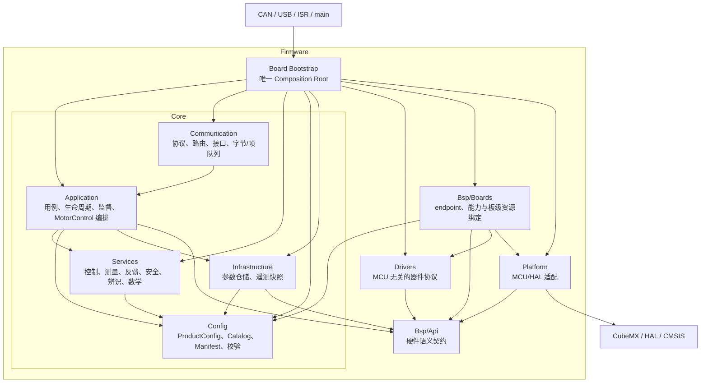
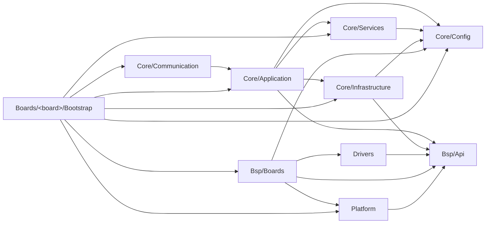
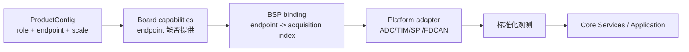
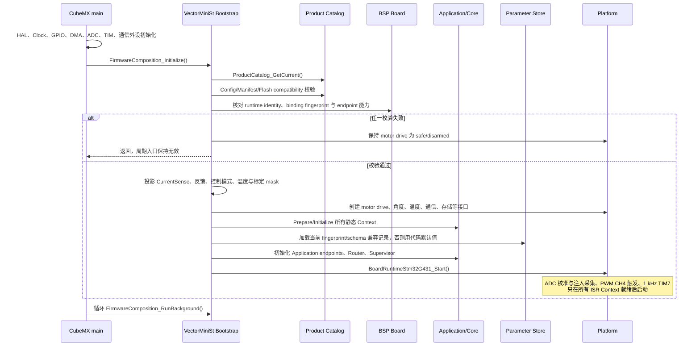
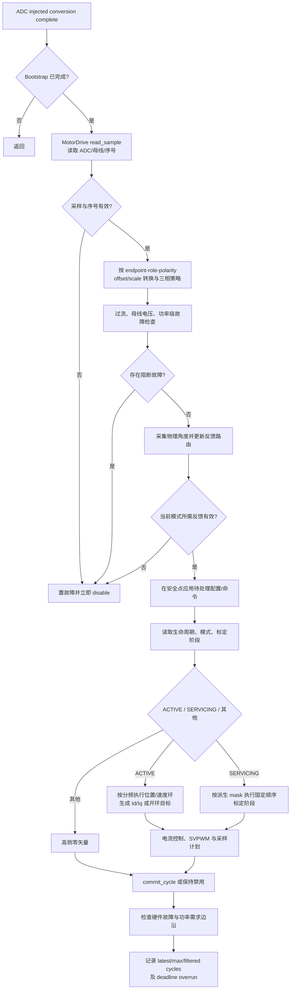
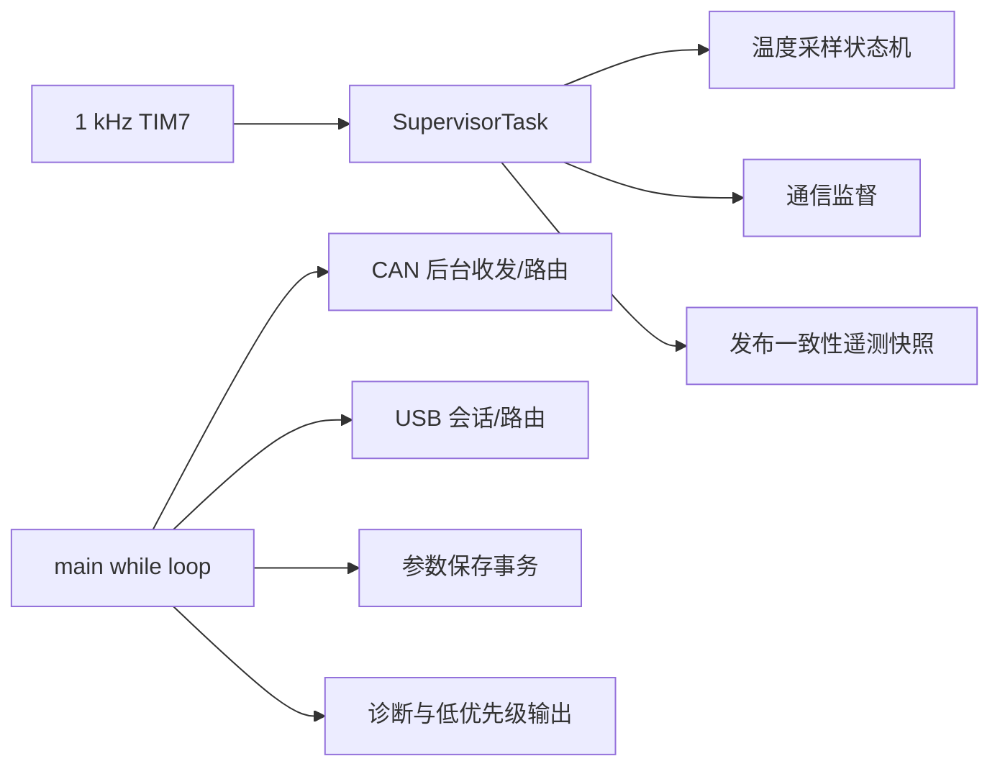

# Vector Mini ST 固件架构

## 1. 架构目标

当前固件采用“可移植内核 + 窄 BSP 契约 + 板级组合根”的产品线架构。一个量产构建只选择一个完整、只读的 `ProductConfig`，由它原子地组合板卡、电机、负载、传感器、反馈路由、保护、控制、标定和通信配置。

架构需要同时满足：

- 控制算法不依赖具体 MCU、HAL、引脚、ADC Rank 或定时器实例；
- 功能模块通过显式输入、Context 和窄接口协作，不读取彼此的内部状态；
- 产品配置与板级物理能力分别建模，启动时交叉校验，能力不足时保持 PWM 关闭；
- 20 kHz 路径有界、无动态分配、无阻塞 I/O、无字符串格式化；
- Flash 只保存模组个体标定量，设计参数每次启动都来自当前产品目录；
- CAN 与 USB 只调用 Application 用例，不直接操作电机控制对象。

## 2. 标准分层



箭头表示“使用”。只有 `Firmware/Bsp/Boards/<board>/Bootstrap/` 可以同时看到所有层并创建完整对象图；普通业务代码不得承担组合根职责。

### 2.1 最终目录

```text
Firmware/
├── Core/
│   ├── Application/
│   │   ├── Api/                 对通信公开的应用端点集合
│   │   ├── Commissioning/       标定/辨识用例验收
│   │   ├── Communication/       CAN 配置等应用用例
│   │   ├── Contracts/           Application 的窄依赖接口
│   │   ├── Diagnostics/         产品与故障诊断用例
│   │   ├── Indicators/          指示灯应用逻辑
│   │   ├── MotorControl/        20 kHz 控制与标定编排
│   │   ├── Parameters/          参数读写和边界校验
│   │   ├── Supervision/         1 kHz 监督与温度监测
│   │   └── Update/              升级准备与复位交接
│   ├── Services/
│   │   ├── CurrentControl/      PI 和电流控制数学
│   │   ├── Identification/      相电阻、摩擦辨识纯逻辑
│   │   ├── Math/                快速数学
│   │   ├── Measurement/         测量模型、电流策略、温度监测
│   │   ├── Modulation/          SVPWM
│   │   ├── MotionControl/       位置、轨迹控制
│   │   ├── RotorFeedback/       编码器模型和反馈路由
│   │   └── Safety/              故障集合与锁存策略
│   ├── Communication/
│   │   ├── Can/                 CAN 响应应用适配
│   │   ├── Contracts/           通信侧窄接口
│   │   ├── Formatting/          有界文本生成
│   │   ├── Interfaces/          CAN/USB 会话编排
│   │   ├── Protocol/            纯编解码和协议常量
│   │   ├── Router/              命令分派、鉴权、范围语义
│   │   └── Transport/           静态字节队列
│   ├── Config/                  产品类型、目录、能力和校验
│   └── Infrastructure/
│       ├── Parameters/          A/B 参数记录管理
│       └── Telemetry/           一致性遥测快照
├── Drivers/
│   └── Angle/Tle5012b/          不含 MCU 资源的 TLE5012B 协议
├── Bsp/
│   ├── Api/                     通用硬件语义接口
│   └── Boards/
│       ├── bsp_board.*          能力模型与 endpoint 查询
│       ├── bsp_product_binding.* 配置需求与物理能力校验
│       └── VectorMiniSt/
│           ├── vector_mini_st_bsp.*
│           ├── vector_mini_st_memory_map.h
│           └── Bootstrap/       VectorMiniSt 唯一组合根
└── Platform/
    └── Stm32G431/               TIM/ADC/SPI/FDCAN/USB/Flash/HAL 适配
```

仓库根目录下 CubeMX 生成的 `Core/`、`Drivers/`、`Middlewares/` 和 `USB_Device/` 不是上述 `Firmware/Core`，只允许由 STM32 Platform、板级 Bootstrap 或生成入口接触。

## 3. 依赖契约



必须遵守：

- `Core` 不包含 STM32、HAL/CMSIS、寄存器、引脚、外设句柄或具体器件驱动头文件；
- `Core/Config` 只描述产品事实，不调用硬件、不持有可变运行状态；
- `Services` 是可在 host 上执行的纯逻辑，状态由调用者持有；
- `Application` 编排服务和硬件语义接口，不依赖具体 Platform；
- `Protocol` 不调用 Router，Router 不调用具体 CAN/USB transport；
- `Drivers` 只实现器件协议，不选择板卡引脚或产品；
- `Platform` 把通用 BSP 语义映射到 MCU/HAL；
- `Bsp/Boards` 声明一块板实际有哪些资源，不能把未焊接或未实现资源伪装为可用；
- ISR 入口只转发到已经构造完成的静态 Context。

## 4. BSP 解耦模型

### 4.1 七类窄接口

| 接口 | 语义 | 实时约束 |
| --- | --- | --- |
| `BspMotorDrivePort` | 安全初始化、arm/disarm、采样、PWM+采样计划原子提交、立即关断 | 快环函数有界、非阻塞、无分配 |
| `BspAngleSensorPort` | 带序号/状态的标准化单圈角度采样 | 非阻塞 |
| `BspTemperaturePort` | 发起/读取带时间与状态的温度样本 | 1 kHz 监督，不作为执行器 |
| `BspCanPort` / `BspByteStreamPort` | 原始帧或字节收发 | 不解释协议命令 |
| `BspSystem` 系列接口 | 时钟、临界区、身份、存储、复位、诊断 | 各自窄职责 |
| `BspIndicatorPort` | 状态指示输出 | 后台/监督调用 |
| `BspSynchronousSerialPort` | 通用同步串行事务 | 由器件 Driver 消费 |

`BspMotorDriveSample` 只携带 ADC 原始观测、母线原始值、有效相位、状态和采样计划序号。offset、极性、A/count、三相重构和滤波都在 BSP 之上完成，因此控制算法不依赖 ADC Rank。

### 4.2 endpoint 的含义

endpoint 是产品配置中的稳定逻辑资源 ID，不是 GPIO、ADC 通道号或数组下标。例如 `0x0101` 表示“该产品要求的 A 相电流采集资源”。板包把该 ID 绑定到实际 acquisition index，Platform 再把 index 映射到 ADC/DMA 数据。

这条映射链为：



配置中的通道顺序可以变化，逻辑 role 不能由顺序推断；endpoint 缺失或重复、role 缺失或重复、极性非法都必须使启动失败。

## 5. 产品配置与能力

`ProductCatalog_GetCurrent()` 返回当前构建唯一的 `ProductCatalogEntry`。entry 包含：

- 完整 `ProductConfig`；
- `ProductManifest`；
- Flash 兼容 tuple、配置 fingerprint 与显式迁移授权。

`ProductConfig_Validate()` 检查结构、单位、范围、跨字段关系和能力派生；板级 binding 再检查所选 endpoint 与物理板能力。任一环节失败，都不得启动周期中断或 arm 功率级。

配置模型最多描述 3 个电流通道、2 个角度传感器和 3 个温度传感器，也能描述 inline 三分流、低侧三分流、低侧两分流和母线单分流。模型能表达不代表当前目标已经具备物理实现，见第 10 节。

反馈源用 `NONE`、角度传感器实例索引或无感观测器显式表示。缺少传感器时使用 `NONE`，不能创建虚假设备。当前双传感器运行时只接受 `primary + output shaft`；转子冗余、自动 fallback、第二份转子 LUT/零位都明确拒绝，不能静默共用单编码器状态。

`features` 不只是能力声明：Bootstrap 将速度、位置、输出位置、无感等策略投影为运行时控制模式门禁，被关闭或前置反馈不满足的模式请求会被拒绝。温度按 `OFF / OPTIONAL / REQUIRED` 处理：`OFF` 不创建该功能，`OPTIONAL` 仅在能力存在时接入，`REQUIRED` 缺失能力即启动失败。`ProductConfigDerived.commissioning_steps` 同样在启动时投影到标定工作流，而不是只用于离线校验。

## 6. 启动流程



启动成功不等于功率桥已经导通。`BspMotorDrivePort` 先执行安全初始化，只有生命周期进入需要功率的活动/标定阶段并且没有阻断故障时才 arm；故障侧效果首先是立即关闭输出。

## 7. 20 kHz 快环

20 kHz 入口来自 ADC2 注入转换完成中断。控制频率由 `ProductBoardDesign.control_frequency_hz` 给出；速度、位置和级联位置环频率来自 `ProductControlConfig`，在 `MotorControlRuntime_Prepare()` 中一次性校验并生成分频。慢环频率必须非零、不高于 20 kHz、整除快环频率且分频不超过 `uint16_t`。



快环约束：

- 禁止等待 SPI、USB、CAN、Flash 或日志输出；
- 禁止动态分配和无界循环；
- 参数与命令只在确定的安全点整体生效；
- 保护判定优先于控制计算；
- PWM 与当前周期采样计划通过 `commit_cycle()` 在同一更新边界提交；
- 任何错误路径都不能留下上一周期的非零输出；
- DWT 统计必须用实机最大周期和超限计数验证，host 测试不能替代时序验收。

## 8. 1 kHz 与后台流程



温度服务使用 wall-clock 毫秒，不随 PWM 频率缩放。`OFF` 不要求温度能力，`OPTIONAL` 在 endpoint 可用时接入但不因缺失阻止启动，`REQUIRED` 必须成功绑定；是否进入保护链还由实例 `protection_enabled` 和 thermal zone 策略决定。当前 MCU 内部温度仅监测：valid/stale/open/short/fault 会进入诊断状态，但活动产品关闭 `temperature_protection`，不会触发温度跳闸。它不能代表电机绕组或 MOSFET 温度。

## 9. 状态与数据所有权

| 数据 | 唯一权威/写者 | 其他消费者如何访问 |
| --- | --- | --- |
| 产品设计值 | 编译期 `ProductCatalogEntry` | Bootstrap 投影只读窄配置 |
| 生命周期与控制模式 | Application lifecycle | 明确 API/快环快照 |
| 控制器积分器、轨迹、observer | 对应 MotorControl Context | 遥测复制，不暴露地址 |
| 外部命令候选 | Application command service | 快环安全点整体应用 |
| 活动/锁存故障 | Safety/Fault manager | 一致性诊断快照 |
| 遥测 | Infrastructure 双缓冲 seqlock | CAN/USB 读取不可变 snapshot |
| Flash 个体参数 | Parameter manager A/B 记录 | 校验 schema/fingerprint/CRC 后投影应用 |

中断与后台共享数据必须使用已经定义的单写者、临界区、原子字段或 seqlock。不得通过去掉 `volatile`、强制转换后 `memcpy` 或直接导出 Context 指针绕过并发语义。

## 10. 框架能力与当前 VectorMiniSt 能力

| 能力 | 配置/BSP 框架 | 当前 VectorMiniSt 量产路径 |
| --- | --- | --- |
| 电流采样 | inline 3-shunt、低侧 3/2-shunt、DC-link 1-shunt | 仅低侧三分流、固定同步采样、A/B/C 三个 endpoint；其他拓扑校验失败并保持关闭 |
| 角度传感器 | 配置数组支持 0/1/2 个实例与显式反馈路由 | 0/1 个和 `primary + output shaft` 两实例可组装；两个实例各有独立采集/跟踪状态，但 schema 10 仍只有一份 primary 转子 LUT/方向/零位。`primary + redundant`、自动切换和第二转子 LUT 明确拒绝 |
| 无编码器 | 反馈模型可选择 sensorless observer | 当前位置功能仍需要角度传感器；标定参考使用 observer，但不能据此宣称完整无编码器产品已验证 |
| fallback | 模型有 `fallback_electrical_angle` | 当前活动 entry 明确为 `NONE`，不得宣称自动切换 |
| 温度 | 最多 3 个实例与多个 thermal zone | 当前 Bootstrap 最多接入 1 个；仅 MCU 内部温度 monitor-only，功率级 NTC endpoint 为未装配状态 |
| CAN | Classic、FD、BRS 能力模型 | 活动 entry 使用 Classic CAN，1 Mbit/s、8-byte、BRS 关闭；FD/BRS 需单独实机验证后才能作为产品能力发布 |
| 通信可选性 | 配置可描述 CAN 与 service stream | 当前 VectorMiniSt Bootstrap 要求 CAN 和 USB byte-stream 都启用并成功绑定；关闭任一项属于目标不支持并拒绝启动，不是 Core 的通用限制 |
| 产品变体 | 多 entry 共存，生产构建选择 1 个 | 已定义无阻尼与约 1.5 Nm 阻尼两个构建，默认阻尼版本 |

标定阶段仍保持固定依赖顺序，但只执行派生 mask 中启用的阶段。mask 全空是合法产品配置并可正常启动；此时统一标定 Mode 21 和各独立标定命令拒绝进入，Mode 8/9 的参数加载/保存维护能力保持可用。当前未实现的双角度对齐与 sensorless validation 必须配置为关闭。

## 11. Flash 边界

VectorMiniSt 物理布局的唯一来源是 `Firmware/Bsp/Boards/VectorMiniSt/vector_mini_st_memory_map.h`：

```text
Flash             0x08000000 .. 0x0801FFFF  (128 KiB)
Application       0x08000000 .. 0x0801BFFF  (0x1C000 = 114688 B)
Parameter storage 0x0801C000 .. 0x0801FFFF  (16 KiB，两个 8 KiB 槽)
Erase size        2048 B
Program alignment 8 B
```

已部署 `ParameterSnapshot` schema 10 的 payload 大小为 2464 B，关键 ABI 偏移受编译期断言保护：shunt 2172、friction 2188、cogging 2208。快照结构保留历史字段是为了兼容读取，不表示这些字段仍是运行权威。

当前只应用以下个体量：

- 三相 ADC offset；
- 单个转子编码器的方向、电零位、机械零位和 1024 点 LUT；
- 摩擦模型；
- 128 点齿槽补偿表。

极对数、R/L/磁链、控制增益、限值、CAN 默认值和标定动作参数始终从当前 entry 重新加载。新 fingerprint 默认拒绝旧记录；只有已部署阻尼 entry 明确允许 erased-fingerprint legacy 迁移，无阻尼 entry 不允许。

## 12. 新项目扩展规则

1. 在 `Core/Config` 定义稳定 board/motor/sensor/load design ID、variant ID 和完整 catalog entry；
2. 在 `Bsp/Boards/<board>` 声明真实 endpoint、容量、安全能力和 memory map；
3. 在 `Drivers` 增加器件协议实现，在 `Platform/<mcu>` 实现通用 BSP 接口，不把产品选择写进二者；
4. 在板级 `Bootstrap` 以精确 `design_id` 分派 Driver；未知或不匹配的 ID 必须拒绝，不能退回“当前唯一驱动”；
5. 投影反馈、控制模式、温度和标定窄策略，并为 0/1/2 传感器及 OFF/OPTIONAL/REQUIRED 正反例增加 host 测试；
6. 为新产品分配新 fingerprint，核对 compatibility tuple；改变已部署 `ParameterSnapshot` 大小/偏移必须升级 schema、提供显式迁移并做断电测试；
7. 用架构门禁阻止 HAL 反向渗入 Core，并用 Keil/link map 验证镜像未进入参数区；
8. 实机验证前重新确认母线状态、限流值、机械约束和急停路径，不能沿用上一次会话的电源假设。

详细配置步骤见 [`../product_configuration_quick_guide.md`](../product_configuration_quick_guide.md)，统一标定见 [`../unified_motor_commissioning_guide.md`](../unified_motor_commissioning_guide.md)。

## 13. 完成门禁

- Damped 与 NoDamper host 矩阵均通过；
- 两道架构检查通过，工程源文件不存在旧目录引用；
- ARM/Keil 0 error，链接镜像严格小于 application capacity；
- ProductConfig 与 BSP identity/endpoint 不匹配时 fail-closed；
- 20 kHz 实机最大周期低于 deadline，超限计数为 0；
- PWM 极性、死区、采样相位、故障关断和母线测量经过示波器/外部仪表确认；
- 统一标定、A/B 保存、断电恢复及不兼容记录拒绝均通过；
- CAN/USB 字节协议与控制权语义保持回归兼容；
- 温度保护只有在安装了代表目标热区的传感器并完成故障注入后才能打开。

## 14. 2026-09-07 软件重构验证基线

本次最终软件基线已完成以下自动验证：

- Damped 与 NoDamper 各 34 项 host 测试，共 68/68 通过；
- STM32G431 motor-drive 与内部温度两个 fake-platform 边界测试均在
  `-Wall -Wextra -Wpedantic -Werror` 下通过；
- 两道架构门禁分别检查 217 个 Firmware 文件、216 个受依赖规则约束的文件和
  451 条依赖边，结果均为 0 failure；
- Keil ARMCC 5.06u7 使用 Level 2、size 优先配置分别全量构建 Damped 与
  NoDamper，两个构建均为 0 error、0 warning；默认交付选择已恢复为 Damped；
- 最终 Damped 镜像为 Code 105484 B、RO-data 5176 B、RW-data 460 B、
  ZI-data 30844 B；按链接器压缩装载量计算占用 110864/114688 B，剩余
  3824 B，高于 2048 B 最低余量；
- Keil 工程包含 39 个组、141 个源文件条目，无重复组、重复文件或缺失文件；
- schema 10、`ParameterSnapshot` 2464 B 以及 shunt/friction/cogging 的
  2172/2188/2208 偏移继续由编译期断言保护；两个产品 fingerprint 保持
  `0x9C501110` 与 `0x9C501111`。

该基线证明目录边界、配置投影、协议路由、目标编译与链接布局成立，但不把软件测试
等同于新镜像的实机验收。本次重构后的镜像尚未下载到目标板，也未重新执行 PWM/ADC
波形、保护注入、20 kHz WCET、统一标定、掉电恢复和闭环运动验证。开始这些操作前必须
重新确认当下母线电压、限流、机械负载、CAN 接线和急停条件。
