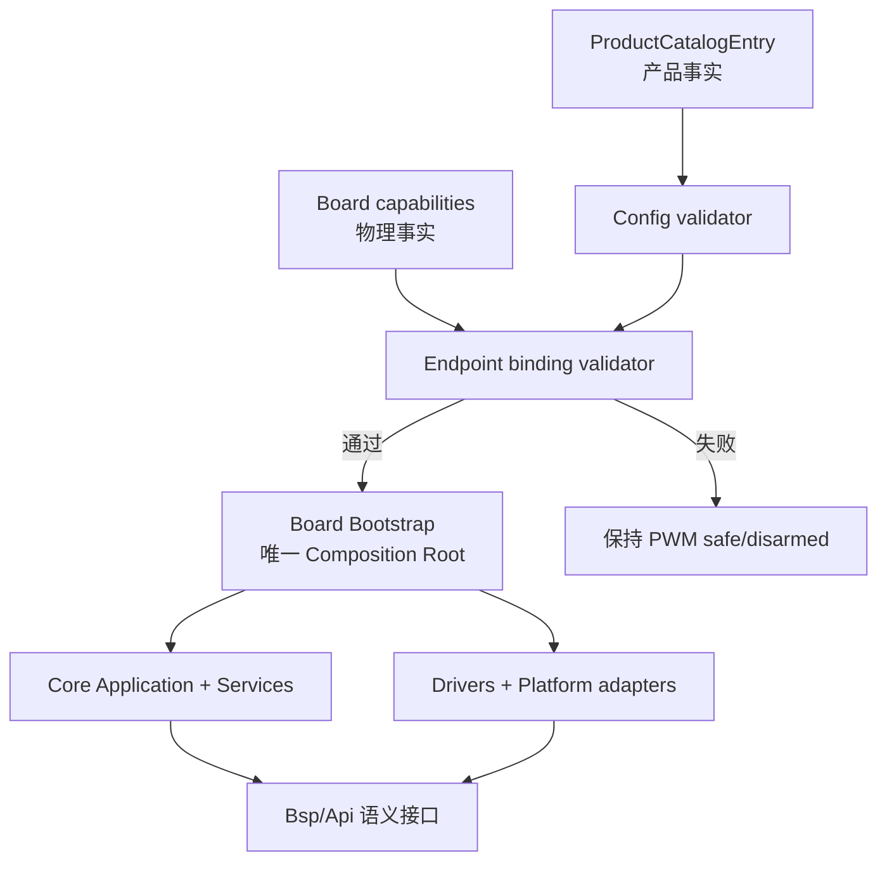
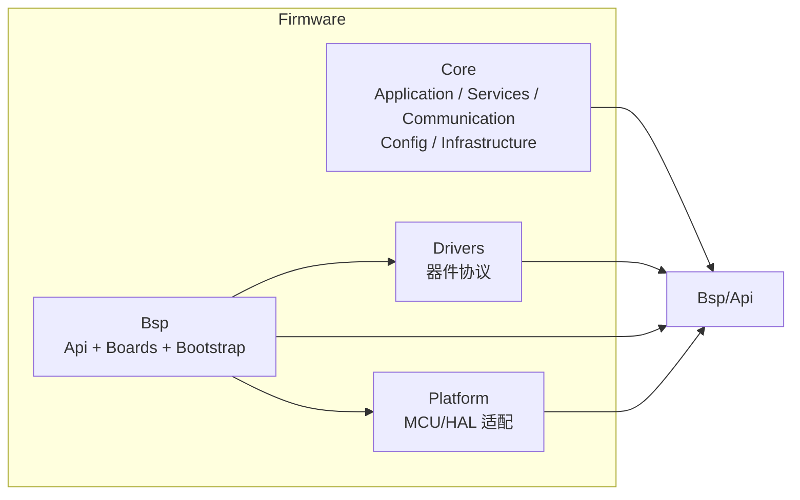
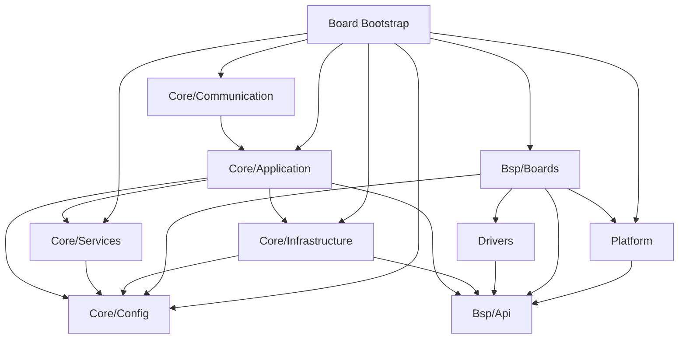
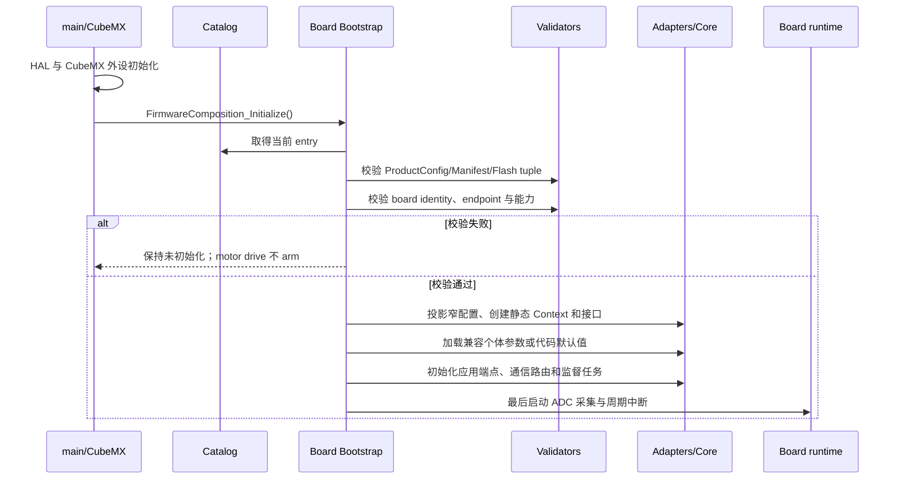
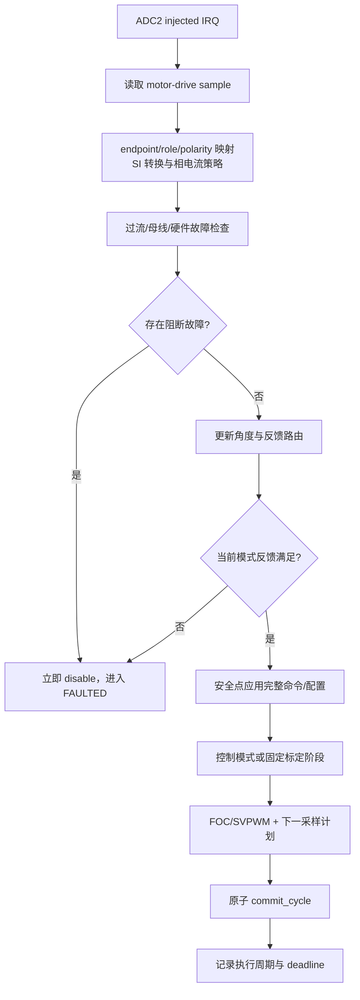

# 可配置电机固件架构契约（V2）

本文是 [`firmware_architecture.md`](firmware_architecture.md) 的约束版说明，用于评审新板、新 MCU、新电机与新传感器接入是否保持解耦。它只描述当前最终目录和已实现边界。

## 1. 核心原则

一个产品构建由一个不可变 `ProductCatalogEntry` 定义。Core 决策“做什么”，BSP 定义“需要什么硬件语义”，Board 描述“这块板实际有什么”，Platform 实现“怎样调用 MCU/HAL”。任何配置与物理能力不一致都必须在周期中断启动前失败，并保持电机输出关闭。



## 2. 四个顶层所有者



| 所有者 | 可以知道 | 不可以知道 |
| --- | --- | --- |
| `Core` | 产品语义、控制/安全/协议规则、通用 BSP 接口 | MCU、HAL、引脚、ADC Rank、具体传感器总线实例 |
| `Drivers` | 某器件协议和通用总线事务 | 板卡、产品 entry、MCU 寄存器、业务状态机 |
| `Bsp` | 通用硬件语义、板级 endpoint/能力、板级组装 | 把缺失硬件声明为可用、在公共 API 暴露 HAL 类型 |
| `Platform` | MCU/HAL、外设实例、时间和寄存器细节 | 产品选择、控制模式、协议命令、标定策略 |

完整物理树：

```text
Firmware/
├── Core/{Application,Services,Communication,Config,Infrastructure}
├── Drivers/
├── Bsp/{Api,Boards/<board>/Bootstrap}
└── Platform/<mcu>/
```

组合根只能位于 `Bsp/Boards/<board>/Bootstrap`。文件名中保留的 `*_runtime.*` 表示 Application 内部实时编排单元，不构成独立架构层。

## 3. 严格依赖方向



评审规则：

- Core 源文件出现 HAL/CMSIS、具体 STM32 外设句柄或板级头文件即为违规；
- Application 只能调用协议无关的用例契约，不能解析 CAN/USB 帧；
- Communication Router 只做协议语义到 Application API 的映射；
- Board 负责能力表和 endpoint 绑定，Platform 不重复保存一套产品参数；
- 只有 Bootstrap 能取得完整 `ProductConfig`，叶模块只接收必要字段；
- 所有跨中断数据必须明确单写者与同步方式。

## 4. endpoint 与实例映射

endpoint 是稳定的逻辑资源 ID。它解决“产品想使用哪个资源”，不是“资源位于哪个 ADC/GPIO”。


因此：

- 电流通道必须用 `role` 明确 A/B/C/DC-link，不能依赖数组顺序；
- 角度和温度使用 `instance_id + role/zone + endpoint`；
- endpoint 在产品 entry 和板包中必须一一对应；
- 缺失、重复、来源不匹配或能力不足均 fail-closed；
- 同一驱动器实现可以被多个 endpoint 实例复用，但状态 Context 必须独立；
- Bootstrap 必须按传感器 `design_id` 精确选择 Driver，未知 ID 不得回退到默认器件实现。

## 5. BSP 契约

公共接口保持窄且以物理语义命名：

- `bsp_motor_drive.h`：PWM、同步电流采样计划、母线原始值、硬件故障和立即关断；
- `bsp_angle_sensor.h`：来源无关、带状态和序号的标准化角度；
- `bsp_temperature.h`：带时间/状态的温度监测样本；
- `bsp_communication.h`：原始帧与字节流；
- `bsp_system.h`：时间、临界区、身份、存储、复位和诊断；
- `bsp_indicator.h`、`bsp_synchronous_serial.h`：指示与通用同步串行事务。

`BspMotorDrivePort` 的快环操作必须有界、无阻塞、无分配、无日志。`commit_cycle()` 同时提交 PWM 与采样计划，避免单分流/两分流项目出现“新 PWM + 旧触发点”的不一致周期。

## 6. 启动契约



周期中断永远晚于 ISR 可见 Context 的完整初始化。加载 Flash 失败只能回退安全默认值，不能改变产品 identity 或硬件设计值。

## 7. 20 kHz 契约



当前板级基准是 20 kHz；速度环 2 kHz、位置阻抗环 1 kHz、级联位置外环 5 kHz。所有分频由 board/control 配置一次性派生并验证，不允许各模块各自维护另一套周期常量。

## 8. 产品能力不是目标板能力

| 项目 | 框架可表达 | 当前 VectorMiniSt 已接通 |
| --- | --- | --- |
| 电流 | inline 3、low-side 3/2、DC-link 1-shunt | 仅 low-side 3-shunt 固定同步采样 |
| 角度 | 0/1/2 个实例与显式 route | 0/1 个和 `primary + output shaft` 可组装；`primary + redundant`、自动降级和独立第二转子 LUT 不支持并拒绝 |
| 持久化角度 | 实例采集状态独立 | schema 10 只有 primary 的一份 rotor LUT/方向/零位；output 实例不复用该标定状态 |
| fallback | 可配置字段 | 活动产品为 `NONE`；没有已发布自动 fallback |
| 温度 | 0..3 个实例和多个 zone | Bootstrap 当前最多 1 个；MCU internal monitor-only |
| CAN | Classic/FD/BRS | 活动产品为 Classic 1 Mbit/s、8-byte、无 BRS |
| 通信可选性 | Core 可接不同 transport | 当前 VectorMiniSt Bootstrap 必须同时绑定 CAN 和 USB byte-stream；关闭任一项会拒绝启动 |

纯算法 `phase_current_strategy` 已包含多种拓扑，也不代表相应 ADC 触发、有效窗口和 PWM 原子调度已经在 VectorMiniSt 上实现。未满足 Board capability 的配置必须拒绝启动。

## 9. 标定与持久化契约

标定阶段次序固定；ProductConfig 的能力与策略只允许裁剪不适用阶段，不能重排先后依赖。当前两个 VectorMiniSt entry 都要求：电流 offset → 相电阻验收 → 方向 → LUT → 电/机械零位 → 摩擦 → 齿槽 → 保存。

Bootstrap 已将 `ProductConfigDerived.commissioning_steps` 投影到有序工作流，并将同一 mask 用于 Mode 21 和独立标定命令的准入。全禁用配置仍可正常启动，但 Mode 21 与各单项标定会拒绝；Mode 8/9 作为参数加载/保存维护命令仍可使用。未实现的双角度对齐和 sensorless validation 必须关闭而不是静默跳过。

`features` 也会投影为控制模式策略：关闭的速度、位置、输出位置或无感功能不能通过 CAN/USB 或内部端口进入相应模式；`OPTIONAL` 仅在能力存在时启用，`REQUIRED` 缺能力则在启动前失败。温度同样执行 `OFF / OPTIONAL / REQUIRED` 语义，并与实例保护开关共同决定是否进入故障链。

Flash 记录使用 schema、compatibility tuple、configuration fingerprint、序号和 CRC 验证。仅持久化模组个体标定量；设计 R/L/磁链、板级比例、控制参数、限值和通信默认值始终来自活动 entry。

## 10. 新平台完成定义

新增项目只有在以下条件全部满足后才算完成：

1. Core 和 Drivers 的 host 构建不需要目标 MCU 头文件；
2. ProductConfig 与 Board binding 正反例测试覆盖所有启用 endpoint；
3. 目标工程只编译最终目录中的存在文件，且只包含一个 Board Bootstrap；
4. 链接结果不越过板包定义的 application/parameter Flash 边界；
5. 无母线时完成启动、通信、参数与 fail-closed 验证；
6. 重新确认电源电压、限流、接线、负载和急停后，完成 PWM/ADC/保护实测；
7. 20 kHz deadline、统一标定、断电恢复、CAN/USB 和闭环逐级验证通过；
8. 未实现的传感器 fallback、冗余/第二 LUT 或目标板采样拓扑保持配置禁用，而不是静默降级；
9. 新器件由精确 `design_id` 分派并覆盖未知 ID 负例；新 fingerprint/compatibility tuple 不误读旧 Flash，任何 ABI 变化都有 schema/migration 与断电测试。
