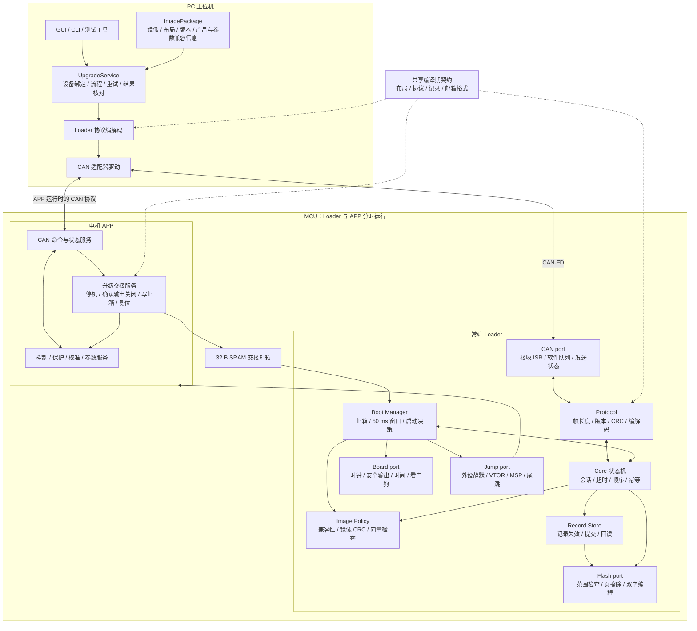
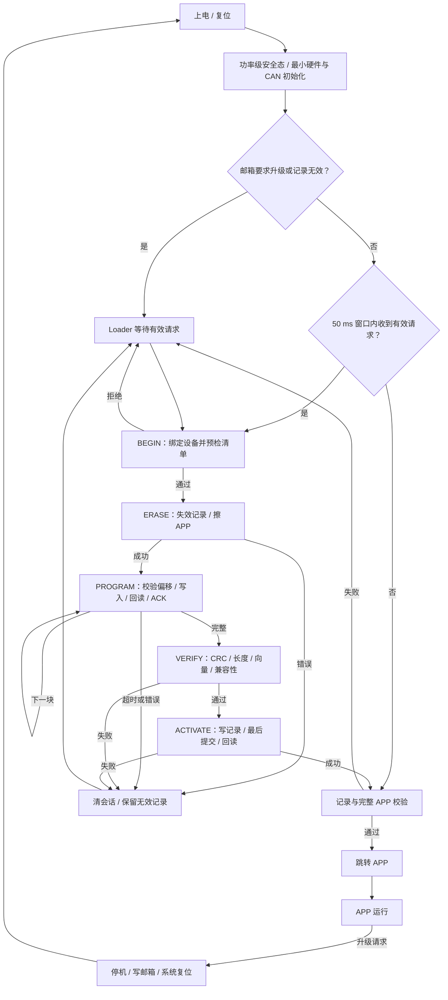

# D-loader 软件架构及 Flash / RAM 分配

日期：2026-09-17。范围：通用 MCU Loader 框架的首个 STM32G431CB 目标，删除 MCU USB 后的实现及内存配置。

状态：详细设计，尚未按本文件修改源码或链接脚本。固定 Flash 分区沿用原方案；RAM 固定栈顶、v2 记录和邮箱格式为新增建议。历史产物的实际地址不能误认为新设计已经实现。

相关文件：[通用 MCU / CAN-FD / UART 框架](d_loader_portable_framework_20260917.md)、[总设计](d_loader_design_20260917.md)、[空间分析](d_loader_space_optimization_20260917.md)。本文件的地址、40 B 数据块、8 B 编程单元、64 B 记录和 Cortex-M 跳转检查仅用于 G431 target；公共 Core 不固定这些条件。

## 1. 实现原则

Loader 和 APP 是两个分别编译、分别链接的独立固件。正常复位先执行 Loader，Loader 决定启动 APP 或等待升级。APP 不链接整个 Loader，也不在运行电机控制时擦写自己的程序区。

Loader 采用裸机主循环、小型中断接收队列和显式状态机，不引入 RTOS，不使用动态内存，不缓存整份 APP 镜像。CAN-FD 单帧最多携带 40 B 升级数据，写 Flash 后读回，再确认下一偏移。

移除 MCU USB 后，设备升级框架支持 CAN-FD 和 UART，第一阶段实现并验证 CAN-FD；两种 adapter 共用 Core，按目标可单独启用或同时监听。PC 的 USB-CAN 适配器可以继续使用，其驱动属于 PC 软件。下图展开第一阶段 CAN-FD 路径，双链路及 MCU/Board 分层见通用框架文档。

## 2. 软件总框图



框图中 APP 与 Loader 同时画出仅表示模块关系，运行时只有一方活动。共享契约是头文件/生成的常量，不是驻留在 RAM 中的第三个程序。

## 3. 模块与接口

以下为建议拆分；历史 `loader_main.c` 中的初始化、命令处理和启动策略将分离，避免主文件同时承担所有逻辑。

| 模块 | 建议文件 | 输入 / 输出 | 关键边界 |
| --- | --- | --- | --- |
| 启动装配 | `loader_main.c` | 初始化结果、主循环事件 | 只负责初始化顺序和事件分发 |
| 启动策略 | `loader_boot.c` | 复位原因、邮箱、记录 → 启动或救援 | 只有合法升级请求延长驻留；无有效 APP 必须保持恢复入口 |
| 会话状态机 | `loader_core.c` | 解析后命令、tick → 响应及受控存储操作 | 不依赖 HAL 类型；写命令必须匹配会话和状态 |
| 协议 | `loader_proto.c` | 原始帧 ↔ 结构化消息 | 固定长度、端序、版本、CRC、flags 校验 |
| 镜像策略 | `loader_image.c` | 清单/记录、Flash 只读视图 → 校验结果 | CRC、长度、产品/布局、MSP、Reset_Handler |
| 提交记录 | `loader_record.c` | 已验证清单 → 有效启动记录 | 接收中的镜像永不标记已提交 |
| CRC | `loader_crc.c` | 字节块 → CRC32 | 与 PC 黄金向量一致；支持流式计算 |
| UART adapter | `transport/uart/loader_uart.c` | 有界字节流 ↔ 通用请求 | 第二阶段实现；处理半包、粘包、重同步，不包含升级状态机 |
| CAN port | `ports/stm32g4/loader_can.c` | FDCAN ↔ 原始帧 | 硬件过滤、队列、溢出计数、bus-off、发送完成状态 |
| Flash port | `ports/stm32g4/loader_flash.c` | APP 相对偏移、数据 → 结果 | 硬编码合法分区；拒绝任意物理地址；操作后回读 |
| 板级 port | `ports/stm32g4/loader_board.c` | 板级配置 → 安全环境 | 尽早关闭功率输出；不初始化电机控制环 |
| 跳转 port | `ports/stm32g4/loader_jump.c` | 已校验向量 → APP | 处理外设/中断状态，最后切换 MSP 并尾跳 |
| APP 交接 | APP 内 `boot_handoff.c` | APP 升级请求 → 停机、邮箱、复位 | 停机完成后才复位，交接目标节点与事务标识 |

建议接口语义：

```c
bool link_rx_pop(loader_frame_t *out);
tx_result_t link_send(const uint8_t *frame, uint8_t length);
tx_state_t link_tx_poll(void);  /* 入队与实际发送完成分开 */

void core_on_request(const loader_request_t *request);
void core_on_tick(uint32_t now_ms);

flash_result_t flash_erase_app_page(uint32_t page_index);
flash_result_t flash_program_app(uint32_t offset,
                                const uint8_t *data, uint32_t length);
image_result_t image_validate(const image_manifest_t *manifest);
record_result_t record_commit(const image_manifest_t *manifest);
```

类型和函数名称为设计接口，并非当前分支已存在的 API。实际实现以静态调用为主，不为可移植性引入大量函数表和动态注册。

## 4. 运行流程与升级数据流



单次 PROGRAM 的实现路径：

```text
FDCAN 硬件 FIFO
  → 接收 ISR：检查 ID/帧类型，复制到原始帧队列
  → 主循环：取帧，检查长度、版本、CRC
  → Core：检查目标、会话、状态、偏移、镜像边界
  → Flash port：最多写 40 B，即最多 5 个 8 B 编程单元
  → 回读并比较
  → 更新 next_offset
  → 构造 ACK，报告已确认的 next_offset
  → PC 收到确认后发送下一块
```

接收 ISR 不擦 Flash、不计算整镜像 CRC、不执行控制逻辑。Flash 操作期间 CPU/中断服务可能受存储器忙状态影响；逐请求确认限制在途数据，不能把软件队列容量当作可承受任意连续发送的保证。

写入必须同时满足：`length != 0`、8 B 对齐、`length <= 40`、不跨 2 KiB 页、`length <= image_size` 且 `offset <= image_size-length`，以及物理 APP 分区边界。

重复 PROGRAM 对已写内容进行比较，相同则确认，不重复编程。重复 ERASE 不重新擦除；STATUS 查询不能破坏写操作的幂等信息。超时只清会话并进入等待，不尝试运行半成品 APP。

## 5. Flash 地址分配

以本工程使用的 128 KiB Flash、2 KiB 页布局为基准。所有范围均含两端。

```text
低地址
0x08000000 ┌────────────────────────────────────┐
           │ Loader：向量表、代码、常量、RW 初值 │ 12 KiB，页 0–5
0x08003000 ├────────────────────────────────────┤
           │ APP 提交记录页                     │  2 KiB，页 6
0x08003800 ├────────────────────────────────────┤
           │ 预留页                             │  2 KiB，页 7
0x08004000 ├────────────────────────────────────┤
           │ APP 向量表、代码、常量、RW 初值    │ 96 KiB，页 8–55
0x0801C000 ├────────────────────────────────────┤
           │ 电机参数 / 编码器标定 / 保留空间  │ 16 KiB，页 56–63
0x08020000 └────────────────────────────────────┘ 高端边界，不包含
```

| 区域 | 起始地址 | 结束地址 | 固定容量 | 当前使用 / 目标 |
| --- | --- | --- | ---: | --- |
| Loader | `0x08000000` | `0x08002FFF` | 12,288 B | 历史构建 11,268 B，余 1,020 B；新增功能需重建确认 |
| APP 记录 | `0x08003000` | `0x080037FF` | 2,048 B | 历史记录 24 B；建议 v2 记录 64 B，按整页管理 |
| 预留 | `0x08003800` | `0x08003FFF` | 2,048 B | 首期不用，不作为第二 APP 槽 |
| APP | `0x08004000` | `0x0801BFFF` | 98,304 B | 删除 USB 后约 88,674 B 的对象归属估算；目标 ≤94,208 B（92 KiB） |
| 参数/标定 | `0x0801C000` | `0x0801FFFF` | 16,384 B | 保留整个区，不将剩余部分挪给 APP |
| **总计** | | | **131,072 B** | **128 KiB** |

Code、RO 常量以及已初始化全局变量的初值都占 Flash；ZI 不占镜像数据空间。最终门禁使用 ELF/HEX 加载范围与实际链接结果，不能仅计算 `.text`。

### Flash 写入权限

| 操作者 | Loader | 提交记录 | 预留页 | APP | 参数/标定 |
| --- | --- | --- | --- | --- | --- |
| CAN 升级中的 Loader | 不写 | 写 | 不写 | 写 | 不写 |
| 正常电机 APP | 不写 | 不写 | 不写 | 不写 | 仅参数服务按现有规则写 |
| 首次部署/维护工具 | 按部署包写 | 按部署流程写 | 默认保留 | 按部署包写 | 默认备份并保留 |

这是软件访问策略；Flash 位于同一 MCU 并不自动形成硬件权限隔离。是否对 Loader 页启用 WRP 由后续维护方式决定。

### v2 提交记录：建议 64 B

| 偏移 | 大小 | 字段 |
| ---: | ---: | --- |
| 0 | 4 | 新格式 magic |
| 4 | 2 + 2 | format_version / record_length |
| 8 | 4 | layout_id |
| 12 | 4 | product_id |
| 16 | 4 | hardware_compat_id |
| 20 | 4 | app_base |
| 24 | 4 | image_size，实际传输及 CRC 覆盖长度 |
| 28 | 4 | image_crc32 |
| 32 | 4 | firmware_version |
| 36 | 2 + 2 | image_type / flags |
| 40 | 4 | param_abi_id |
| 44 | 2 + 2 | param_schema_min / max |
| 48 | 4 | reserved，按规定填充值 |
| 52 | 4 | record_crc32，覆盖前 52 B |
| 56 | 4 + 4 | commit_magic / 其反码，最后写入 |

记录内部统一使用明确的字节编码，例如固定小端，与 CAN 帧大端分别处理；禁止依赖任意 C 结构体 padding。具体 magic 和格式版本在实现时登记，补充长度/偏移静态断言和黄金字节向量。

先编程并回读前 56 B，再写最后 8 B 提交单元。只有格式、CRC、提交标记及其反码全部有效，且 APP 校验通过，才允许启动。记录占 64 B 不代表能将其余 1984 B 当作普通参数区；它仍属于 Loader 管理的整页。

每次升级先使旧记录失效，再擦 APP。这个顺序保证中断升级后不误启动新旧混合镜像，但单 APP 方案不能自动恢复被擦除的旧版本。

## 6. RAM 总体分配

以下针对当前工程链接使用的 `0x20000000–0x20007FFF`，共 32 KiB；这里描述链接地址窗口，不额外假定其他 RAM 可用。

**Loader 与 APP 分时复用 RAM，不能把两者占用相加。** APP 启动代码会重新初始化自己的 RW/ZI；需要跨软件复位交接的数据只能放在双方明确保留的邮箱中。

### 新版共同边界：建议固定 3 KiB 顶部栈

| 地址范围 | 容量 | 用途 |
| --- | ---: | --- |
| `0x20000000–0x2000001F` | 32 B | 交接邮箱，双方排除在普通 RW/ZI 清零之外 |
| `0x20000020–0x200073FF` | 29,664 B | 当前固件的全局数据、队列、工作区及需要的堆 |
| `0x20007400–0x20007FFF` | 3,072 B | 当前固件栈，向低地址增长 |
| 初始 MSP | — | `0x20008000`，栈顶为 RAM 高端边界 |

这与历史 map 的“栈顺排在 RW/ZI 后面”不同，需同步修改两个链接配置和 startup，且从 `.ANY(+RW +ZI)` 中明确排除并单独放置 STACK。不能只改向量表初始 MSP，而仍让旧的 STACK 段重复占用 RAM。

3 KiB 是起始预算，不是已验证的最大栈深度。后续结合静态调用分析和最坏中断嵌套高水位确认；固定栈边界也不自动提供溢出保护。

### Loader 的目标 RAM 使用

```text
0x20000000 ┌─────────────────────────────────────┐
           │ 交接邮箱                            │   32 B
0x20000020 ├─────────────────────────────────────┤
           │ .data/.bss：队列、会话、协议缓冲     │ ≤4064 B 的设计预算
0x20001000 ├─────────────────────────────────────┤
           │ 保留余量，不启用动态堆/整镜像缓存  │ 25 KiB
0x20007400 ├─────────────────────────────────────┤
           │ Loader 栈                           │ 3 KiB
0x20008000 └─────────────────────────────────────┘
```

`0x20001000` 是建议静态区预算边界，具体对象由链接器排布，不要求手工固定每个数组地址。4064 B 预算包含 RW/ZI 对齐与运行库状态，超出时由构建门禁报警。

| Loader RAM 项目 | 大小 / 预算 | 说明 |
| --- | ---: | --- |
| 原始 RX 队列 | 历史 544 B | 8 个 68 B 槽；历史 head/tail 空槽法实际可排队 7 帧 |
| 收发处理临时缓冲 | ≤256 B | 例如原始请求/响应及编码区，控制重复拷贝 |
| 写请求幂等与回复缓存 | ≤256 B | 与只读请求缓存区分；可复用前项空间但预算先独立计 |
| 会话与待提交清单 | ≤256 B | session、启动实例、偏移、状态、超时、兼容信息 |
| 提交记录工作副本 | 64 B | 不缓存整个记录页 |
| CAN/HAL 句柄、诊断及运行库数据 | ≤1024 B | 以最终 map 校验，包含对齐和全局变量 |
| 对齐及后续小功能余量 | 剩余预算 | 上述合计 2400 B，距静态区预算尚余 1664 B |
| 动态堆 | 0 B，目标 | 删除 Loader startup 的 512 B 堆需确认其 C 运行库启动配置可无堆运行 |
| 栈 | 3072 B | 与 .data/.bss 分开计，局部变量不能再次当作静态占用相加 |

Loader CAN-only 总预留使用预算为 `32 + 4064 + 3072 = 7168 B`，即 **7 KiB，含邮箱和栈**，其余 25 KiB 可暂不使用。这里的 7 KiB 是预算，不是预测一定消耗 7 KiB。UART/双链路版另加字节环形队列、组帧缓冲和驱动状态，优先从该静态区余量配置；超限必须调整目标预算和门禁。

无需 2 KiB 页缓存：当前按 ≤40 B 写入并读回，CRC 可直接遍历 Flash。以后若引入页缓存或滑动窗口，再单独从余量中分配。

### 历史 Loader 的实际 RAM

历史 map 的 RW+ZI 为 **4552 B**，范围 `0x20000020–0x200011E7`：

| 项目 | 实际 B |
| --- | ---: |
| .data/.bss、运行库状态、对齐等 | 968 |
| 启动文件 HEAP | 512 |
| 启动文件 STACK | 3072 |
| **总计，不含邮箱** | **4552** |

历史栈范围为 `0x200005E8–0x200011E7`，初始 MSP 为 `0x200011E8`。不能将新设计的固定顶部栈地址标注为历史实际值。

### APP 删除 USB 后的 RAM 估算

| 项目 | RAM / B | 分类 |
| --- | ---: | --- |
| 参数/校准自定义堆池 | 12288 | 保留；目前用于校准数组和参数临时记录 |
| RTT 数据与控制块 | 3256 | 保留工程观测，后续可按生产配置缩减 |
| 启动文件 C 堆 | 512 | 暂按现状保留，确认运行库需求后再优化 |
| APP 栈 | 3072 | 当前容量基线，目标固定在顶部 |
| 其他全局数据与对齐 | 6369 | 按无 USB 估算余额，含控制状态、运行 LUT 等 |
| **APP 合计，不含邮箱** | **25497** | **约 24.90 KiB，移除 USB 前 map 推算** |
| 交接邮箱 | 32 | 新增双方保留 |
| **剩余 RAM 估算** | **7239** | **约 7.07 KiB，尚未扣新增交接/CAN 业务** |

其他全局数据中的运行 LUT 和 Flash 参数记录不是同一份存储：Flash 保留持久化数据，RAM 保存实际控制使用的状态/查表。自定义堆和 C 堆分别统计，不能混为一个 12 KiB 堆。

APP 将 12 KiB 自定义池作为 .bss 的一部分，由链接器放在共同数据区内；无需给每个功能硬编码 RAM 物理地址。需要固定的只有邮箱、数据区边界和栈，缓冲区容量通过静态断言与 map 门禁约束。

## 7. 32 B 邮箱格式与生命周期

建议新邮箱使用 8 个 32 位字，确切字段语义在实现时冻结：

| 偏移 | 字段 | 用途 |
| ---: | --- | --- |
| 0 | magic | 最后写入的有效标记 |
| 4 | format_version | 拒绝不认识的格式 |
| 8 | command | 无请求 / ENTER_LOADER / 启动跟踪等 |
| 12 | node_arg | APP 节点或临时 Loader 节点交接参数 |
| 16 | transfer_id | PC 升级事务关联 |
| 20 | boot_attempts | 可选启动失败跟踪计数 |
| 24 | flags | 启动待确认、健康确认等 |
| 28 | mailbox_crc32 | 覆盖前 28 B 的规定编码 |

写入顺序：先使 magic 无效，写其余字段和按最终 magic 计算的 CRC，内存屏障后最后写有效 magic。读取时检查复位原因、magic、版本、CRC 和字段范围。消费升级命令后清命令；若保留启动跟踪字段则重新计算 CRC。

邮箱不假定跨断电保留，不作为永久设备身份或已安装版本的唯一依据。掉电后从 Flash 提交记录恢复启动判断；记录无效则留在 Loader。

## 8. APP 跳转与链接要求

APP 在 `0x08004000` 链接，向量表位于 APP 起始；第一个字为初始 MSP，第二个字为带 Thumb 位的 Reset_Handler 地址。检查的是 Reset_Handler，而不是 C 的 main 地址。

启动交接顺序：

1. 确认记录、镜像长度、CRC、兼容性、MSP 和 Reset_Handler 全部有效。
2. 保持功率级安全态；停止 Loader CAN 收发，处理必要发送完成状态。
3. 禁止中断，停止 SysTick，清理 Loader 使用的 IRQ 使能/挂起以及 SysTick/PendSV 等状态；按约定处理看门狗和时钟交接。
4. 设置 `VTOR=0x08004000`，执行必要屏障。
5. 使用经过检查的最小汇编跳转段恢复约定的 CPU 状态，切换 MSP，尾跳 APP Reset_Handler；不得切 MSP 后继续使用原 C 调用栈。
6. APP SystemInit/startup 保持正确向量表设置，按契约恢复中断并完成自身 RW/ZI 和外设初始化。

ACTIVATE 可通过系统复位重新走上述统一启动流程，避免直接跳转遗漏状态；具体选择在实现时固定，并保证发送结果与 PC 的 APP 身份确认流程一致。

## 9. 构建门禁

- Loader Flash 加载范围严格位于 `0x08000000–0x08002FFF`；APP 严格位于 `0x08004000–0x0801BFFF`。
- 两者都不把邮箱包含进 RW 初始化或 ZI 清零；栈段不能与普通 RW/ZI 重叠或重复分配。
- Loader 不链接 USB、FOC、参数迁移业务、浮点格式化和动态分配路径。
- CAN-only/UART-only/双链路按目标选择，未启用传输不链接；核心不得引用 MCU HAL、CAN ID 或 UART DMA 细节。
- APP 移除 USB 后实际重建，不能拿旧 map 的减法代替最终验收。
- 记录和邮箱编解码有固定长度、偏移、端序与 CRC 测试。
- 全流程验证参数/标定区前后逐字节一致；断电后只启动完整镜像或停留恢复模式。
- Loader 12 KiB 预算只剩约 1 KiB 历史余量；新协议可能超限，必须边实现边测量，不能用 APP 剩余空间隐式掩盖 Loader 越界。

本次交付为架构和内存设计，没有修改固件或执行设备写入。
