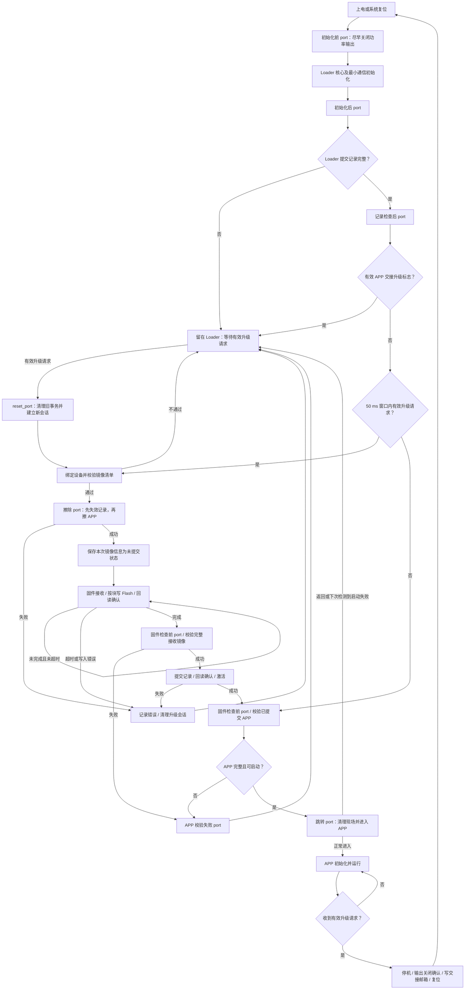
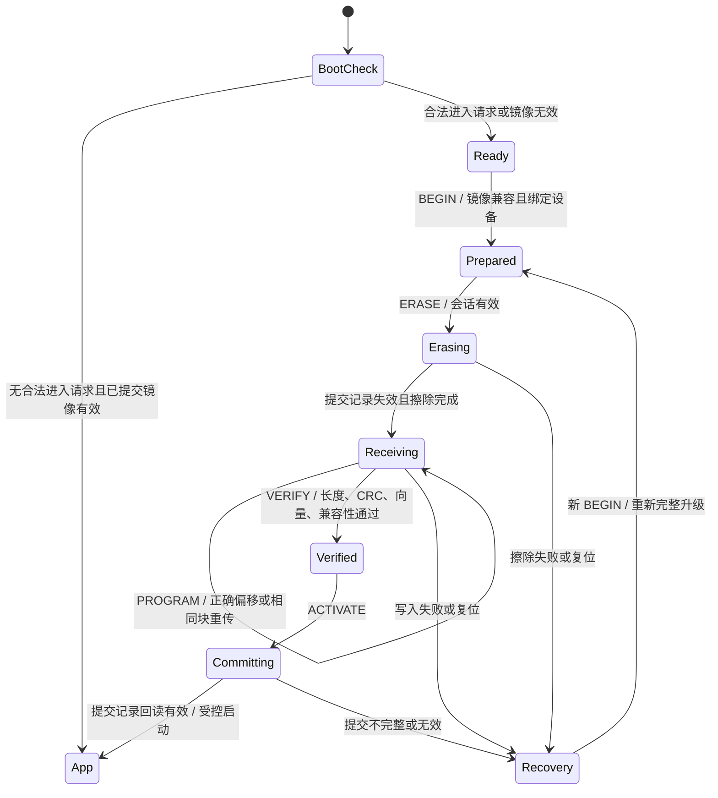

# D-loader 设计与优化方案

日期：2026-09-17。状态：设计提案，尚未实现或进行实机验收。

本方案将 D-loader 定义为常驻升级固件、APP 交接接口和 PC 升级服务三部分。首期目标是可靠完成指定设备的 CAN-FD 升级，在升级中断后保留恢复入口，并完整保留电机参数和标定数据。

后续架构要求已纳入：[多 MCU、CAN-FD 与 UART 通用框架](d_loader_portable_framework_20260917.md)。公共核心与 MCU/板卡/链路解耦；CAN-FD 优先实现，UART 共用升级状态机。本文固定地址和存储几何仅描述首个 G431 target。详细内存及软件框图见 [架构与内存分配](d_loader_architecture_memory_20260917.md)。

## 1. 设计结论

升级主流程参考用户提供的“即时通信版本（救砖）”流程图：上电初始化 → 读取 Loader 记录 → 50 ms 升级窗口 → 检查 APP → 启动 APP 或留在 Loader；接收升级完成后重新检查 APP；接收超时则清理会话并留在 Loader。

采用独立 Loader、单 APP 分区、提交记录最后写入的方案。首个 G431/CAN-FD 配置保留现有 1M/1M、40 字节数据块、逐请求确认机制，先补正确性，再优化吞吐。按用户补充要求，下一步实现删除 MCU 侧 USB 通信与协议栈；通用升级框架同时设计 CAN-FD 与 UART 接口，优先落地 CAN-FD。

- 更新失败后允许设备停留在 Loader，重新完整升级。
- 首期不承诺旧固件自动回滚，也不承诺断电后的断点续传。单 APP 原地擦写无法保存旧镜像。
- Loader 升级通过维护接口完成；普通升级协议只能更新 APP。
- 擦除前识别设备和镜像，激活前校验完整启动条件，激活后确认目标 APP 的身份与版本。
- 当前固件与历史 Loader 的地址布局仍需适配。容量以移除 USB 后的新构建为准；现有 map 显示 USB 专用 Code+RO 约 18.84 KiB，预计足以解决原 APP 分区超限，无需因此调整参数区或更换 MCU。

## 2. 审查依据与发现

当前分支基线为 `7a2d235bf94966bf8743b85d0962a1f00abc7158`，工作区另有未提交修改。当前分支没有 Loader 源码；本次只读审查历史 stash index `29188dc5d3e0ec98a5f5898fae35affd91df9698` 中的 `loader/`、`shared/` 和 `host_app/`，没有恢复 stash。

| 优先级 | 源码或产物证据 | 影响及设计要求 |
| --- | --- | --- |
| 集成阻塞 | 当前 APP scatter 从 `0x08000000` 链接；历史 Loader 要求 APP 从 `0x08004000` 链接 | 不能将当前 APP 原样与 Loader 拼接或通过 CAN 下载；必须重新链接、配置向量表和 RAM 邮箱 |
| 容量基线 / 已选优化路径 | 本地 2026-09-17 含 USB 的 APP map 的 Total ROM 为 107,968 B；历史 APP 分区为 98,304 B | 含 USB 时超出 9,664 B；已决定移除 USB，按 USB 专用 Code+RO 粗估降至 88,674 B（86.60 KiB）。准确收益需重建确认；旧 map 不代表移除 USB 后产物 |
| P0 | `loader_main.c::handle_frame/handle_request` 没有校验请求 session；`handle_begin` 可覆盖进行中的会话 | 错误或过期会话仍可擦除、写入、终止；必须校验会话和命令允许状态 |
| P0 | `loader_cfg.h` 固定 `LDR_CAN_NODE=0`；PC 客户端用同一个 node 进入 APP、查询 Loader、查询升级后的 APP | 节点 3/4 等设备切换阶段后寻址不一致；多个恢复设备可能共享节点 0 |
| P0 | `handle_verify` 只检查长度和 CRC；`handle_activate` 写记录后直接跳转，没有调用 `loader_image_valid` | CRC 正确但 MSP/Reset 向量错误的镜像可在当次激活时被跳转；冷启动检查不能替代激活检查 |
| P1 | 单项回复缓存被 INFO/STATUS 等任意回复覆盖；ERASE 可在 RECEIVING/VERIFIED 状态执行 | ERASE 应答丢失、随后查询状态、再重发旧 ERASE，可能重新擦除；必须定义命令幂等性 |
| P1 | `handle_program` 限制 APP 分区，但未限制 `offset+length <= image_size` | 可写超出声明镜像的内容，然后在 VERIFY 才失败；应在写入前拒绝 |
| P1 | `main` 在解析前因收到一个目标 CAN 帧就设置 `stay=true` | 非法帧可阻止正常 APP 启动；启动驻留应由合法进入命令触发 |
| P1 | `image_type` 仅存入记录；无产品、硬件、参数 ABI 校验 | 错型号、错参数布局镜像无法在擦除前被完整拦截 |
| P1 | ACTIVATE 仅尽力发送 ACK、固定延迟后跳转；PC 必须先拿到 ACK 才检查 APP | ACK 丢失可让已经成功的升级被报告为失败；应设计状态核对流程 |
| P2 | ERASE 和写提交记录各擦一次记录页；`loader_link_send` 不返回发送结果 | 增加擦写消耗，且难区分排队成功和实际发送完成 |

已有 `outputs/loader_cycles_full/summary_1000.json` 记载历史 1000/1000 成功、平均 4751.7 ms；历史故障报告记载 14/14 通过。本次核对了报告文件，未重跑试验。这些记录可作性能参考，不能证明本方案已验证，也不能覆盖上述会话、多节点与新固件布局问题。

## 3. 分区与容量方案

首选保留历史分区，避免移动现有 16 KiB 参数/标定区：

| 区域 | 地址范围（含两端） | 容量 | 写入权限 |
| --- | --- | --- | --- |
| Loader | `0x08000000–0x08002FFF` | 12 KiB | 维护接口 |
| APP 提交记录 | `0x08003000–0x080037FF` | 2 KiB | Loader 专用 |
| 预留页 | `0x08003800–0x08003FFF` | 2 KiB | 首期保留 |
| APP | `0x08004000–0x0801BFFF` | 96 KiB | APP 升级协议 |
| 参数与标定 | `0x0801C000–0x0801FFFF` | 16 KiB | 原参数服务；Loader 不写 |

RAM 首 32 B 用作跨软件复位邮箱；Loader 和 APP 的 RW/ZI 都从 `0x20000020` 开始。冷启动邮箱内容必须校验并结合复位原因处理，不假定断电保留。

容量策略：先完整移除 USB，再按新 map 决定是否继续优化。详细模块账目和删除范围见 [USB 移除与空间优化分析](d_loader_space_optimization_20260917.md)。本次分析仍使用含 USB 的旧产物，未把估算当作已完成删除的实测结果。

容量门槛：

1. 重建当前普通版/HIL 版，按最终 HEX/ELF 加载地址计算跨度，不能只看 C 文件大小或 Code 字段。
2. 删除 USB CDC、应用协议、专用环形缓冲、PCD/LL USB 编译输入及调用入口，同步清理 CubeMX 配置。核对 USB 独有业务是否需迁移到 CAN，保留电机控制、校准和保护功能。
3. 硬上限为 96 KiB；建议 APP 发布预算 ≤92 KiB，留 4 KiB 增长空间。仅扣除 USB 专用 Code+RO 的估算已降至约 86.60 KiB，对 96 KiB 分区约余 9.40 KiB；USB 所带入格式化库可能进一步释放空间。以实际重链接结果验收。
4. Loader 历史构建约 11,268 B，距 12 KiB 上限只余 1,020 B。每轮加固均需实测尺寸；不能预设新增协议和诊断都装得下。
5. 若容量不满足，重新评估 MCU 容量或分区设计。Loader 扩容会进一步减少 APP 空间；挪动参数区不是默认方案。

构建与打包统一消费一个布局描述，生成 C 常量、链接配置和 PC 镜像元数据；CI 核对向量地址、加载跨度、邮箱保留、参数区不相交。现有从 `0x08000000` 链接的镜像必须被升级工具拒绝。

## 4. 模块划分

```text
PC 界面 / CLI
    └─ UpgradeService：预检、设备绑定、升级流程、重试、结果核对、日志
         ├─ ImagePackage：布局、产品/硬件、参数兼容、版本、长度、校验
         └─ Transport：CAN-FD 优先、UART 共用；RS-485 按硬件另配

APP：进入升级请求 → 停机并确认输出关闭 → 写邮箱 → 系统复位

Loader
    ├─ Core：启动决策、状态机、会话、命令幂等规则
    ├─ Protocol：帧解析、长度/版本/CRC、请求和响应编码
    ├─ ImagePolicy：兼容性、向量、CRC、提交记录
    ├─ Transport：CAN-FD / UART adapter + 多链路单写会话路由
    └─ Platform：独立 MCU Port + Board Port + Target Profile
```

Core 不依赖 HAL/CMSIS 类型、CAN ID、UART 字节流或固定地址，平台操作通过窄接口注入，便于用真正的状态机代码做离线故障测试。保留静态缓冲区，不引入动态分配。PC 两份升级实现收敛成一个服务，GUI、CLI、压测工具及两种传输共用。Flash 几何、启动向量检查和跳转方式由 target/MCU port 提供。

传输发送接口需区分“入队失败、已入队、已发送、超时”。总线关闭与 APP 跳转不能依靠固定延迟推断 ACK 已发出。Flash 接口自身检查空指针、地址、长度、对齐和分区边界，不能仅信任上层检查。

## 5. 升级状态机

### 5.1 按参考图确定的主流程



记录不完整时直接进入可通信的救援等待，不主动擦除。图中的“走升级流程”在实现中拆成“等待有效请求”和“请求通过预检后擦写”，避免无请求时反复擦 Flash。

有明确 APP 邮箱请求时直接驻留，不要求 PC 再抢 50 ms 窗口。普通上电的窗口从通信链路可接收时开始计时；50 ms 只是请求窗口，不等于上电到 APP 的总耗时。

参考图中的“参数区”在本方案专指 **Loader 升级记录区**，存放 APP 长度、CRC32、版本和提交状态。电机参数/标定区是另一块独立区域，升级擦除操作不涉及它。清单可以先保存在 RAM；掉电续传未启用时，不必为了保存接收进度频繁写记录页。

### 5.2 参考图各 port 的职责

| 参考图节点 | 本方案职责 |
| --- | --- |
| 初始化前 port | 使用最少硬件依赖让功率输出进入安全态，读取必要复位原因；不要等全部时钟初始化成功才处理输出 |
| 初始化后 port | 初始化升级链路、时间基准和必要状态，不启动 FOC 或运动控制 |
| 参数区检查后 port | 读取已验证的 Loader 记录并暴露诊断；不直接解释可变的电机参数结构 |
| 升级窗口等待 port | 有界处理通信，确认完整合法的升级请求；非法帧和只读查询不无限延长窗口 |
| 固件检查前 port | 准备只读校验环境；启动和接收完成共用同一镜像校验函数，后者使用待提交清单 |
| APP 校验失败 port | 保存错误原因并进入救援等待，保留通信与安全输出状态 |
| 检查升级前 port | 检查链路、请求超时和设备选择状态；不能因等待而阻塞通信 |
| 重新请求处理 reset_port | 清理升级协议事务，不等同于 MCU 复位；同一请求重发走幂等应答，不能每次重发都清会话 |
| 擦除 port | 只接受固定 APP/记录区域的内部操作；先失效记录，再擦 APP，禁止客户端传任意物理地址 |
| 跳转 port | 检查启动条件，关闭 Loader 使用的外设/中断并完成受控跳转；无法进入时保留恢复入口 |

这些是明确的扩展点，可实现为静态调用接口；无需为每个节点建立复杂的动态回调框架。

参考图中的 APP 检查进一步收紧为：

1. 前 64 B 非全 `0xFF` 可作快速空片检查，但不能证明镜像有效。
2. 校验提交记录的格式、长度、CRC 和提交标记，再检查 APP 实际范围与全镜像 CRC32。
3. MSP 位于允许 RAM 栈区，满足本工程要求的 8 B 对齐，并避开邮箱保留区；允许合法的栈顶边界。
4. 检查向量表中的 **Reset_Handler**，而非 `main` 地址：Thumb 位为 1，去掉该位后落在本次 APP 镜像范围内。
5. 接收完成后对待提交清单执行同样的镜像检查；通过后才写有效提交记录，随后进入统一启动检查路径。

“跳转失败”分两类：校验失败或跳转函数异常返回可立即留在 Loader；已跳入 APP 后卡死，需要看门狗或外部复位才能重新获得控制。可在邮箱增加带校验的启动尝试标记，由 APP 完成最低健康检查后清除；连续异常启动达到阈值后驻留 Loader。具体阈值和看门狗时限随台架验证确定，不能声称一次分支跳转就能检测 APP 是否正常运行。

### 5.3 内部事务状态



关键规则：

- `BEGIN` 不擦 Flash。活动会话期间另一 BEGIN 返回 BUSY；同一请求重传返回原 session，不能创建新会话。
- 除只读命令、设备选择和初始 BEGIN 外，变更状态的命令均校验非零 session、当前启动实例、目标设备及允许状态。session 用于事务隔离，不是安全认证。
- ERASE 先让提交记录失效并读回确认，再擦 APP。每次会话只执行一次；查询 STATUS 不改变这个事实。重新开始需明确终止旧事务并建立新事务。
- PROGRAM 必须满足 `length <= image_size` 且 `offset <= image_size-length`，并同时满足物理分区边界、8 B 对齐、≤40 B、不跨页。
- 已写块重发时，对照 Flash 内容；完全一致则确认，不重复编程，不一致则返回冲突。未来偏移和部分重叠请求拒绝。
- 序号用于请求对应和重复检测。相同序号、不同内容返回冲突；只读请求不能驱逐写操作幂等信息。
- VERIFY 同时检查实际长度、CRC、MSP、Thumb 位、Reset 地址范围和镜像兼容信息。只有全部通过才进入 Verified。
- ACTIVATE 再检查启动条件，再提交记录。提交回读成功后才启动 APP；启动路径统一使用校验后的跳转入口。
- ABORT 不恢复被擦除的旧 APP。擦除前终止可保留原有效镜像；擦除后终止进入 Recovery。界面明确显示“需要重新升级”。
- 接收超时使会话失效，清除会话、偏移和缓存等 RAM 状态，回到可通信的救援等待；不会清除电机参数，也不会自动跳转。Flash 已变更时保持记录无效，后续接受新请求并完整重刷。正常启动窗口结束未收到请求，与升级接收超时是两种不同事件。
- 启动窗口内只有校验通过、针对本设备的 ENTER/BEGIN 才能要求长期驻留；单纯收到数据或只读扫描不改变启动决策。

## 6. 设备身份与多节点

PC 明确区分 `app_node`、`loader_node` 和稳定的 `device_uid`，升级过程中不能用一个 node 字段代替三者。

正常 APP 交接：停机后将 APP 节点和交接标识放入带版本/校验的邮箱，再复位。Loader 使用有效邮箱提供的临时地址；PC 在 BEGIN 前核对 UID，升级后再次核对 UID 和期望版本。

协议第一阶段继续使用请求 `0x7D0+node`、回复 `0x7E0+node`，Loader 节点限定 0–15。APP 地址范围以当前 APP 协议为准，两种范围分别校验。更大节点规模另行分配 ID，不能直接扩展现有加法公式。

无有效邮箱的恢复模式：

- 首期工具要求同一恢复地址只连接一个待恢复设备；无法确认唯一 UID 时禁止写入。
- 多设备同时恢复列入后续协议能力：发现回复必须有避碰和完整 UID 枚举，SELECT 指定完整 UID 后分配临时地址；未选中的设备不响应写命令。
- 只做随机回复延时不构成唯一性保证。多节点恢复验收前，界面不能提供无差别广播升级。

Loader 不直接依赖电机参数结构解析身份，避免 schema 变化使恢复入口失效。需要独立持久化身份时再定义版本化身份记录，不在本阶段占用预留页。

## 7. 协议与镜像包

保留帧结构 `magic | version | opcode | flags | seq | payload_len | session | payload | CRC32`；拒绝未支持版本、未定义 flags、非法命令长度。对改动 BEGIN/INFO 格式的版本发布协议 v2，旧固件使用明确的 v1 客户端路径，不自动尝试降级写入。

GET_INFO 返回或分页返回：Loader 版本、协议能力、UID、布局 ID、APP 容量、产品与硬件兼容 ID、最大块长、当前启动实例标识。GET_STATUS 返回事务状态、已确认偏移、错误阶段和 Flash/链路诊断。

BEGIN v2 的候选 40 B 清单如下，所有多字节字段固定大端；编号和枚举在实施前登记：

| 字段 | 字节数 | 用途 |
| --- | --- | --- |
| layout_id | 4 | 确认 APP 链接地址与分区契约 |
| product_id | 4 | 产品匹配 |
| hardware_compat_id | 4 | 硬件兼容组匹配 |
| image_type / flags | 2 + 2 | 生产、工厂或调试镜像策略 |
| version | 4 | 镜像版本 |
| image_size | 4 | 补齐后实际传输/校验长度 |
| image_crc32 | 4 | 完整传输内容 CRC |
| param_abi_id | 4 | 参数布局身份，避免同 schema 不同布局 |
| param_schema_min / max | 2 + 2 | APP 可加载或迁移的参数 schema 范围 |
| transfer_id | 4 | PC 事务标识；与 session、UID 联合使用 |

设备选择及启动实例挑战通过独立交互完成，不挤入本清单。精确 opcode 和错误码表在编码阶段冻结；至少区分 BAD_SESSION、BUSY、BAD_IDENTITY、BAD_LAYOUT、BAD_VECTOR、CONFLICT 和具体 Flash 错误。

PC 镜像包包含 manifest、APP 二进制和 SHA-256。manifest 由构建产物生成，不靠操作员手填。先完成镜像读取、补齐、容量、向量、产品与参数兼容预检，再让设备进入 Loader。BEGIN 长度和 CRC 必须针对同一份最终字节计算，不能先 BEGIN 后修改补齐方式。

参数兼容由 APP 参数服务和 PC 预检共同执行；Loader 只检查稳定的兼容标识，不承载整个历史参数迁移系统。设备无有效参数时使用独立的恢复/重新配置流程，不能默认解释为已有标定兼容。

CRC 用于检测传输和存储错误；SHA-256 用于包一致性和追溯。两者都不证明发布者身份；是否增加固件签名由实际分发与可信边界决定，不作为本轮功能扩张项。

## 8. 掉电一致性与激活结果

保留保守写入顺序：校验清单 → 擦记录并验证失效 → 擦 APP → 分块写并回读 → 完整验证 → 写新记录 → 回读记录 → 启动。

新记录使用独立 magic、格式版本、固定长度，包含布局/产品/硬件标识、镜像类型/版本/长度/CRC、记录 CRC，并在最后一个独立 Flash 编程单元写提交标记。启动只接受格式正确、已提交且镜像有效的记录。不能沿用旧 magic 仅靠 CRC 失败猜测记录版本。

首期允许每次升级擦记录页两次，先保证可靠性。减磨作为独立变更：验证完成后直接使用 ERASE 阶段已擦净的记录页可减少一次擦除，但必须证明本次事务拥有干净记录页，处理提交中断和重复 ACTIVATE。不得直接把已编程双字再次写零作为默认失效方案；需先按目标芯片的编程/ECC 约束验证。

掉电恢复含义：擦 APP 前掉电可能仍运行完整旧 APP，也可能进入恢复；擦写中掉电进入恢复；记录提交完成后掉电可启动完整新 APP。验收要求是始终不执行不完整镜像，且可恢复升级，不要求所有断电点都进入 Recovery。

ACTIVATE 超时不立即判失败。PC 依次核查目标 UID 的 APP 版本和健康状态，以及 Loader 的提交状态；无法确认时显示“结果待核实”。禁止因一个 ACK 丢失自动擦除重刷。

受控启动需审查中断、SysTick 挂起状态、VTOR、MSP、CONTROL 及平台时钟交接。优先考虑提交后系统复位，再走统一启动校验；直接跳转保留时使用最小汇编尾跳，避免切 MSP 后继续执行依赖原栈的 C 代码。

## 9. 性能优化顺序

先补测本版本各阶段 p50/p95/p99、重传率、bus-off、FIFO 丢帧、发送超时。历史约 4.75 s 来自旧镜像和旧构建，不能作为新固件的承诺。

1. 保持 40 B 块逐请求确认。96 KiB 按 2 KiB 页切分共 2496 次 PROGRAM；主机每请求额外增加 1 ms，就增加约 2.5 s。
2. 优化 PC 收包路由、USB 适配器等待和进度刷新；UI 以 10–20 Hz 合并刷新，协议 ACK 按实际请求处理。
3. 擦除按页推进，适当加入进度/喂狗点；同 Bank Flash 忙时的 CPU/中断行为必须实测，不假定调用异步接口就能并行收包。
4. 只有测量确认瓶颈在逐请求确认后，才设计页缓冲、累计 ACK 或滑动窗口；这会改变流控、重传和 RAM 预算，单独版本验收。
5. 提高数据段速率、CRC 优化、局部擦除均按测量收益决定。局部擦除需定义旧尾部数据策略。

首版不以协议复杂度换未经验证的速度收益。

## 10. 实施顺序与验收

| 阶段 | 交付物 | 通过条件 |
| --- | --- | --- |
| A：基线与容量 | 移除 MCU USB、独立可构建 Loader、当前 APP 适配、镜像打包门禁 | 普通/HIL 无 USB 链接依赖且布局正确；保留所需 CAN 参数/校准功能；APP 与 Loader 均满足尺寸；参数区不相交；旧地址镜像被拒绝 |
| B：正确性加固 | Core 状态机、会话/幂等处理、统一激活检查 | 真正 C 实现的离线测试覆盖异常会话、重复 ERASE、重复 PROGRAM、越界、坏向量、错误状态 |
| C：协议和 PC | v2 镜像清单、UID 绑定、统一 UpgradeService | 擦除前拒绝不兼容镜像；激活 ACK 丢失能正确核对；取消/超时可解释 |
| D：系统验证 | 多节点、复位/断电、链路故障及输出安全证据 | 目标节点升级；非目标节点 Flash 不变；目标参数区逐字节不变；中断后均可恢复 |
| E：性能优化 | 阶段统计及测量驱动的优化 | 满足约定耗时指标，重跑故障回归，无恢复能力退化 |

必须新增的测试场景：

- 错误 session、旧启动实例、会话中重复 BEGIN、不同内容复用序号。
- ERASE ACK 丢失 → STATUS → 重发 ERASE，已写数据不被重新擦除。
- PROGRAM ACK 丢失 → STATUS → 重发旧块，只返回确认、不重复编程；内容不同则拒绝。
- 超声明长度、整数边界、跨页、最小/最大镜像、未对齐输入。
- CRC 正确但 MSP/Reset 错误、错误产品/布局/参数 ABI，均不允许激活。
- 非法帧和持续只读扫描不会无条件阻止有效 APP 启动。
- Loader 记录无效直接进入救援；接收超时清会话后仍可再次升级；接收完成回到统一镜像校验；窗口计时从链路就绪开始。
- ACTIVATE 应答丢失、提交中断、APP 不上线、APP 回报错误 UID/版本。
- 节点 3/4 等非零节点端到端交接，以及两个恢复设备共享默认地址时工具拒绝不确定写入。
- 记录擦除、各 APP 页擦写、记录每个编程单元及最终提交处的复位/真实断电；模拟复位和真实断电分别报告。
- 无 ACK、拔线、bus-off、RX 溢出后的重试与恢复；功率输出在升级全程保持安全状态。

看门狗策略需要 Loader 与 APP 协同确定，覆盖整段启动、Flash 最坏阻塞和跳转后行为；先按目标硬件实测，再设置时间预算。真实断电和总线故障使用受控台架，且记录参数区前后快照。

## 11. 尚需确定的产品约束

以下项目不阻碍本次方案，但会影响实现：产品/硬件 ID 注册表；镜像类型及生产设备可接受范围；是否必须多设备同时恢复；参数 ABI 的稳定标识；看门狗策略；可接受的首次 Loader 部署方式；新增 Loader 功能能否保持 12 KiB 预算。APP 空间优先通过已确定的 USB 移除方案解决。

本轮仅更新设计和空间分析，没有修改固件、恢复历史源码、构建新镜像或操作设备。
