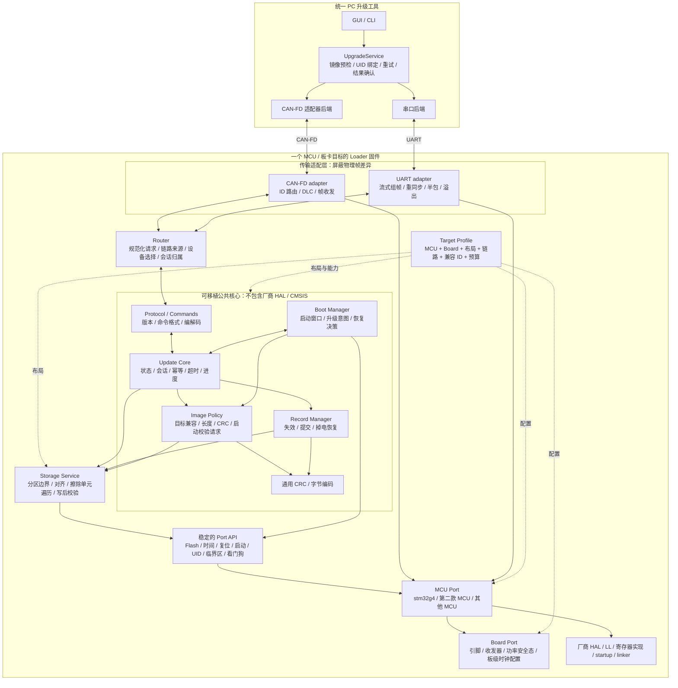

# D-loader 通用 MCU 升级框架

日期：2026-09-17。状态：目标架构设计，尚未实现。

目标：同一套升级核心支持多款 MCU，同时具备 CAN-FD 和 UART 升级能力。首个交付目标是 STM32G431 + CAN-FD，随后接入 UART 和第二款 MCU。原 STM32G431 Flash/RAM 方案作为第一个 target profile，不作为通用框架的固定假设。

“通用”指可移植的软件和一致的升级行为，不表示同一份二进制可烧写所有 MCU。每个 MCU/板卡目标分别编译，独立描述存储布局、时钟、引脚和镜像兼容信息。

相关文件：[目标板内存及实现框图](d_loader_architecture_memory_20260917.md)、[原始审查及升级流程](d_loader_design_20260917.md)。架构冲突时以本文件的多 MCU、多传输设计为准。

## 1. 总体软件框图



公共核心只处理“升级请求”和“镜像”，不处理 CAN ID、DLC、UART DMA 寄存器、STM32 Flash 页号或 Cortex-M 的 VTOR/MSP。

## 2. 分层责任和依赖规则

| 层 | 负责 | 不允许依赖 |
| --- | --- | --- |
| Core | 升级状态、会话、重复请求、超时、错误恢复 | STM32 HAL、CMSIS、CAN ID、UART 句柄、固定 Flash 地址 |
| Image / Record | 镜像清单、兼容策略、CRC、记录完整性、提交顺序 | 某一 MCU 的向量表结构、固定 8 B 编程单元 |
| Storage Service | 合法分区和偏移、范围溢出检查、按设备几何拆分操作 | 具体 Flash 控制寄存器 |
| Transport adapter | 物理帧/字节流转为统一消息，响应路由 | 修改升级状态或绕过 Core 擦写 Flash |
| MCU Port | Flash 驱动、设备 UID、时间、复位、CPU 启动交接、CAN/UART 外设底层 | 产品业务参数和电机控制算法 |
| Board Port | 引脚、时钟源配置、收发器方向/使能、安全输出 | 升级协议状态机 |
| Target Profile | 组合上述能力，声明分区和资源预算 | 重复实现升级业务逻辑 |

同一 MCU 的不同板卡通常只替换 Board/Profile；同系列 MCU 的 Flash 差异由几何描述或 MCU Port 处理；不同 CPU 架构则重新实现 image_boot_probe 和 jump，不修改会话流程。

APP 同样通过薄的交接接口请求进入 Loader。SRAM 邮箱是 G431 的实现选择；其他平台可通过保留 RAM、备份寄存器或目标平台支持的持久化启动标记实现，Core 不固定邮箱物理地址。

## 3. 建议目录结构

```text
loader/
  core/
    loader_boot.c              启动/恢复决策
    loader_update.c            升级会话状态机
    loader_image.c             镜像通用策略
    loader_record.c            记录事务和提交
    loader_storage.c           分区、边界及存储几何适配
  protocol/
    loader_command.c           公共命令语义
    loader_codec.c             固定端序及消息编解码
    loader_crc.c
  transport/
    loader_router.c            来源、目标和会话归属
    canfd/loader_canfd.c        CAN ID、DLC、帧映射
    uart/loader_uart.c          有界字节流解析和帧封装
  port/include/
    loader_port_flash.h
    loader_port_boot.h
    loader_port_time.h
    loader_port_link.h
    loader_port_system.h
  ports/
    stm32g4/                   第一款 MCU 的实现
    <next_mcu>/                后续 MCU 实现
  boards/
    vector_mini_st/             时钟源、引脚、输出安全态
    <next_board>/
  targets/
    vector_mini_st_g431/
      target_config.h
      memory_layout.*          生成链接配置及主机布局元数据
      startup/
      linker/
  tests/
    native/                    内存 Flash + 模拟时钟/链路
    integration/               CAN/UART 一致性及故障注入

host_app/
  .../services/upgrade.py       唯一升级流程
  .../transport/canfd.py
  .../transport/uart.py
  .../image/package.py          按 target 匹配固件包
```

目录代表依赖关系，不要求全部接口使用运行时函数指针。首期可在链接时选择 port 实现，只有多链路路由等必要位置才使用小型静态接口表。

## 4. 统一消息与多链路会话

CAN-FD 和 UART 交给 Core 的都是规范化消息：

```c
typedef struct {
    uint8_t  link_id;           /* 来源链路，不是 CAN ID */
    uint32_t peer_id;           /* 已规范化的对端路由信息 */
    uint16_t opcode;
    uint16_t sequence;
    uint32_t session;
    uint16_t payload_length;
    const uint8_t *payload;
} loader_request_t;
```

结构是软件接口示意，不直接 memcpy 到线上的协议帧。payload 的生命周期由调用约定限定；Core 若需跨调用保留信息，复制到自己的固定容量上下文，不能长期持有已归还的接收缓冲指针。

两种链路共用命令语义：GET_INFO、GET_STATUS、SELECT/ENTER、BEGIN、ERASE、PROGRAM、VERIFY、ACTIVATE、ABORT。CAN 地址或 UART 地址映射由对应 adapter 管理。

**同一设备最多一个修改 Flash 的活动会话。** 归属键至少包括当前启动实例、link_id、peer_id、session 和已绑定设备身份：

- CAN 会话进行中，UART 可只读查询状态；另一 BEGIN/ERASE/PROGRAM 返回 BUSY 或会话错误。
- 响应从请求来源链路返回，不广播到全部接口。
- STATUS 不替换写命令的重传记录。
- 链路中断并超时后释放会话；另一链路可建立新会话并完整重刷。
- 首期不支持升级中途透明切换链路和跨复位断点续传。
- 两个启用链路均由有界轮询处理，避免 UART 连续输入使 CAN 或超时处理饿死。

会话 ID 用于隔离事务，不代表身份认证。设备 UID、产品兼容信息和主机设备选择策略仍需独立校验。

## 5. CAN-FD 与 UART 适配

| 项目 | CAN-FD，第一阶段 | UART，第二阶段 |
| --- | --- | --- |
| 输入形式 | 一帧一消息，具有帧边界 | 连续字节流，需重组消息边界 |
| 寻址 | adapter 负责请求/响应 CAN ID | 首期点对点；多点/RS-485 地址与方向控制单独配置 |
| 完整性 | 物理帧约束 + 应用消息 CRC | 应用消息 CRC，且封装中的地址/长度必须受校验保护 |
| 初始传输块 | G431 profile 为最多 40 B | 首期可用同样 40 B，之后通过能力协商扩展 |
| 缓冲 | 固定帧队列 | 固定字节环形队列 + 有界组帧缓冲 |
| 异常 | bus-off、FIFO 溢出、无 ACK、发送超时 | 半包、粘包、错帧、超长长度、接收溢出、帧间超时 |
| HAL 依赖 | 在 MCU CAN port | 在 MCU UART port |

UART 协议必须定义同步/转义或编码边界、最大帧长、端序、CRC 覆盖范围和接收超时。采用明确可重同步的帧封装，不能把 UART IDLE 中断当作可靠的协议帧边界，也不能把一次 DMA 接收返回当作完整请求。具体线格式在 UART 实施前用黄金向量冻结。

UART 首期可复用公共消息字段和命令，但不带 CAN DLC 的 `0xFF` 填充。需要 RS-485 时额外提供 DE/RE 及发送完成控制；通用 UART 支持不等于当前板上已经有 RS-485 收发器。

支持三种构建配置：CANFD_ONLY、UART_ONLY、CANFD_AND_UART。架构支持第三种运行时同时监听，但首个验证交付物为 CANFD_ONLY。双接口版只有通过会话互斥、资源和实机测试后才标为已支持。

## 6. Flash 几何与启动方式的移植边界

### 不能留在公共核心中的假设

- Flash 起始地址固定 `0x08000000`。
- 全片均为 2 KiB 页、编程单元总是 8 B。
- 擦除态总是按某个写入 API 的特定模式处理。
- Flash 可以直接通过 CPU 指针读取，擦写时还能从同一 Bank 执行代码。
- 启动向量一定包含 Cortex-M 的 MSP 和 Thumb Reset_Handler。
- RAM 从 `0x20000000` 开始且固定为 32 KiB。
- 已写 Flash 可直接再次写入某个失效值。

### Port 能力示意

```c
typedef struct {
    uint32_t base;
    uint32_t size;
    uint32_t program_unit;
    uint32_t program_alignment;
    uint8_t  erased_value;
} loader_partition_t;

/* 不同 MCU 可有不等大小扇区，按地址查询实际擦除单元。 */
port_result_t port_flash_erase_unit_at(uint32_t address,
                                      loader_erase_unit_t *out);
port_result_t port_flash_read(uint32_t address, void *dst, uint32_t size);
port_result_t port_flash_program(uint32_t address,
                                const void *src, uint32_t size);

boot_result_t port_image_boot_probe(const loader_image_t *image);
void port_jump_to_image(const loader_image_t *image);
```

布局生成时确保 APP、Loader、记录和参数分区各自满足实际擦除单元边界；运行时再次校验。遇到扇区跨越保护区的目标布局必须拒绝，不能为了“通用”扩大擦除范围。

核心长度检查用防溢出形式 `length <= image_size && offset <= image_size-length`。写入块长度由传输上限、存储编程单位、写入边界和固定工作区容量共同决定。G431 的 40 B、8 B 对齐、不跨 2 KiB 页属于该目标/链路的首期配置，不能推广为所有 MCU 的硬限制。

若编程单元比单帧可装数据更大，移植目标必须提供有界聚合缓冲和明确的“已接收/已落盘”确认规则，或使用分片消息适配。首期 G431 不需要这条路径；未实现时在目标配置阶段报不支持，不能静默执行不满足硬件要求的写入。

Flash port 负责硬件要求的 RAM 执行、缓存处理、中断屏蔽和错误状态；公共层不能假定页擦除永远不阻塞。看门狗和超时预算必须匹配实际最坏操作时间。

提交记录的最后提交单元按目标实际 program_unit 对齐并独立编程。G431 的 64 B v2 记录只是第一个存储编码：其他 MCU 如要求更大编程粒度，可以使用更大的记录槽；必须保持同样的提交/校验语义，而非固定在偏移 56 写 8 B。

对 Cortex-M，image_boot_probe 检查 RAM 栈指针、Thumb 位、Reset_Handler 和向量表；对不同启动架构，由对应 port 定义入口校验和跳转约定。公共 Image Policy 仅根据结果决定是否可启动。

## 7. 能力协商与镜像包

GET_INFO 分页提供：协议版本、Loader 版本、UID、target/layout ID、产品/硬件兼容 ID、APP 容量、编程单位、最大消息/数据块、启用链路和可选功能。

镜像包至少包含目标兼容标识、layout_id、链接基址、长度、版本、CRC/哈希及参数兼容信息。PC 和 Loader 均按实际 target 检查；不能仅凭“也是 STM32”或文件大小匹配就允许擦除。

目标配置为内存布局的单一来源，生成 C 配置、链接文件和主机元数据。不同型号可拥有不同 Loader/APP 大小，保留参数区是否存在、位置在哪里也由配置决定。没有可靠擦除隔离的目标不应通过构建校验。

## 8. 首个目标的 Flash 与 RAM 分配

多 MCU 架构不改变本轮 G431 的固定 Flash 计划：

| 地址 | 大小 | 用途 |
| --- | ---: | --- |
| `0x08000000–0x08002FFF` | 12 KiB | Loader |
| `0x08003000–0x080037FF` | 2 KiB | APP 提交记录 |
| `0x08003800–0x08003FFF` | 2 KiB | 预留 |
| `0x08004000–0x0801BFFF` | 96 KiB | 无 MCU USB 的 APP |
| `0x0801C000–0x0801FFFF` | 16 KiB | 原电机参数与标定 |

G431 RAM 仍由 Loader 与 APP 分时复用：邮箱 32 B，顶部栈起始预算 3 KiB，其余为当前固件数据区。Loader CAN-only 静态数据预算 4064 B。

UART/双接口版本增加独立字节接收环和组帧缓冲。若首期配置 RX ring 512 B、组帧缓冲 128 B，则仅两项增加 640 B，尚需 UART 句柄、解析状态及对齐；这些容量是候选预算，需按波特率、服务延迟和最大帧长验证。不能用接收缓冲弥补不受控的发送流水。

历史 G431 Loader Flash 实占 11,268 B，12 KiB 分区仅余 1,020 B。新公共层和 UART 并不能保证装进这 1 KiB：

1. 链接时剔除未启用传输；CAN-only 不携带 UART 实现，反之亦然。
2. 简化 vendor 初始化依赖和协议重复实现，先测量实际收益。
3. 双接口固件若超限，停止该配置发布，再评审布局版本变更；不允许侵占记录页或 APP。
4. APP 移除 USB 释放的是 APP 空间，不会自动扩大 Loader 分区。需要扩容时必须重新生成布局、重链接 APP，并制定维护部署流程。

## 9. 实施阶段与可移植性验收

| 阶段 | 交付 | 验收 |
| --- | --- | --- |
| 1 | 公共 Core/Storage/Port 契约 + G431/CAN-FD 实现 | 正常升级、掉电恢复、幂等、参数保护及容量门禁通过 |
| 2 | UART adapter + PC 串口后端 | 同一命令用例同时经过 CAN/UART；覆盖半包/粘包/超时/溢出 |
| 3 | CANFD_AND_UART 配置 | 同时监听，单写会话，跨链路冲突拒绝，响应正确路由 |
| 4 | 第二款 MCU/板卡 target | Core 不改，新增 port/profile/startup/linker 即可运行；真实设备验证 |

第二款 MCU 型号尚未指定。本轮先冻结可移植接口，不虚构其容量、扇区几何或时序。增加第二 MCU 是证明解耦有效的验收步骤，不以“已经抽象接口”替代实际移植。

离线测试使用内存 Flash 模型，至少覆盖均匀页/不均匀扇区、不同编程单位、写入失败、提交各步骤中断，并分别注入 CAN 帧和 UART 字节流。模拟可验证核心逻辑，硬件擦写/中断/看门狗行为仍须各 port 的实机验证。

## 10. 本轮范围

本轮仅补充通用框架设计。后续按 CAN-FD 优先实现，架构从第一步即保留 UART 和多 MCU 接入位置。没有修改或烧录固件，也没有宣称双链路或第二 MCU 已通过测试。
