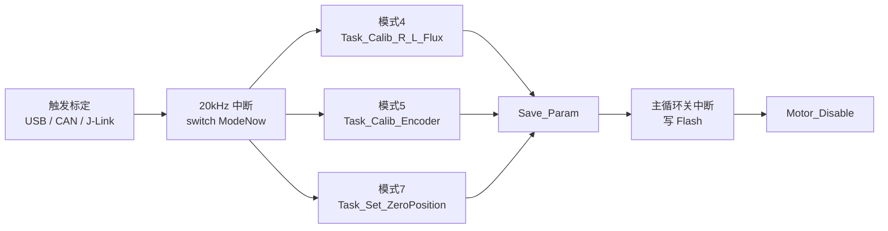

# 标定过程说明

本文档记录 Vector_Mini_ST_Firmware 的标定逻辑与执行方法，包括电机参数辨识（R/L/磁链）、编码器标定、置零、参数保存，以及 USB / CAN / J-Link 三种触发方式。

> 记录日期：2026-08-07。当前默认标定电流 `calib_current = 4.0 A`；默认跳过电机参数辨识（模式 4），电机参数使用默认值：相电阻 1 Ω、Ld/Lq = 100 µH（见 `Foc/foc_param.c`）。上电默认自动执行电流偏置标定（模式 11）。

## 1. 标定模式总览

| 模式 | 名称 | 功能 | 实现状态 |
| --- | --- | --- | --- |
| 4 | Calib_Motor_R_L_Flux | 辨识相电阻 R、dq 电感 Ld/Lq、永磁磁链 ψ | 已实现 |
| 5 | Calib_EncoderOffset | 编码器方向判定 + 偏移 + 偏心补偿 | 已实现 |
| 6 | Calib_Anticogging | 齿槽转矩补偿 | **未实现**（仅枚举占位） |
| 7 | Set_ZeroPosition | 设定当前位置为机械零点 | 已实现 |
| 11 | Calib_CurrentOffset | 三相电流采样 ADC 零点偏置标定 | 已实现，**上电默认自动执行** |

模式 11（电流偏置标定）在开机后自动运行：不输出 PWM，三相 ADC 原始值累计 1 s（20000 周期 @ 20 kHz）取平均写入 `A/B/C_Offset`，完成后自动回到失能（偏置范围校验当前已注释，不因偏置超范围报错）。该过程约 1 s，可在 RTT 波形/调试器里观察到模式从 11 回到 0。

标定任务全部在 **20 kHz FOC 中断**内以状态机 `CalibStep` 逐周期推进（每个中断执行一小步，跨大量周期完成）。完成自动进入 `Save_Param` 写 Flash，随后回到 `Motor_Disable`（失能）。

调度入口：`FOC20kHzIRQHandler`（`Foc/foc_task.c`）→ `switch(ModeNow)` 分发到对应任务函数。



## 2. 前置条件

- 供电 13–30 V，母线电压正常（过压 30 V / 欠压 10 V 保护）。
- 电机**空载、能自由转动**，标定全程电机会转动。
- 确认关键参数：
  - 极对数 `pol`（2–30），必须与电机一致；
  - 编码器型号与使能 `enc_state`（默认外部 TLE5012B 使能）；
  - 标定电流 `i_cal`（当前默认 4 A，一般取电机额定电流 25%–50%）。
- 切入标定模式前，电机必须处于失能（mode 0）且无错误（代码限制见 `ModeSwitch_Handle`）。

## 3. 电机参数辨识（模式 4）

任务函数：`Task_Calib_R_L_Flux`（`Foc/foc_calibration.c:20`），状态机分 4 个阶段。

### 3.1 三相 ADC 零点（CS_ADC_OFFSET，约 1 s）

不输出 PWM，累计三相 ADC 原始值 20000 次（1 s）取平均 → `A/B/C_Offset`。

- 校验范围：[2018, 2078]（12 位 ADC 中点约 2048）；
- 越界 → `CurrentOffset_Error`，中止并回 `CS_NULL`。

### 3.2 相电阻 R（CS_MOTOR_R）

逐相 A → B → C：

1. 单相通电（如 A 高、B/C 低），占空比从 0 每 10 ms 增加 0.0002 缓慢爬升，直到 `|I| ≥ calib_current`（默认 4 A）；
2. 保持 20000 周期（1 s），累加
   - 电压：`V = Vbus × (duty − 2 × 死区占空比)`（死区补偿）；
   - 电流：`|Ia| / |Ib| / |Ic|`；
3. 三相测完后计算：

```
R = (Va+Vb+Vc) / (Ia+Ib+Ic) × 2/3 − 0.004 Ω
```

- `2/3`：单相通电时电流经另两相并联回流，等效电阻为 1.5R，折算回相电阻；
- `0.004 Ω`：MOSFET 导通电阻 + 采样电阻 + 线路电阻补偿。
- 校验 `R ≤ 0.2 Ω`，越界 → `Large_Phase_Resistance`；
- 成功派生：`id_Ki = iq_Ki = R × 200`。

### 3.3 dq 轴电感 Ld/Lq（CS_MOTOR_L）

沿 d 轴注入 1 kHz 正弦电压（20 点表，20 kHz/20），幅值每周期 +0.0001 V 缓升，直到 `Is = √(Iα²+Iβ²) ≥ calib_current/2`（默认 2 A）；稳定后低通滤波并累计 10000 次（0.5 s）取平均 → `Is_testd`。q 轴同样 → `Is_testq`。

```
Ld = (Vd − R·Is_testd) / (ωe·Is_testd)     ωe = 2π×1000 rad/s
Lq = (Vq − R·Is_testq) / (ωe·Is_testq)
最终 Ld/Lq 再 × 2.25（标定经验修正系数）
```

- 校验 `L ≤ 0.5 mH`，越界 → `Large_Phase_Inductance`；
- 成功派生：`id_Kp = iq_Kp = L × 200`。

### 3.4 永磁磁链 ψ（CS_MOTOR_FLUX）

电流闭环拖动（`iqRef = calib_current/2`，默认 2 A；`idRef = 0`），电角度由 `θe += ωe·Ts` 开环积分产生：

1. ωe 从 0 每周期 +0.01 缓升（200 rad/s²），直到 `|duty| ≥ 0.3`（调制量约 25%）；
2. 保持 20000 周期（1 s），累加 `|V| = √(vd²+vq²)`（`vd = mod_d × Vbus/1.5`）与 `|I| = √(id²+iq²)` 取平均；
3. 计算：

```
ψ = (|V| − R·|I|) / ωe − L·|I|      L = (Ld+Lq)/2
```

量纲：V/(rad/s) − H·A = Wb。ψ 供磁链观测器（无感）与电机模型使用。

### 3.5 辨识现象

- 阶段 1：电机被拖到三个特定位置，电流线性上升（测 R）；
- 阶段 2：发出 1 kHz 高频声（测 L）；
- 阶段 3：匀速加速到指定占空比后失能（测磁链）。

## 4. 编码器标定（模式 5）

任务函数：`Task_Calib_Encoder`（`Foc/foc_calibration.c:462`）。

### 4.1 方向判定（CS_DIR）

施加 d 轴电压 `V = calib_current × R × 3/2`，静止 2 s 后以 π rad/s 电气角速度开环转 4 圈，比较 `shadow_count` 差：

- 差 > 0 → `dir = +1`；否则 `dir = −1`。

目的：保证“正 q 电流 → 正方向转矩”，编码器方向与电气角一致。

### 4.2 偏移与偏心补偿（CS_ENCODER）

1. 动态分配 `p_error_arr`（`128 × 极对数` 个 int）；
2. **正转**：π rad/s 电气角速度，每 1/64 s 采样一点（128 点/电气周期），共 `128 × 极对数` 点 = 一整圈机械角，每点：

```
error = 编码器原始读数 − 理想计数值
理想计数值 = θe / (2π × 极对数) × cpr
```

3. **反转**：同一组采样点往回扫，`error = (正转误差 + 反转误差) / 2`（抵消摩擦/滞回）；
4. 收尾：
   - 全部点平均 → `Encoder->offset`（整圈平均偏移，counts）；
   - 128 点窗口 FIR 平滑 → 128 项 `offset_lut`（每 1/128 圈一个补偿值，值 = 滤波误差 − offset）；
   - 释放堆内存 → `Save_Param`。

运行期 `Encoder_Update` 查 LUT 并线性插值，减去 offset 得到机械角，乘极对数得电气角。

## 5. 置零（模式 7）

任务函数：`Task_Set_ZeroPosition`（`Bsp/encoder.c:540`）。单步完成：当前 `count_in_cpr` 写入 `zero_count` 并同步 `shadow_count`，当前位置即机械零点，随后 `Save_Param`。

## 6. 参数保存与恢复

标定完成 → `ModeNow = Save_Param` → 主循环（`Core/Src/main.c`）：

1. 关闭全局中断；
2. `flash_write_param()`：`Param_Upload()` 打包参数 → 擦除 Flash 第 54 页 → 写入；
3. 开启中断 → 回 `Motor_Disable`。

上电时 `flash_read_param()` 恢复参数；`magic_word` 不匹配则回默认参数（`Param_Return_Default`）。

> 注意：**手动改用户参数后需执行模式 9 保存**；模式 4/5/7/8 执行后自动保存，无需重复保存。若 Flash 中已有旧参数，修改默认值不会覆盖已保存值。

## 7. 标定期间的公共保护

20 kHz 中断在标定期间照常执行：

| 保护 | 阈值 | 错误码 |
| --- | --- | --- |
| 母线过压 | > 30 V（持续确认） | Over_Voltage (8) |
| 母线欠压 | < 10 V（持续确认） | Under_Voltage (9) |
| 相电流过流 | > current_limit + 10 A | Over_Current (7) |
| 过温 | ≥ 100 ℃ | High_Temprature (10) |

一旦报错，中断强制回到 `Motor_Disable`；清除错误后（模式 10）方可重新标定。

## 8. 执行方式

### 8.1 USB（推荐，即插即用）

格式：`\w_参数=值\r\n` 写，`\r_参数\r\n` 读。

```text
\w_ica=4\r\n      # 设标定电流 4 A
\w_pol=21\r\n     # 设极对数
\w_mod=4\r\n      # 执行电机参数辨识（R/L/磁链）
\w_mod=5\r\n      # 执行编码器标定
\w_mod=7\r\n      # 可选：设定当前位置为零点

\r_mrs\r\n        # 读相电阻 (mΩ)
\r_mld\r\n        # 读 Ld (µH)
\r_mlq\r\n        # 读 Lq (µH)
\r_mfx\r\n        # 读磁链 (mWb)
\r_err\r\n        # 读错误码
```

### 8.2 CAN

帧格式：扩展 ID = `节点ID << 8 | 参数ID`，DLC = 4，数据为大端 float32。写操作参数 ID 为偶数，读为奇数。

| 操作 | 参数 ID | 数据 |
| --- | --- | --- |
| 设置模式 | 0x00 | 4.0f / 5.0f / 7.0f |
| 读模式 | 0x01 | — |
| 读电阻 / Ld / Lq / 磁链 | 0x45 / 0x47 / 0x49 / 0x4B | — |
| 读错误 | 0x4C | — |

以节点 0 为例，执行模式 4：发 ID `0x004`、数据 `4.0f`（字节 `0x40 0x80 0x00 0x00`），轮询 ID `0x005` 回传 0 表示完成。

### 8.3 J-Link（调试器 / RTT）

- 固件 RTT 通道 1 为 JScope 二进制波形（Ia/Ib/Ic/dtc_a/dtc_b/dtc_c × 1000，int16），可用 J-Link RTT Viewer 观察；
- 固件**未**实现 RTT 终端输入，RTT Viewer 里直接输入命令无效；
- 可用 J-Link 调试器 Watch 窗口直接改 `MotorControl.ModeNow` 为 4/5/7 触发标定（需先保证模式 0、无错误、空载）；也可用 JLink.exe 写 RAM（地址从 .map 中 `MotorControl` 符号获取，`ModeNow` 为结构体首成员）。

## 9. 注意事项

- **顺序依赖**：默认参数下可跳过模式 4 直接跑模式 5（模式 5 的驱动电压按默认 R 计算）；更换编码器、磁钢、电机线序后必须重跑模式 5。若更换电机，需先重新辨识 R/L（模式 4）或改默认值。
- **i_cal**：当前默认 4 A；过大可能烧电机，过小辨识效果差；低电感低内阻电机（如涵道电机）辨识结果较差，需人工甄别。
- **空载**：全程电机空载、不断电，标定中不要触碰电机。
- **模式 6（齿槽补偿）未实现**，请勿依赖。
- 闭环模式（1/2/3）之间切换必须先回模式 0；标定完成自动回 0。

## 10. 代码索引

| 内容 | 位置 |
| --- | --- |
| 标定模式定义 | `System/data_type.h`（ModeNow_TypeDef） |
| 标定状态机枚举 | `Foc/foc_calibration.h`（CalibStep_TyepeDef） |
| 电机参数辨识 | `Foc/foc_calibration.c` Task_Calib_R_L_Flux |
| 编码器标定 | `Foc/foc_calibration.c` Task_Calib_Encoder |
| 置零 | `Bsp/encoder.c` Task_Set_ZeroPosition |
| 模式调度 | `Foc/foc_task.c` FOC20kHzIRQHandler |
| 默认参数（i_cal=4 A） | `Foc/foc_param.c` Param_Return_Default |
| 保存 Flash | `Core/Src/main.c` + `Bsp/flash.c` |
| 模式切换保护 | `Foc/foc_errhandle.c` ModeSwitch_Handle |
