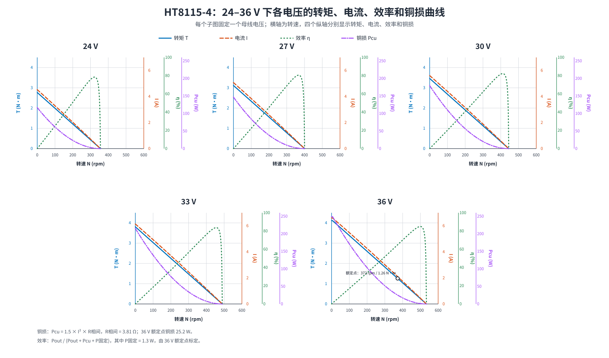

# HT8115-4：24–36 V 单电压组合性能图（含铜损）

## 图中工况

图中按 3 V 步进给出 24 V、27 V、30 V、33 V、36 V。每一个子图对应一个固定母线电压；横轴为转速 N，纵轴依次为转矩 T、电流 I、效率 η 和铜损 Pcu。

## 铜损和效率模型

- 相间电阻采用数据手册值 3.81 Ω。
- 三相铜损：Pcu = 1.5 × I² × R相间。该式假设曲线中的 I 可按线电流 RMS 解释，且 R相间 = 2 × R相。
- 36 V 额定点铜损为 25.20 W。
- 固定损耗为 1.31 W，用 36 V 额定输入功率 75.6 W、机械输出功率 49.08 W 和铜损反推。
- 效率：η = Pout / (Pout + Pcu + P固定)。

电流的 RMS/峰值、相电流/线电流定义在图片中未明确；若驱动器报告的是相电流峰值或 dq 电流，应据实际电流定义修正铜损系数。该图适用于趋势比较和初步选型。
