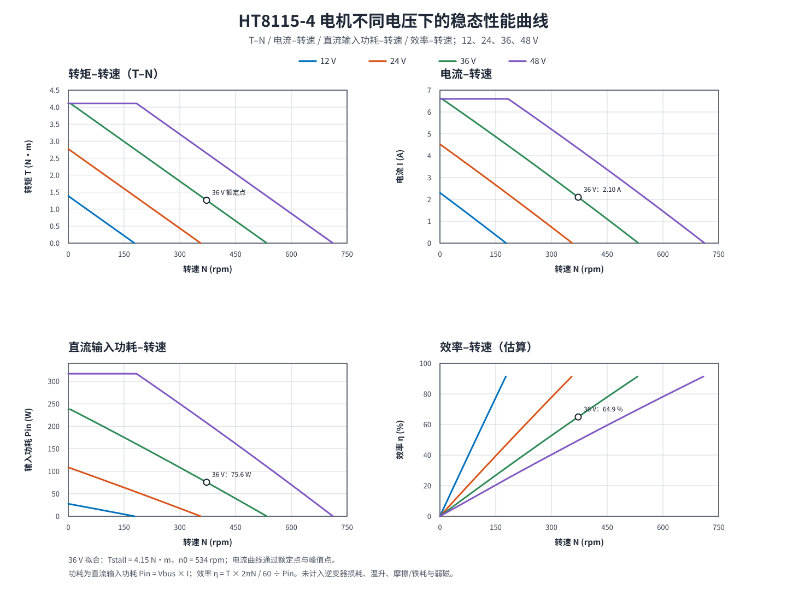

# HT8115-4 不同电压下的综合性能曲线

## 电机参数（图片红框）

| 参数 | 数值 |
| --- | ---: |
| 额定电压 | 36 V |
| 额定电流 | 2.10 A |
| 额定转矩 | 1.26 N·m |
| 额定转速 | 372 rpm |
| 最高转速 | 534 rpm |
| 峰值转矩 | 4.11 N·m |
| 峰值电流 | 6.60 A |
| 相间电阻 | 3.81 Ω |
| 转速常数 | 15 rpm/V |
| 转矩常数 | 0.67 N·m/A |

## 计算模型

同一张图中绘制 12 V、24 V、36 V 和 48 V 的转矩–转速、电流–转速、直流输入功耗–转速和效率–转速曲线。

- 36 V 转矩–转速线由数据手册额定点 (372 rpm, 1.26 N·m) 与最高转速 534 rpm 拟合，得到 36 V 堵转转矩 4.153 N·m。
- 零转矩转速随母线电压线性缩放：n0(V) = 534 × V / 36。转矩按 4.11 N·m 峰值转矩限幅，因此 48 V 在低速段存在恒转矩区。
- 电流采用 I(T) = 1.694T - 0.0213T²，精确通过额定点 (1.26 N·m, 2.10 A) 和峰值点 (4.11 N·m, 6.60 A)。
- 输入功耗 Pin = Vbus × I；机械输出功率 Pout = T × 2πN / 60；效率 η = Pout / Pin。36 V 额定点：Pin = 75.6 W，Pout = 49.1 W，η = 64.9%。

## 适用范围

该图是根据数据手册工作点得到的稳态估算，适用于选型及不同母线电压的趋势比较。未包含逆变器损耗、温升导致的电阻变化、铁耗、摩擦/风阻、空载电流、母线压降、弱磁及控制器实际限流策略；效率曲线因此为估算值。若提供空载电流、控制器最大相电流和测功机数据，可进一步校准为实测精度模型。
