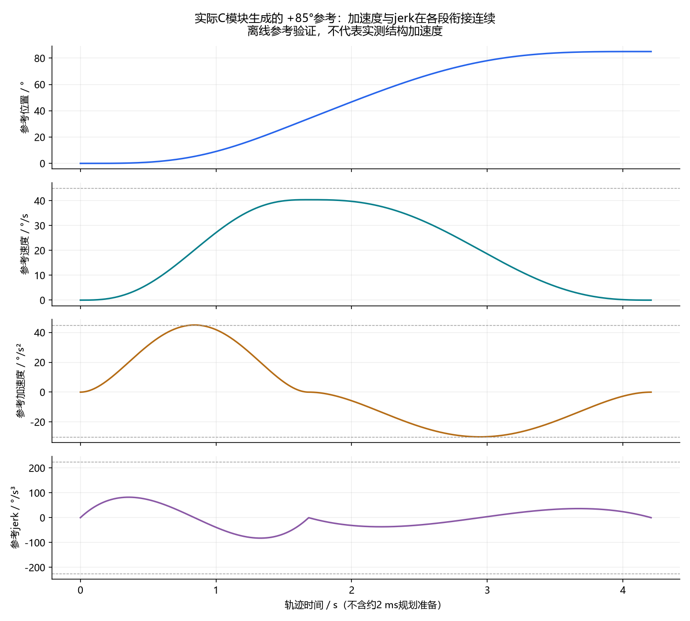

# 模式3连续加速度轨迹验证（2026-09-08）

## 结果与范围

已下载image33_c3_bounded_plan。静止点到点轨迹的位置、速度、加速度和jerk在各段衔接连续，起终点v/a/j均为零。用户实机反馈“有改善，但仍有抖动”。因此本次完成的是参考轨迹平滑，不能宣称机械结构抖动已经解决，也没有用编码器波形冒充结构加速度测量。

模式3保留巡航上限45°/s、加速度45°/s²、有效减速度上限30°/s²及jerk上限225°/s³。PID、摩擦补偿和Flash参数不变。实机试验使用包含schema10及其他未提交改动的工作区固件；本次模式3提交保留schema9，与实机镜像并非逐字节相同。阶段取舍及提交验证见 [优化过程汇总](mode3_optimization_20260908.md)。

## 轨迹表达式

加速段归一化时间u=t/T，速度由 `v=V(10u³−15u⁴+6u⁵)` 给出；积分得到位移 `q=VT(2.5u⁴−3u⁵+u⁶)`，加速度为 `a=(V/T)30u²(1−u)²`，jerk为 `j=(V/T²)60u(1−u)(1−2u)`。减速段从终点反向计算剩余时间和距离，避免终点附近相减损失精度。

每段时间满足 `T >= (15/8)V/A` 和 `T >= sqrt((10/sqrt(3))V/J)`。长行程在两端平滑段之间巡航；短行程用16次有界二分搜索降低峰值速度，保留可行区间下界。每个控制tick最多4次搜索，最终准备周期也不运行完整外环，避免把规划与控制的计算峰值叠加。极小行程可能再缩小搜索区间，且检测无有效浮点候选值及非法数值。

+85°离线轨迹时长4.208 s，峰值速度40.397°/s，参考加速度范围−30～45°/s²，参考jerk峰值约82.321°/s³。长距离可达到45°/s巡航；限值是上限，不保证每次运动都达到。数值来自实际C模块导出的轨迹，不是实测负载响应。

运动中改目标或调整限值时保留当前q/v/a，转用原在线限jerk路径；该路径不承诺所有动态切换的jerk连续。规划期间密集改目标也转在线路径，避免规划饥饿。新曲线的C3结论针对静止定位路径，不覆盖硬件停机或紧急断电。

## 测试

- 22项C伺服场景通过，新增运动中改目标和连续目标流检查。
- 独立平滑轨迹测试覆盖双方向、极短/短/长行程、巡航段、段间q/v/a/j连续性、速度积分与位移一致性、速度/加速度/jerk限值和精确静止终点。
- 实际编码器与HIL命令服务回归通过；工作区16项Python检查通过，其中3项属于未提交的本地台架脚本。提交范围内的检查单独验证，见优化过程汇总。
- 正常/HIL工程均0错误0警告。独立模块没有Vendor/HAL依赖，状态由控制器持有，没有新增跨模块全局变量。
- 初版image32在规划完成时记录到4次超过50 μs，最大53.42 μs，未保留。image33将准备收尾与反馈计算分离，后续两轮均无50 μs以上记录。

## 实机结果

trial57的±20°序列末2 s最大保持误差0.120°，最大超调0.078°，各目标末段均为HOLD，没有到位前持续低速停留。最大IRQ记录8344周期，约49.08 μs。

trial58序列为85、−85、0、5、−5、0，每目标10 s。自动目标限制±85°，主机/板端停止边界仍为±88°/±90°。表中到位时间为持续进入±0.3°的时间，来自主机接收锚点，有批处理延迟。

| 目标 / ° | 到位 / s | 末2 s最大绝对误差 / ° | HOLD |
| --- | --- | --- | --- |
| +85 | 4.067 | 0.229 | 100% |
| -85 | 5.764 | 0.213 | 100% |
| +0 | 3.667 | 0.159 | 100% |
| +5 | 0.781 | 0.120 | 100% |
| -5 | 1.092 | 0.034 | 100% |
| +0 | 0.782 | 0.154 | 100% |

该轮最大保持误差0.230°，Iq记录峰值3.052 A，无RTT丢帧/限流标志，最大IRQ记录8448周期（49.69 μs），1200780次记录均低于50 μs。DWT测量不包含全部异常入栈/返回成本，不是完整WCET证明；静态调用图给出496 B加未知调用因素，配置栈为1024 B，不能仅据此替代最坏嵌套栈验收。

+85°末段仍有约0.34 s低于2°/s的收敛，并伴随前馈脱困；−85°约0.10 s低速收敛。旧平滑版本对应+85°到位3.547 s、170°换向5.204 s，新版本为4.067 s、5.764 s；此次平滑有运动时间代价。小角度最大超调约0.154°。这些剩余现象和用户反馈共同表明，结构抖动仍需后续针对力矩及机械响应判断。

## 归档与最终状态

原始记录在本地 `outputs/servo_hil_20260908/trial56_c3_small`、`trial57_c3_twenty`、`trial58_c3_range`，已装载镜像在 `image33_c3_bounded_plan`。C轨迹导出、曲线图、构建日志和最终状态在 `outputs/servo_acceleration_continuity/`；本地采集产物不随源码分发。

实机验证结束时已逐字节确认参数与校准区域保持不变，当时工作区构建HEX与所装载镜像一致。结束时mode0/error0、HIL未使能、Iq参考0、三相输出关闭。NTC未安装，本轮未验收热保护。本次整理提交未再次下载固件或操作电机。
