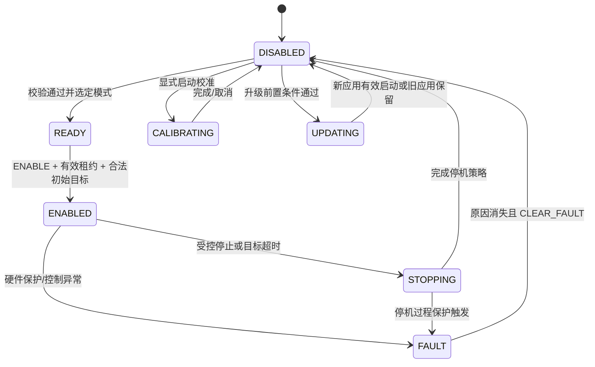
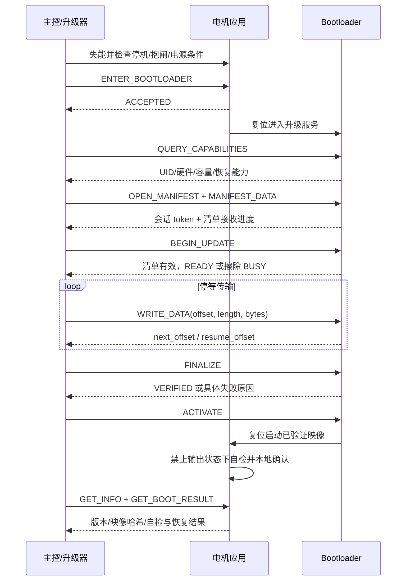

# 电机通信扩展与固件升级协议设计参考

> 当前设计入口：[1.2.3 CAN FD 统一协议评审稿](motor_protocol_v1.md)，仅采用 CAN FD 与公司统一帧框架，尚未完成固件实现。本文为历史设计参考，链路范围以当前设计稿为准。

> 当前设计入口：[电机通信与固件升级协议设计规范](motor_protocol_classic_can_v1.md)。该规范基于已读取的公司原文，并按用户最新确认采用经典 CAN 加 29 位扩展 ID；本文保留为早期参考，不应据此实现新协议。

> 原文核对更新（2026-09-06）：已成功分段读取飞书《通信协议设计 副本》正文至第 11 节，详见 [公司协议原文阅读记录](company_protocol_source_readback.md)。下列 v0.2 仍是未读原文时的候选设计，不能作为公司协议的直接实现规范。原协议规定小端、16B 帧头、帧头 CRC8、帧尾 CRC16、16 位 type，电机消息范围为十进制 100～199；这些规定优先于本文第 3 节和第 5.0 节候选外层。升级应复用公司统一帧，把会话/镜像/offset 等放入业务 payload；保持接口无关，但不另外创建竞争的外层 PDU。本文业务状态机、能力协商、Flash 恢复等建议可继续评审；完整字节级对齐还需核对关联消息类型表并解决原文歧义。

版本：讨论稿 v0.2；日期：2026-09-06。v0.2 将升级业务协议与 RS485、CAN/CAN FD、以太网承载解耦。

本文 v0.2 是基于当前 Vector_Mini_ST_Firmware 工程、在未取得飞书正文时形成的设计建议，不是已实现协议，也不是公司协议的核定扩展版。现在已读到主文档正文，原文核对结论见上方更新说明；所有新增命令号、帧格式、超时时间均需评审定版。“升级”在本文中指 MCU 应用固件升级。

## 1. 设计结论与已知约束

建议在业务层增加设备管理、电机控制、参数管理、诊断、固件升级五类服务。升级业务协议独立于通信接口，统一命令、镜像格式、会话、结果码和恢复规则；RS485、CAN/CAN FD、以太网适配层分别处理寻址、成帧、分片与流控。公司已有通信外层作为一种承载使用。升级核心不处理 CAN ID、485 地址、IP 地址、DLC 或串口波特率；电机控制与升级共享业务结果码定义，但使用独立状态机、队列和超时规则。

项目核查结果：

| 项目 | 当前证据 | 对设计的影响 |
| --- | --- | --- |
| MCU | `Vector_Mini_ST.ioc`：STM32G431CBU6 | Flash 容量 128 KiB，必须先做容量预算 |
| CAN | `Communication/interface_can.c`：11 位标准 ID，`node_id << 8 \| param_id` | 节点 ID 实际只有 3 位，即 0～7 |
| 数据 | 4 字节 float 位模式，高字节先传 | 旧协议大端字节序必须保留 |
| 帧类型 | 发送配置为 CAN FD，BRS 开启 | “标准 ID”不代表“经典 CAN 帧” |
| 命令 | 参数编号已扩展至 `0x62` | 新命令需登记，不能随意覆盖已有编号 |
| 控制模式 | 电流、速度、位置、电流域位置阻抗、辨识等 | 运行状态、控制模式、一次性操作应分开定义 |
| 单位 | 速度设定经 r/s→rad/s，位置设定经圈→rad；部分测量直接返回内部值 | 必须逐项定义单位，不能默认设定值与测量值相同 |
| Flash 参数 | `Bsp/flash.c` 从 `0x0801C000` 写参数 | 升级不得擦除参数及标定数据 |
| 现有构建记录 | `.map` 的 Total ROM Size 为 90120 B，约 88.01 KiB | 两份当前体量应用已超过 128 KiB；该记录不是本次重新编译结果 |
| RAM 构建记录 | Total RW Size 为 32168 B；工程 RAM 区大小 32768 B | 增加队列前核查 heap/stack 与映射方式；不能直接叠加大缓存 |

STM32G431CB 的容量可见 [ST 产品资料](https://www.st.com/en/microcontrollers-microprocessors/stm32g431cb.html)。协议设计阶段不承诺 MCU 内部 A/B；是否具备外部 Flash 尚未核实。

## 2. 与公司协议的兼容策略

优先方案：公司现有帧头、设备寻址、长度、校验和响应规则保持一致，只分配新的服务或命令范围。本文第 3 节是电机控制/管理的 CAN FD 候选承载；第 5 节定义独立的通用升级 PDU。升级不受第 3 节 48 B 业务载荷限制，不直接把该格式当作通用升级帧。

定版前建立以下映射表：

| 要核对的原协议项 | 必须确定的结果 |
| --- | --- |
| 物理链路与承载 | CAN/CAN FD、UART/RS485、以太网 TCP/UDP；速率、拓扑、成帧与寻址规则 |
| 地址空间 | 主控、电机、广播、组地址及保留地址 |
| 帧格式 | 11/29 位 ID、数据字段、最大长度、字节序 |
| 命令注册 | 已用范围、厂商扩展范围、应答编码 |
| 事务机制 | 序号、超时、重试、广播应答规则 |
| 升级基础 | 是否已有文件传输、分包、签名和设备版本字段 |
| 系统约束 | 最大电机数、控制周期、总线负载、失联后的机械动作 |

迁移规则：

1. 先用 `GET_CAPABILITIES` 获取协议主次版本、服务位图、最大帧长度、固件/Bootloader 版本和控制模式能力。
2. 老协议不改变原有字段含义；特别不能在同一命令号下把圈改成 rad，或把电流改成力矩。
3. 老协议与新协议通过明确的 ID/版本空间分流；不要仅靠收到的字节长度猜测版本。
4. 新版运行期间只允许一个控制源持有控制权；CAN、USB、旧协议不能同时改目标。
5. 不认识的服务返回 `UNSUPPORTED`，主版本不支持返回 `VERSION_MISMATCH`；不得按旧命令解释未知帧。

若采用 29 位新协议与 11 位旧协议共线，需同时配置两类过滤器并验证混合仲裁。仅凭“扩展帧数字更大/更小”不能推断其相对标准帧的优先级。若总线上有不支持 FD 的设备，必须另行验证共线可行性，不能直接发送 FD 帧。

## 3. 候选 CAN FD 承载格式

本节服务于控制和管理帧。CAN 升级使用第 5.0 节的分片适配，在专门注册的升级通道传输通用升级 PDU，不能让本节的浮点编码、16 位控制序号或单帧容量限制升级业务。

### 3.1 29 位 ID（仅供外层未固定时选择）

| 位段 | 位数 | 含义 |
| --- | ---: | --- |
| 28:26 | 3 | priority，同一格式下数值越小优先级越高 |
| 25:18 | 8 | destination |
| 17:10 | 8 | source |
| 9:8 | 2 | channel：0 管理、1 控制、2 遥测、3 升级 |
| 7:0 | 8 | 保留，发送为 0，非 0 拒绝 |

建议主控地址 0，节点 1～254，255 广播。禁止节点以 255 为源地址；地址分配冲突必须在使能前解决。V1 的节点 0 需显式映射，不能原样视为 V2 主控。

优先级建议：停机/故障 0，实时控制 1，实时反馈 2，管理 4，升级 6，调试日志 7。广播仅开放停机、同步等白名单操作，无逐节点即时应答；升级写入、擦除、复位和使能不接受广播。发现设备优先按地址轮询，避免同时抢答。

### 3.2 数据区

多字节整数和 IEEE-754 binary32 均采用大端；禁止直接发送 C 结构体内存。新协议继续大端可减少与现有实现的混淆，但最终以公司规则为准。

| 偏移 | 长度/B | 字段 |
| ---: | ---: | --- |
| 0 | 1 | major_version，候选值 2 |
| 1 | 1 | service |
| 2 | 1 | command |
| 3 | 1 | flags：bit1:0=0 请求/1 响应/2 事件；bit2=请求响应，其余为 0 |
| 4 | 2 | sequence |
| 6 | 2 | payload_length，0～48 |
| 8 | 4 | token，控制租约或升级会话标识；非会话服务用 0 |
| 12 | N | payload |
| 12+N | 4 | CRC32C |
| 16+N | 可选 | 为满足 CAN FD DLC 补 0，不计入 payload_length |

单帧最多 `12 + 48 + 4 = 64 B`。发送选择能够容纳实际长度的最小合法 DLC；接收要求 DLC 与此规则一致，先校验长度再访问 CRC。经典 CAN 的 8 B 无法直接承载本格式；若需要支持，应单独制定分包承载规范，保持业务命令一致。

候选 CRC32C：poly=`0x1EDC6F41`，init=`0xFFFFFFFF`，RefIn/RefOut=true，xorout=`0xFFFFFFFF`；ASCII `123456789` 的校验值为 `0xE3069283`。CRC 输入依次为 4 B 大端 CAN ID（高 3 位补 0）、12 B 头、N B payload；不包含 CRC 自身与 DLC 补齐字节。CRC 结果按大端发送。该应用层 CRC 用于覆盖路由、内存与网关链路；它不提供身份认证。若公司已提供同等端到端校验，应复用现有机制。

响应复用 service、command、sequence、token，交换源/目的地址；payload 首 2 B 为 result_code，随后才是结果数据。事件有自己的序列号，不与请求序号配对。发现阶段 token=0；控制租约和升级会话建立后由设备分配新的非零 token，重启后失效。token 用于隔离旧请求，不等同于鉴权。

### 3.3 可靠性约定

| 类别 | 策略 |
| --- | --- |
| 电流/速度/位置周期目标 | 不逐帧应答；反馈携带最后应用的 sequence，只应用最新有效目标 |
| 参数读写、使能、停机、保存、校准 | 请求必须有结果；耗时操作先回 ACCEPTED+operation_id，再查询最终结果 |
| 升级 | 首版停等传输，一包完成持久化后再应答 |
| 故障事件 | 状态变化即上报，并在后续状态周期中保留故障状态 |

序号采用 16 位模比较：`delta=(new-old) mod 65536`，仅 `0<delta<32768` 为新数据；相同序号是重复，差值 32768 拒绝。控制租约超时、源重启或停发到可能超过半周期窗口后重新建立 token。接收时间不能检测所有链路内滞留；有网关/多轴时使用经过同步的执行时间和过期时间，过期目标直接拒绝。

管理事务每节点最多 1 个在途请求；以源、token、service、command、sequence 及请求内容识别重复。相同请求重发返回原结果，不重复保存 Flash、执行校准或激活固件；相同序号不同内容返回 `SEQ_CONFLICT`。候选管理超时 100 ms、重试 3 次；去重记录至少覆盖重试期限，长操作一直保留到完成。设备重启后通过状态和版本查询恢复判断，不盲目重放副作用命令。

## 4. 电机业务协议

### 4.1 服务与命令建议

下表中的编号是候选分配，不能直接视为公司正式编号。

| service | command | 名称 | 主要内容 |
| --- | --- | --- | --- |
| 0x01 | 0x01/0x02 | GET_INFO / GET_CAPABILITIES | UID、产品、硬件、固件、协议版本、支持能力 |
| 0x01 | 0x03/0x04 | ACQUIRE_CONTROL / RELEASE_CONTROL | 取得/释放唯一控制租约，设备返回 token |
| 0x01 | 0x05 | HEARTBEAT | 当前控制源、租约状态；不替代目标刷新 |
| 0x02 | 0x01/0x02 | ENABLE / DISABLE | 显式使能与失能 |
| 0x02 | 0x03 | SET_MODE | 电流、速度、位置、电流域阻抗等能力支持的模式 |
| 0x02 | 0x10/0x11/0x12 | SET_CURRENT / SET_SPEED / SET_POSITION | 目标及可选前馈；不隐式切换模式 |
| 0x02 | 0x13 | SET_IMPEDANCE | 位置、速度、Kp、Kd、Iq 前馈一次提交 |
| 0x02 | 0x20/0x21 | CONTROLLED_STOP / CLEAR_FAULT | 受控停止；故障条件消失后清故障 |
| 0x03 | 0x01/0x02 | READ_OBJECT / WRITE_OBJECT | 参数对象访问 |
| 0x03 | 0x03/0x04 | COMMIT_CONFIG / RESTORE_DEFAULTS | 校验并持久化配置；恢复默认需限定对象集合 |
| 0x04 | 0x01/0x02 | READ_STATUS / CONFIG_TELEMETRY | 状态快照、反馈周期配置 |
| 0x04 | 0x03/0x04 | READ_FAULT_LOG / START_CALIBRATION | 故障记录、指定校准操作 |
| 0x04 | 0x05 | QUERY_OPERATION | 校准/保存等长操作结果 |
| 0x05 | 见第 5 节 | 固件升级服务入口 | 承载通用升级 PDU，较长 PDU 由适配层分片重组 |

GET_INFO 等大结果分成固定的信息页，通过 page_index 读取，每个响应不得超过 48 B。READ_OBJECT 对数组/LUT 使用 object_id、offset、count 分段读取；写入先在候选区拼齐再整体校验提交，不让半张标定表生效。

### 4.2 状态机与动作约束



运行状态与控制模式分别编码，不把 Save_Param、Clear_Error 等一次性操作当成持续模式。借鉴 CiA 402 的驱动状态约束思路，但本候选协议没有声明符合 CANopen/CiA 402。[CiA 官方驱动配置说明](https://www.can-cia.org/can-knowledge/cia-402-series-canopen-device-profile-for-drives-and-motion-control)

关键规则：

- 设置目标不会自动使能；第一版只在 DISABLED/READY 切换控制模式。
- 进入 ENABLED 前必须已有合法初始目标；位置模式要定义从当前位置平滑接管，不能突然跳到默认零位。
- 只有通过地址、长度、CRC、token、序号、数值范围和模式校验的目标帧能刷新目标看门狗。
- 分开管理在线心跳与目标超时：查询参数或普通心跳不应掩盖主控停止下发目标。
- 重连、清故障和升级后不自动使能，需要重新取得控制权并执行 ENABLE。
- 失联后的动作必须按机械系统定义：滑行、限加速度停止、保持/抱闸交接等。垂直负载不能默认撤力；过流等硬件故障必须立即按硬件保护路径处理。
- 校准可能主动转动电机，需单独的操作许可、速度/电流边界和取消机制；UPDATING 中禁止校准及使能。

### 4.3 单位、参数字典与阻抗

建议新版使用 SI 单位，明确机械轴坐标；旧协议在适配层完成单位换算。

| 对象 | 类型 | 单位/约定 |
| --- | --- | --- |
| 电流目标与 Iq | float32 | A，明确为 q 轴控制电流，固定正方向 |
| 位置与速度 | float32 | 电机机械轴 rad、rad/s；位置注明多圈累计/单圈与零点 |
| 加速度 | float32 | rad/s² |
| 电压、温度 | float32 | V、°C |
| 力矩（可选） | float32 | N·m，必须声明电机轴/输出轴以及 Kt、电流约定和减速比 |
| 故障、功能位图 | uint32 | 位含义固定；不通过 float 传位图 |
| 时间 | uint32 | ms 或 µs，字段名带单位并定义回绕比较 |

float 数据拒绝 NaN/Inf；超范围请求返回错误。实际运行时仍执行本地限幅，并在反馈中报告限幅状态。不能把 Iq 直接标成“测量力矩”。

当前工程的阻抗是电流域：`Iq = Kp*(pos_ref-pos) + Kd*(vel_ref-vel) + Iq_ff`，所以 Kp 单位为 A/rad，Kd 为 A·s/rad。若提供 N·m 域阻抗，必须定义独立 profile 和转换规则。

SET_IMPEDANCE 示例 payload 为 5 个大端 float32，共 20 B：pos_ref_rad、vel_ref_rad_s、kp_a_per_rad、kd_a_s_per_rad、iq_ff_a。收到后整体校验、整体应用；不得跨多个帧逐个修改实时 Kp/Kd/目标。

参数字典建议分区：0x0000～0x0FFF 设备信息；0x1000～0x1FFF 控制与目标；0x2000～0x2FFF 电机及编码器；0x3000～0x3FFF 保护；0x4000～0x4FFF 诊断；0x5000～0x5FFF 升级状态。每个对象至少登记 ID、类型、单位、范围、默认值、权限、允许运行状态、是否持久化、引入版本。配置写入 RAM 候选副本，COMMIT 时检查跨参数约束并原子切换，显式保存 Flash，避免每次控制设定都触发擦写。

### 4.4 状态反馈与错误码

周期反馈至少包含：state、mode、last_applied_sequence、position、velocity、Iq、bus_voltage、temperature、fault_bitmap、limit_flags。若需分帧，快反馈放位置/速度/Iq/序号，慢反馈放温度/电压/计数；给快照加 sample_counter，避免拼接不同时刻的数据。

候选频率：控制目标及快反馈 100～1000 Hz，慢反馈 10～50 Hz，在线心跳 10 Hz。它们是预算起点，不能同时默认开启最高值。按节点数量、实际 DLC、仲裁速率/数据速率、填充位、重传和突发故障计算负载；优先实测，正常平均占用先以不超过约 50% 为设计目标。多轴同步另加同步时钟与执行时间，不把依次收到等同于同步执行。

结果码建议：0x0000 OK，0x0001 ACCEPTED，0x0002 BUSY，0x0101 UNSUPPORTED，0x0102 BAD_LENGTH，0x0103 BAD_VALUE，0x0104 BAD_STATE，0x0105 NO_CONTROL_LEASE，0x0106 SEQ_CONFLICT，0x0107 VERSION_MISMATCH，0x0201 IMAGE_MISMATCH，0x0202 OFFSET_MISMATCH，0x0203 FLASH_ERROR，0x0204 VERIFY_FAILED，0x0205 AUTH_FAILED。帧校验失败直接丢弃并计数；已经可信解码的业务请求才回对应错误。result_code 与电机 fault_bitmap 分开。

## 5. 固件升级通信协议

### 5.0 分层、通用 PDU 与接口适配

升级业务核心只接收完整 PDU，并提交响应 PDU；它调用独立的存储接口擦除、写入、校验、提交启动记录。软件依赖方向为：

```text
升级状态机：协商 → 清单 → 准备 → 写入 → 校验 → 激活 → 确认
                         ↕ 完整通用升级 PDU
传输适配层：寻址、成帧/解帧、分片/重组、流控、链路错误
          ↙                 ↓                    ↘
    RS485 串口驱动      CAN/CAN FD 驱动       以太网 TCP/UDP

升级状态机 → 存储接口 → 内部 Flash / 外部 Flash / 镜像槽
```

物理接口无关不意味着忽略链路差异；链路差异由适配层和能力协商消化，不能改变“写入成功”“可启动”“确认成功”的业务含义。

**通用升级 PDU 候选格式：**

| 偏移 | 长度/B | 字段 |
| ---: | ---: | --- |
| 0 | 1 | protocol_version，独立于电机控制协议版本 |
| 1 | 1 | message_type：0 请求，1 响应，2 事件 |
| 2 | 2 | header_length，首版固定 20 |
| 4 | 2 | command，使用第 5.2 节的命令值，线上编码为 uint16 |
| 6 | 2 | result_code，请求为 0；响应/事件使用统一结果码 |
| 8 | 4 | session_id，即本节所称升级 token |
| 12 | 4 | request_id，响应回显；同一会话不回绕复用 |
| 16 | 4 | payload_length，受协商和本地编译上限约束 |
| 20 | N | payload |
| 20+N | 4 | CRC32C，覆盖头部和 payload，不包括任何接口地址或链路头 |

字段全部大端。CRC 参数沿用第 3.2 节的 CRC32C 算法，但覆盖范围不同：通用 PDU 不含 CAN ID、485 地址、IP 地址及链路补齐字节。通用响应的 result_code 已在头部，payload 不再重复添加状态码。PDU 总长为 `24+N`；先校验上限、加法溢出和完整长度，再校验 CRC 和派发。未来扩展头需通过版本/能力明确协商，首版拒绝其他 header_length。

查询与建立会话时 session_id=0；OPEN_MANIFEST 成功响应分配非零 session_id，后续请求携带该值。request_id 用于业务去重；相同会话和编号但内容不同必须拒绝。重试返回相同业务结果，不重复擦除/激活。会话标识、CRC 和接口地址都不是安全认证。

**适配层边界：**

| 承载 | 适配层负责 | 不应进入升级核心的内容 |
| --- | --- | --- |
| RS485 | 定义串口链路帧；主从地址、帧边界、长度/转义、链路 CRC、半双工收发切换和主控轮询 | 波特率、DE/RE、总线空闲时间、站号 |
| 经典 CAN | 将完整 PDU 拆成多个 ≤8 B 帧；按源/目的/传输编号重组，检查片序、总长、超时和接收流控 | CAN ID、仲裁优先级、DLC、片序 |
| CAN FD | 同样分片重组，可用 ≤64 B 帧提高效率 | BRS、DLC 补齐和每帧长度 |
| 以太网 TCP | 连接管理、认证上下文、按 PDU 头中长度从字节流提取完整 PDU、拆包/粘包与发送背压 | IP、端口、socket 与一次 recv 的长度 |
| 以太网 UDP（可选） | 明确数据报长度上限；避免依赖 IP 分片，超长 PDU 在适配层分片重组并处理丢包 | 路由 MTU、数据报边界与片序 |

RS485 与以太网本身都不是完整的升级传输协议，必须分别选定串口链路格式和 TCP/UDP profile。RS485 首版采用主控请求、设备响应；长操作返回 BUSY/ACCEPTED，后续轮询，设备不主动争用总线。CAN 分片 profile 必须登记独立的命令/通道空间，并规定传输编号、总长、片序和流控帧的字节布局；可采用已有分段传输规范或公司现有分包规范，不能在没有适配规范时宣称三种链路可互通。

下层流控/分片确认只说明“片已接收或可继续发送”；TCP 写入成功也不表示远端 Flash 已写入。只有升级服务返回 WRITE_DATA 成功才说明该块完成规定的写入与验证。重组失败后丢弃不完整 PDU，不向升级核心提交半包；上层按 request_id 重试整个请求。

**块大小与能力协商：**

- 查询 max_rx_pdu、max_tx_pdu、max_manifest_size、max_write_data、write_alignment、erase_unit、max_inflight、操作时限，以及恢复/回滚能力。
- 块大小取双方能力、设备 RAM 与存储约束允许的值；128/256/1024 B 只是候选，不与 CAN 帧长绑定。当前工程 RAM 紧张，实际值需预算后确定，必要时使用更小块。
- WRITE_DATA 的请求 payload 为 8 B 块头加 N B 镜像数据，因此必须满足 `N <= max_write_data` 且 `N+32 <= max_rx_pdu`。应用块与链路分片是不同概念。
- 例如 256 B 镜像块形成 288 B 完整 PDU：CAN 适配层分成若干帧；485 以其链路帧承载；TCP 按长度读出同一个 PDU。命令、offset、校验和应答语义相同。
- 首版 max_inflight=1，之后通过能力协商增加窗口，不能因为换成以太网就隐式改变状态机。
- 响应超时至少覆盖请求发送、全部分片、总线等待、设备处理及完整响应返回时间。Flash 擦除/校验另设操作完成上限；不能在不同速率链路上统一硬编码 200 ms。

**跨接口续传与身份：**

统一以设备 UID、image_id、摘要和持久化检查点识别目标和进度；485 站号、CAN 节点号、IP 只用于路由。能力查询验证 UID，升级会话绑定目标身份和授权来源。一次只允许一个升级写入者，其他接口返回 BUSY。

接口切换不能默认继承旧连接的权限或旧 session_id。首版不提供正在运行的会话无缝迁移：原会话显式释放或按策略失效后，新接口重新认证/建立会话，提交相同镜像清单并查询 resume_offset；相同镜像才恢复，否则按新升级处理。若设备重启，未完整提交的页按第 5.4 节恢复规则处理。USB、网关转发等未来承载也遵循此规则。

链路核心接口可抽象为 `on_pdu(peer_context, bytes, length)` 与 `send_pdu(peer_context, bytes, length)`；peer_context 是适配器提供的不可伪造内部路由/授权上下文。升级模块只使用该句柄应答，并通过 storage_erase/write/read/commit_boot 调用存储服务，不依赖具体驱动。

### 5.1 升级流程



App 的 ENTER_BOOTLOADER 应在确认功率输出已关闭、机械交接完成后回复。ACK 丢失时主控查询当前运行模式，不持续发送复位请求。即使 App 损坏，Bootloader 也必须通过预定入口可进入；每个产品明确其实际支持的维护接口及对应参数，保留持久化设备身份和物理恢复入口。接口无关的业务设计不意味着当前 MCU/板卡具备所有接口；Bootloader 需实际编入对应适配器，或由网关转发通用 PDU。

### 5.2 服务 0x05 命令表

| command | 名称 | 请求与返回原则 |
| --- | --- | --- |
| 0x01 | QUERY_CAPABILITIES | 返回产品/硬件/UID、最大收发 PDU、Flash 写入对齐、最大镜像/块长度、版本、接口 profile、操作时限和恢复/回滚/签名能力；必要时分页 |
| 0x02 | ENTER_BOOTLOADER | 仅 App DISABLED 且前置条件满足时接受 |
| 0x03 | OPEN_MANIFEST | 给出清单长度；Boot 分配 session_id，清单上限由能力查询公布，候选 256 B |
| 0x04 | MANIFEST_DATA | offset:u32 + data_len:u16 + reserved:u16 + data[N]，依序传输清单；N 受协商 PDU 上限约束 |
| 0x05 | BEGIN_UPDATE | 清单全部验证后锁定目标分区，标记升级中并准备擦除；耗时则 ACCEPTED/BUSY |
| 0x06 | WRITE_DATA | offset:u32 + data_len:u16 + reserved:u16 + data[N]，N 通过能力协商确定，reserved=0 |
| 0x07 | QUERY_STATUS | state、image_id、next_offset、resume_offset、last_error；大信息分页 |
| 0x08 | FINALIZE | 校验长度、从 Flash 重算摘要/签名验证结果、向量及入口合法性，成功置 VERIFIED |
| 0x09 | ACTIVATE | 仅 VERIFIED 接受；写入启动记录并复位；重复执行保持幂等 |
| 0x0A | ABORT | 取消传输；已覆盖单应用时继续停留 Boot，不声称可以回到旧应用 |
| 0x0B | GET_BOOT_RESULT | 上次版本、当前版本、启动原因、自检/确认/回滚结果，必要时分页 |

每个 WRITE_DATA 请求携带一个完整升级数据块，大小与物理帧容量无关。offset 从镜像起始偏移 0 计算；非最后一块长度必须等于协商块长并满足设备公布的写入对齐。当前代码使用 8 B 编程粒度，但通用协议不能把 8 B 写死为所有设备的约束。最后一块可短，由存储层按要求补齐，当前 Flash 方案补 0xFF，摘要只覆盖真实 image_size 字节。

Bootloader 自己从目标 image_type 决定地址，不接受主控给出的任意 Flash 地址。先检查 `offset <= image_size`，再检查 `data_len <= image_size-offset`，避免整数溢出；跨页块由 Bootloader 拆分写入。Boot、参数、元数据、OTP 均不在远程写入白名单中。

### 5.3 镜像清单

建议清单固定字段序列、固定字节序与签名范围，第一版可限制总长 256 B。至少包括：

- manifest_version、image_type、product_id、hardware_revision_range、MCU_variant；
- firmware_version、minimum_boot_version、parameter_schema_version；
- image_size、image_id、SHA-256；
- load_profile_id（由 Boot 映射分区）、security_counter；
- signature_algorithm、key_id、signature。

签名覆盖规范化清单中除 signature 自身之外的所有字段，并通过 SHA-256 绑定整个真实镜像。设备只接受内置可信公钥对应的支持算法；不接受清单自带公钥作为信任根。签名策略确定后不能允许降级到“不验证”。CRC 检测传输损坏，SHA-256 检测镜像一致性，签名验证来源与完整性，三者语义不同。

单应用原地升级应先验证签名清单和兼容条件，再开始擦除；下载结束仍需重算整镜像摘要。没有额外存储时，擦除开始后就无法保证旧应用可用。Bootloader 自身升级不纳入第一版普通升级服务。

### 5.4 状态、重试与断点

升级状态：IDLE → RECEIVING_MANIFEST → PREPARING → RECEIVING → VERIFYING → VERIFIED → ACTIVATING。任一步失败返回 ERROR，输出保持禁用；是否可以运行旧应用取决于旧映像是否仍完整有效。

第一版使用停等：同一时刻只有一个 WRITE_DATA 请求在途，一个请求可由多个物理帧传输。Boot 成功完成 Flash 写入与必要读回后返回 next_offset；BUSY 不是数据成功确认，主控按 retry_after_ms 查询。块超时根据协商参数与链路最坏传输时间确定，候选最多 5 次重试；擦除/校验使用独立操作超时，由设备公布上限并经硬件验证，不把擦页延迟当丢包。

- `offset == next_offset`：按顺序写入并应答。
- `offset < next_offset`：逐字节比对已经写入内容；一致返回当前进度，不重复编程；不一致终止本次会话。
- `offset > next_offset`：返回 OFFSET_MISMATCH 与期望位置，不开新洞。
- 新 token 绑定同一 image_id、大小和摘要后，才可恢复旧传输；不同镜像不能续写。

区分两个进度：next_offset 是本次会话已完成写入的位置；resume_offset 是掉电后可安全恢复的持久化检查点。后者建议以完整 Flash 页为粒度推进，避免每个小块都更新元数据造成磨损。重启后擦除检查点之后可能半写的页，从 resume_offset 重传；不要直接重编程可能被掉电破坏的 Flash 双字。断电保证基于数据手册规定的电源/Flash 条件及掉电测试，不能只靠软件 CRC 宣称成立。

元数据采用至少两个独立擦除页上的日志或冗余记录，含 generation、image_id/摘要绑定、state、resume_offset、记录 CRC 和最终提交标志。新记录完整写入并验证、提交后才淘汰旧记录；每次重启选最新有效记录。BEGIN 必须先持久化“应用待更新/不可启动”状态，再擦应用；只有整镜像验证通过才允许标为可启动。

## 6. 当前硬件的存储与恢复方案

### 6.1 现有硬件优先：受保护 Bootloader + 单应用恢复升级

当前构建约 88 KiB，参数从 112 KiB 偏移开始。下面仅是容量预算示意，不可直接写入链接脚本：

| 区域 | 候选地址 | 大小 |
| --- | --- | ---: |
| Bootloader | 0x08000000～0x08003FFF | 16 KiB |
| 应用 | 0x08004000～0x0801AFFF | 92 KiB |
| 升级元数据两个页 | 0x0801B000～0x0801BFFF | 4 KiB |
| 参数与标定保留区 | 0x0801C000～0x0801FFFF | 16 KiB |

16+92+4+16=128 KiB。92 KiB 应用空间相对现有 88.01 KiB 记录只剩约 4 KiB，还需放新协议代码；Bootloader 的 16 KiB 也未验证能容纳通信、摘要和签名库。若任一空间不够，必须精简、调整经验证的分区或换更大容量 MCU，不能挤占标定区。RAM 也需要单独预算。

Bootloader 从复位入口运行，硬件默认保持功率输出禁用；用写保护保护 Boot 区。应用链接地址、向量表偏移、镜像打包与启动跳转同时调整；跳转前正确处理中断、SysTick、DMA、MSP、VTOR 和缓存/外设状态。复位进入新应用通常比直接从下载过程跳转更易验证。

恢复能力：传输中断电后可以继续升级或重新下载；无有效应用时停留 Boot。它不保证自动恢复到上一个固件版本。原地更新已擦旧应用后 ABORT、验签失败、自检失败都只能进入恢复模式。

首次从当前“应用直接位于 0x08000000”的布局迁移到 Bootloader 布局，需要独立的工厂/维护刷写流程，先备份参数和标定、刷入 Boot+重链接 App，再核验恢复入口；不能假设现有 CAN 固件已经具备自举安装 Bootloader 的能力。

### 6.2 要求坏版本自动回滚：增加镜像存储

若量产要求“新程序无法正常启动也能自动恢复”，需保留已知良好旧镜像：选择更大 Flash MCU 的双槽，或外部 Flash 存新旧镜像及安装日志。仅有一个新固件暂存区不能自然提供旧版本回滚。

候选镜像先试运行，禁止功率输出，经过启动自检、关键外设/配置校验后由本地应用标记 confirmed；仅收到主控报文不能当作固件自检通过。看门狗重启、确认超时或启动异常时由 Boot 恢复已知良好镜像。该机制可参考 [MCUboot 的试启动、确认与 revert 设计](https://docs.mcuboot.com/design.html)，但必须评估本平台分区、库体积和移植成本。

防降级计数与自动回滚要协调：不要在试运行前提升到排除回退镜像的安全计数；成功确认后按既定策略推进。参数迁移同样必须可恢复，试运行前不要不可逆覆盖旧参数格式；新固件确认后再提交迁移，或保留旧参数快照与兼容读取。

ST 的 [AN5405 FDCAN Bootloader 协议](https://www.st.com/resource/en/application_note/an5405-how-to-use-fdcan-bootloader-protocol-on-stm32-mcus-stmicroelectronics.pdf) 可作为维护下载流程参考。ROM Bootloader 是否适用还要按具体芯片与 Boot ROM 版本、引脚和启动配置核对，不能直接假设它提供公司节点寻址、回滚或本文会话语义。项目 README 已提示 PB8 同时涉及 BOOT0/FDCAN_RX，恢复入口需要板级验证。

## 7. 固件落地点与验证清单

建议把链路收发、解包校验、服务派发、电机状态机、参数字典、升级状态机分别实现。中断中仅把已接收帧快速入有界队列，业务处理在任务/主循环；校准和 Flash 操作不能直接阻塞接收中断。控制目标使用最新值槽，管理请求与响应使用有界队列，升级阶段只初始化必要模块。

当前代码扩展前优先处理：

1. CAN 接收缓冲只有 4 B，且接收路径没有先根据长度拒绝较长帧。启用新长帧前，必须保证 HAL 接收目标至少容纳外设最大接收数据，再检查实际 DLC、帧类型、ID 和返回值。
2. 当前任意匹配节点的帧都会清零 can_hb_count，并清除 CAN_DisConnect；应改为有效目标与控制租约驱动看门狗，故障恢复走明确状态迁移。
3. 现有设置电流/速度路径会切换模式；新协议通过统一控制接口显式管理模式与使能，保留旧语义的部分应受控制源仲裁限制。
4. CAN_SendMessage_Update 只有一个待发送槽；突发请求可能覆盖响应，需要队列和失败处理。
5. CAN_GET_CAN_BR 当前返回时使用 CAN_GET_CAN_HB 标识，需在兼容性核查时修正并测试。
6. 节点 ID 与速率修改应采用“旧地址应答→持久化→约定重启生效→新配置重连”；Boot 与 App 使用一致的身份及维护速率规则。
7. 现有参数 Flash 写入忽略部分编程返回值，不能直接当作升级写入实现；升级需要每次检查错误、读回验证、范围限制和可恢复元数据。

建议验收场景：

| 场景 | 预期结果 |
| --- | --- |
| 错 DLC、超长、CRC 错、NaN、越界、未知命令 | 不访问越界，不修改目标，不刷新目标看门狗 |
| 目标重复、乱序、序号回绕、旧 token | 不倒退执行目标，反馈序号可解释 |
| 查询持续但主控不再发目标 | 仍在约定时间执行失联策略 |
| 清故障、重连、升级完成 | 保持未使能，等待显式控制流程 |
| 参数保存 ACK 丢失、校准请求重发 | 返回原结果，不重复操作 |
| 升级数据 ACK 丢失、重复块、错 offset | 正确续传或明确拒绝，不多写 Flash |
| 相同升级 PDU 经 RS485、经典 CAN、CAN FD、TCP 承载 | 升级命令语义、写入内容、结果码与检查点一致 |
| CAN 丢片、TCP 拆包/粘包、RS485 半帧与校验失败 | 适配层正确重组或拒绝，不提交半包，不提前确认 Flash 成功 |
| 不同接口同时申请升级、接口断开后换链路 | 仅一个写入者；新会话重新验证 UID/权限/镜像后续传 |
| 清单不完整、错误硬件、错误签名、越界镜像 | 擦应用前拒绝可提前发现的错误；永不写保护区 |
| 擦除中、编程中、元数据提交中、激活前后随机掉电 | Boot 可达；启动完整有效镜像或进入恢复模式 |
| 新应用卡死或自检失败 | 单槽进入恢复；具备旧镜像的回滚方案恢复旧版本 |
| 参数 schema 升级后回滚 | 旧版本仍能获得匹配参数，标定数据不丢失 |
| 多节点满负载、故障突发、升级限流 | 控制截止时间与硬件保护响应满足系统要求 |

推荐落地顺序：先核对公司外层和命令注册表；再落实状态机、单位、错误码、反馈及控制源仲裁；随后单独验证 Boot 的容量、Flash 掉电恢复与板级入口；最后接入升级器并开展整机压力测试。文档中的候选编号和布局完成评审后，再形成正式的字节级协议与测试向量。
