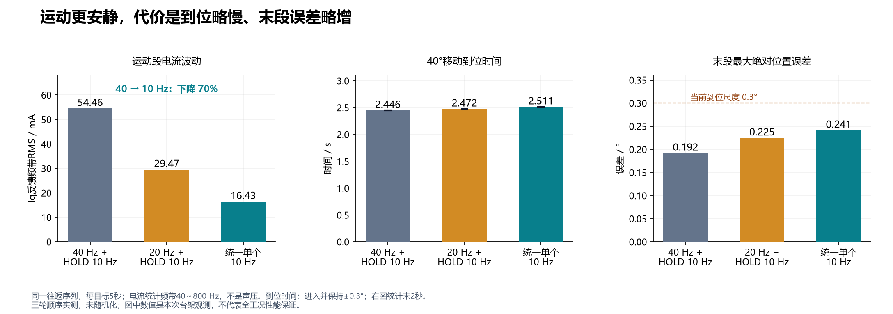
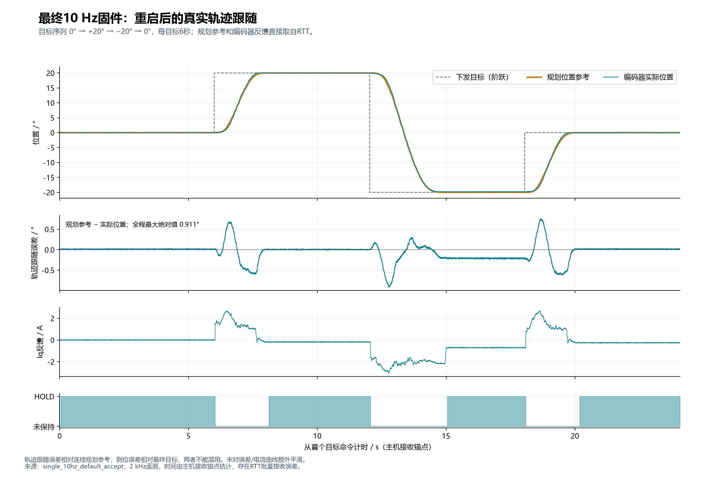
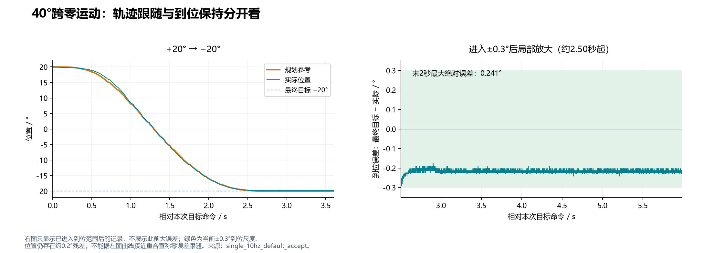
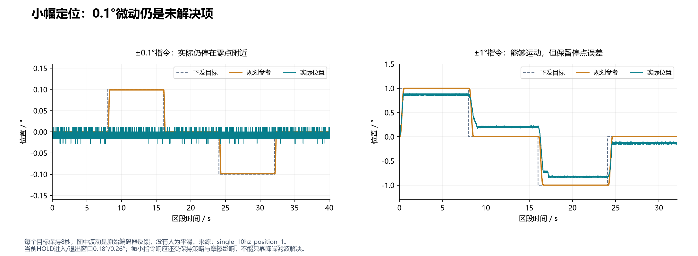

# Roll位置闭环噪声优化总结与轨迹跟随效果

日期：2026-09-10。对象：当前roll电机、驱动板和对应校准，位置模式3。

**最终方案：运动、减速、到位保持共用单个10 Hz软件测速低通，HOLD额外低通关闭。**
同序列实测中，运动段40～800 Hz电流波动由54.46 mA降至16.43 mA，约下降70%；
用户确认运动更安静、定位和保持正常。代价是到位略慢、保持电流波动比双级方案高。
降噪改善不等于定位精度全部达标：动态轨迹跟随误差峰值约0.911°，
末段目标误差最大0.241°，0.1°微小指令仍未可靠跟随。

## 1. 优化的核心点

### 找到速度反馈进入电流指令的路径

最初分别观察静止HOLD和运动MOVE，避免用整段运动电流RMS衡量噪声。
运动中40～800 Hz的速度反馈与Iq指令高度负相关，原始分析轮相关系数约−0.999。
电流指令自身的高频波动明显大于电流反馈减指令的差值，支持优先处理外环速度反馈。
闭环相关性不证明原始扰动一定来自编码器，也可能包含真实机械振动。

当前控制关系为：

```text
速度命令 = 轨迹速度 + 位置Kp × 位置误差 + 位置Kd × (轨迹速度 − 滤波速度)
速度PI比例电流 = (速度Kp × 电流上限) × (速度命令 − 滤波速度)
```

roll参数为位置Kp/Kd=8/2、速度Kp/Ki=0.5/1、电流上限6 A。
在线性、未限幅的比例通道中，速度扰动到电流的系数约为
`−0.5 × 6 × (1+2) = −9 A/(rad/s)`。
因此速度反馈中的细小波动，会同时通过位置阻尼和速度PI比例通道进入Iq指令。
这里是小扰动近似，不包含积分、前馈及真实机械闭环的全部作用。

### 从只优化HOLD，扩展到运动全过程

第一步在原40 Hz基础测速上增加HOLD专用10 Hz低通。
roll原地A/B中Iq反馈AC RMS由45.65 mA降到15.89 mA，用户确认B明显更安静。
但运动仍使用40 Hz路径，因此不能消除运动中的同类噪声。

第二步将基础测速40→20 Hz，HOLD额外10 Hz保留。
同轨迹运动频带Iq反馈RMS从54.46降至29.47 mA，用户确认运动更安静、到位正常。

第三步按用户要求统一为单个10 Hz，关闭额外HOLD级。
同轨迹运动频带Iq反馈RMS进一步降至16.43 mA。原编码器窗口测速仍保留，
这里“单个”指位置控制使用的软件一阶测速低通。

### 运动与保持共用滤波状态

最终MOVE、SETTLE、HOLD都使用同一个基础滤波输出，阶段切换时不再叠加另一级低通。
2 kHz外环下：

```c
// Ts = 0.0005 s, fc = 10 Hz
alpha = (2*pi*fc*Ts) / (1 + 2*pi*fc*Ts); // ≈ 0.030459
velocity_filtered += alpha * (velocity_measured - velocity_filtered);
```

对应默认配置：

```c
POSITION_SERVO_VELOCITY_FILTER_HZ      = 10.0f;
POSITION_SERVO_HOLD_VELOCITY_FILTER_HZ = 0.0f; // 关闭额外HOLD级
```

本轮滤波调整保留原位置/速度增益和轨迹规划；HOLD进入/退出位置窗口仍为0.18°/0.26°。
保留位置误差修正、负载支持电流、行程/速度/电流保护及心跳停止逻辑。
基础滤波也改变HOLD判定所用速度，不能把它描述为完全不影响阶段判定。

### 同时检查收益和代价

用同组目标、相同增益比较运动电流、到位时间、末段误差和保持状态。
随后执行0.1°、1°、5°小幅定位、跨零往返和8秒保持，并用重启后的最终固件复验。
roll启动时跨编码器码值边界造成的整圈位置歧义也已修复；这是测试前提修正，
不计作滤波降噪效果。每次下载都保留本模组的完整参数和校准区。

## 2. 降噪效果及性能取舍

以下三轮均为`0 → +20 → −20 → 0 → +20 → −20 → 0°`，每目标5秒。



| 指标 | 40 Hz＋HOLD 10 Hz | 20 Hz＋HOLD 10 Hz | 统一单个10 Hz |
| --- | ---: | ---: | ---: |
| 运动Iq反馈频带RMS，40～800 Hz | 54.46 mA | 29.47 mA | 16.43 mA |
| 运动目标段最大轨迹跟随误差 | 1.123° | 1.014° | 0.917° |
| 40°移动到位时间均值，±0.3°尺度 | 2.446 s | 2.472 s | 2.511 s |
| 目标末2秒最大绝对误差 | 0.192° | 0.225° | 0.241° |

三轮为顺序测试，未随机化，数值是本次台架观测。
电流RMS不是声压，不能将“电流波动下降70%”表述为“声音降低70%”或换算为声压分贝。

单级方案的保持阶段Iq AC RMS均值约16 mA，高于前一双级方案约9 mA。
两者为各运动目标末2秒的全频AC统计，和上表MOVE频带统计口径不同。
现场用户反馈单级方案“运动更安静，定位和保持正常”，但数据不支持声称保持电流也进一步变小。

## 3. 最终固件的轨迹跟随效果

图和下表来自**重启后的最终10 Hz固件**：`single_10hz_default_accept`。
目标为`0 → +20 → −20 → 0°`，每目标6秒。灰色虚线是下发目标，橙色是规划轨迹，
青色是编码器实际位置。误差和电流曲线没有额外平滑。



必须区分：

- **轨迹跟随误差**＝连续规划参考−实际位置，反映运动过程中的跟随能力。
- **到位误差**＝最终目标−实际位置，末2秒反映最终停点。
- **到位时间**＝从目标命令开始，进入并在本段剩余时间保持±0.3°的时刻；不等同首次进入HOLD。

| 实际测试段 | 最大轨迹跟随误差 | 进入并保持±0.3° | 首次HOLD | 末2秒最大目标误差 |
| --- | ---: | ---: | ---: | ---: |
| 约0° → +20° | 0.682° | 1.555 s | 2.089 s | 0.027° |
| +20° → −20° | 0.911° | 2.504 s | 2.988 s | 0.241° |
| −20° → 0° | 0.756° | 1.579 s | 2.108 s | 0.038° |

曲线整体跟随规划轨迹，但加减速阶段存在可见的动态偏差。
尤其−20°落点最终约为−19.786°，存在约0.214°残差。
因此不能仅凭位置曲线看似重合，就认为实现了零误差或高精度跟随。
该轮运动Iq反馈40～800 Hz RMS为15.27 mA，复现候选测试的降噪趋势；采样Iq峰值3.050 A。



右图专门放大进入±0.3°后的误差，保留真实残差；三段末2秒均处于HOLD。
本轮末段位置峰峰值约0.038～0.049°，没有观察到持续漂移。
本轮最大越过目标的超调约0.023°；另一次小幅长保持轮的最大超调为0.147°，
二者来源不同，不能只选择较小值作为全工况上限。

## 4. 尚未解决的小幅定位问题

以下来自单个10 Hz候选的8秒/目标长保持轮`single_10hz_position_1`，
其有效滤波配置与最终固件一致。



±0.1°目标变化时，实际位置基本停在零点附近，未逐次跟随；±1°可以运动，但存在停点残差。
这些微小目标本来就在±0.3°验收范围内，所以软件统计的“0秒到位”不代表微动响应优秀。

后续优化重点应是微小命令的捕获/保持判据，以及保持积分和摩擦的交互，
同时复查噪声。继续降低测速截止频率不能单独解决该问题。

## 5. 验证范围与结果文件

完整C控制/编码器/命令/轴配置回归通过；新增逐采样测试确认单个10 Hz递推在
HOLD、重定向、MOVE、再捕获阶段保持连续。正常和HIL构建均0错误0警告。
单个10 Hz三轮记录快中断共3766308次，无记录到的50 μs超时，最大5554 cycles，约32.67 μs。
目标运动区段无无效/丢帧/限幅标志；使能前无效遥测帧不作为运动数据使用。
试验末状态为mode0、active0、error0、三相输出关闭，参数和校准区读回保持不变。

本报告基于2 kHz RTT及主机接收时间锚点，时间有批量接收误差。
位置数据来自驱动器编码器，没有独立角度基准；不等同机械绝对精度。
测试没有覆盖45°/s全速、±90°全行程或外加扰动刚度；其他电机/负载需要独立验证。

- [最终逐目标指标CSV](assets/noise_optimization_20260910/final_tracking_metrics.csv)
- [完整图表指标JSON](assets/noise_optimization_20260910/metrics.json)
- [原始记录哈希与镜像版本](assets/noise_optimization_20260910/sources.json)
- [绘图脚本](../tools/plot_noise_optimization_report.py)
- [完整运动降噪过程记录](motion_noise_20260910.md)
- [早期HOLD定位噪声记录](position_hold_noise_20260910.md)

原始记录目录：`outputs/hold_noise_20260910/roll_connected/`。
当前台架镜像：`installed_single_10hz_default`；图表源数据未重新驱动电机采集。
在具备现有绘图依赖的工作区中，执行`python tools/plot_noise_optimization_report.py`可重建全部附图和指标文件。
