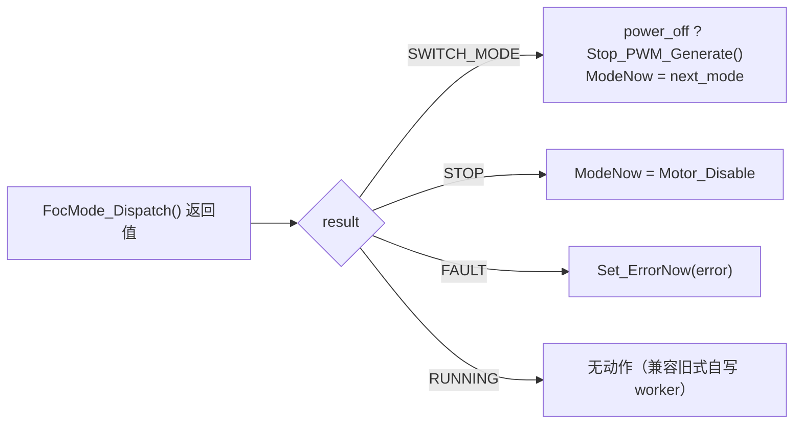
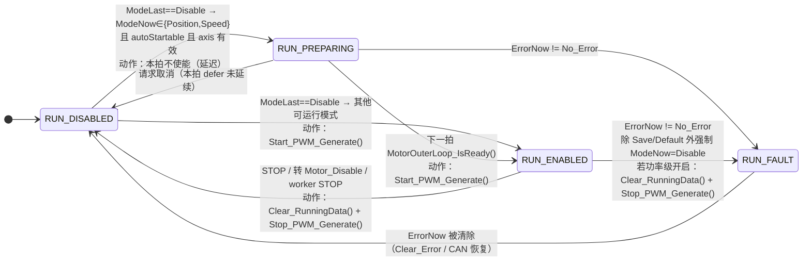

# 统一运行状态机设计 v1.0

日期：2026-09-19。状态：**阶段 1 与阶段 2a 已实施并验证**（阶段 2b/3 待启动）。

## 背景

当前"状态"由五套隐式机制分别维护，没有任何一处是单一权威：

| 隐式状态 | 载体 | 写点（2026-09-19 统计） |
| --- | --- | --- |
| 运行模式 | `MotorControl.ModeNow`（16 值，含 4 个伪命令） | 约 17 处：`ModeSwitch_Handle` 内部直接赋值、`foc_calibration.c` ×7、`foc_cogging_calibration.c` ×4、`foc_friction_identification.c`、`main.c`、各标定完成/失败路径 |
| 故障 | `MotorControl.ErrorNow` | 30+ 处 `Set_ErrorNow`；清除路径散落（`Clear_Error` 模式、CAN 恢复时自动清 `No_Error`） |
| 功率级 | TIM1 PWM/OCN 开关 | `Stop_PWM_Generate` 被辨识模块直接调用 4 处；`Start_PWM_Generate` 被 cogging 模块直接调用 1 处；`foc_run_state` 2 处 |
| 使能准备 | `position_start_prepared`（`foc_run_state` 静态变量） | 1 处，无对外可见状态 |
| 标定阶段 | `CalibStep`、`SensorlessStartup.state`、cogging/friction 内部状态 | 各模块自持 |

`motor_state.{c,h}` 是状态**存储**层（实例归属与初始化）；`foc_run_state.{c,h}` 是迁移**策略**层，
两者职责不重叠。真正缺失的是把"模式 / 功率级 / 故障反应 / 使能准备"统一为一个显式状态机：
现状下迁移只能靠 `ModeLast` 与 `ModeNow` 差分推断，任何一个 `Task_*` 都能直接改模式或开关功率级，
异常路径（例如 PREPARING 中触发欠压）无法集中验证。

## 目标与验收

1. 引入唯一权威的显式运行状态机（命名 `RunState`），状态与迁移条件集中在一个函数内；
2. 单一写者：`ModeNow`、功率级开关（`Start/Stop_PWM_Generate`、`Clear_RunningData`、零值预载）
   只由状态机写；外部请求改为投递事件；
3. 标定/控制任务不再自行改模式或开关功率级，改为返回统一结果上报边界；
4. 阶段 1 行为等价：ISR 调用顺序与功率级调用序列与现状逐 token/夹具一致；
5. 迁移表可由原生夹具穷举验证（stub 驱动，无硬件）。

## 设计

### 状态集（4 态）

| 状态 | 含义 | 功率级 | 允许的事件 |
| --- | --- | --- | --- |
| `RUN_DISABLED` | 空闲；接受模式请求 | 关闭 | `REQ_MODE`、`REQ_STOP`、`EV_FAULT` |
| `RUN_PREPARING` | 已准入使能：预载零矢量、控制器校验、等待就绪 | 关闭（保持预载占空比） | `EV_READY`、`REQ_STOP`、`EV_FAULT` |
| `RUN_ENABLED` | 执行模式 worker | 开启 | `WORKER_RESULT`、`REQ_STOP`、`EV_FAULT` |
| `RUN_FAULT` | 故障锁存；功率级关闭、故障指示 | 关闭 | `REQ_CLEAR` |

### 事件集

| 事件 | 来源 | 说明 |
| --- | --- | --- |
| `REQ_MODE(mode)` | CAN 命令、内部请求 | 先经准入校验（现 `ModeSwitch_Handle` 拆为纯校验），失败原因为 `MotorParam_Error`/`Over_Voltage` 等 |
| `REQ_STOP` | CAN STOP、CAN 断开、内部请求 | 请求停机并清理运行数据 |
| `EV_FAULT(error)` | 保护模块 `Set_ErrorNow` | 状态机观察 `ErrorNow != No_Error` 即视为故障事件 |
| `EV_READY` | 预载完成 + `MotorOuterLoop_IsReady()` | 仅 `RUN_PREPARING` 使用 |
| `WORKER_RESULT` | 模式 worker 返回值 | `{RUNNING, SWITCH_MODE, STOP, FAULT}` |
| `REQ_CLEAR` | `Clear_Error` 命令、CAN 重连恢复 | 清除锁存；条件不满足时保持 `RUN_FAULT` |

### 迁移表（阶段 1 行为基线）

| 当前 | 事件 | 下一状态 | on-entry 动作 |
| --- | --- | --- | --- |
| `DISABLED` | `REQ_MODE`（Position/Speed/需准备类）| `PREPARING` | 记录待启动模式；保持零矢量预载 |
| `DISABLED` | `REQ_MODE`（其余可运行模式）| `ENABLED` | `Start_PWM_Generate`（沿用当前列表：除 Save/Default/Clear/SetZero/Calib_Anticogging 外） |
| `PREPARING` | `EV_READY` | `ENABLED` | 提交 `ModeNow`；`Start_PWM_Generate` |
| `PREPARING` | `REQ_STOP` | `DISABLED` | 清理准备标志；不写 `ModeNow`（保持停止语义） |
| `PREPARING` | `EV_FAULT` | `FAULT` | `ModeNow = Motor_Disable`（Save/Default 例外）；`Stop_PWM` |
| `ENABLED` | `REQ_STOP` / `WORKER_RESULT(STOP)` | `DISABLED` | `Clear_RunningData` + `Stop_PWM_Generate` |
| `ENABLED` | `WORKER_RESULT(SWITCH_MODE)` | `PREPARING`/`ENABLED` | 按新模式的使能策略选择 |
| `ENABLED` | `EV_FAULT` | `FAULT` | `Clear_RunningData` + `Stop_PWM` + 故障指示 |
| `FAULT` | `REQ_CLEAR`（条件允许）| `DISABLED` | 清 `ErrorNow`；指示复位 |
| 任意 | `EV_FAULT` | `FAULT` | 幂等：确保功率级关闭 |

说明：

- **保留现状的例外**：`Save_Param`/`Default_Param` 期间故障不强制停机（Flash 写入容错），
  在 `FAULT` 的 on-entry 中以显式分支保留；`Set_ZeroPosition`/`Calib_Anticogging` 不进入自动使能
  列表，同样在准入表中显式列出。
- **伪命令暂保留枚举**：`Save_Param`/`Default_Param`/`Clear_Error`/`Set_ZeroPosition` 仍占用
  `ModeNow` 值（CAN 兼容），内部先按"命令状态"处理，迁出枚举列为后续独立评估项。
- **`ModeLast`/`ErrorLast` 保留**：作为前台/诊断使用的影子副本，由状态机在提交点统一更新；
  差分不再作为迁移依据。
- **`Set_ErrorNow` 保持现状**：保护模块实时置位审计不变；清除路径收敛到 `REQ_CLEAR`。

### 单一写者规则

| 资源 | 唯一写者 | 其他模块的正确做法 |
| --- | --- | --- |
| `MotorControl.ModeNow` | 状态机提交点 | 投递 `REQ_MODE`/`REQ_STOP`/`WORKER_RESULT` |
| `Start/Stop_PWM_Generate`、`Clear_RunningData`、零矢量预载 | 状态机 on-entry | 不再直接调用（辨识模块现有 5 处移除） |
| `ErrorNow` | 置位：保护模块；清除：状态机 | 置位走 `Set_ErrorNow`，清除走 `REQ_CLEAR` |

### worker 结果协议（阶段 2）

```c
/* firmware/motor/motor_work.h：类型必须放在 motor 层，辨识模块才能包含它 */
typedef enum
{
    MOTOR_WORK_RUNNING = 0, /* 继续当前模式 */
    MOTOR_WORK_SWITCH_MODE, /* 请求切换到 next_mode（内部完成/阶段推进） */
    MOTOR_WORK_STOP,        /* 请求停机 */
    MOTOR_WORK_FAULT        /* 上报故障码，由状态机锁存并在同拍停机 */
} MotorWorkResult_TypeDef;

typedef struct
{
    MotorWorkResult_TypeDef result;
    ModeNow_TypeDef next_mode; /* 仅 SWITCH_MODE 有效 */
    ErrorNow_TypeDef error;    /* 仅 FAULT 有效 */
} MotorWorkOutcome_TypeDef;
```

- `FocMode_Dispatch()` 返回该结果，`FocRunState_Tick(outcome)` 是唯一消费者；
  任务不再需要直接调用 `Set_ModeNow`/`Set_ErrorNow`（迁移完成的路径）。
- 类型放在 `firmware/motor/motor_work.h`：`foc_run_state.h` 是 app 层，motor 层模块不能包含它。
- 各标定内部阶段机（`CalibStep`、`SensorlessStartup.state` 等）保留，只在开始/完成/失败边界上报。
- 功率级处理沿用状态机既有迁移规则：转 `Motor_Disable` 走停机路径；
  带本地 `Stop_PWM`/高侧状态/`Start_PWM` 的路径（阶段 2b）仍由模块自理，未纳入本协议。

### 与现有文件的映射

| 文件 | 变化 |
| --- | --- |
| `foc_run_state.{c,h}` | 演进为状态机：新增 `RunState_TypeDef`/`RunEvent_TypeDef` 与迁移函数；现存三个函数降为内部动作或删除 |
| `motor_state.{c,h}` | 不变（纯存储）；可选后续改名 `motor_context` 以消除命名歧义 |
| `foc_mode_dispatch.{c,h}` | `ENABLED` 下的模式执行 + 结果收集；不再持有迁移判断 |
| `foc_errhandle.c` | `ModeSwitch_Handle` 拆为纯准入校验 + 模式准备动作；清除/停机路径改为事件 |
| `foc_task.c` | ISR 顺序不变，状态机调用点替换现 `FocRunState_*` 三个调用 |

## 状态机图（当前实现，2026-09-19）

### worker 结果预处理（每拍先执行）



### 状态迁移（ModeLast/ModeNow 差分 + 故障锁存）



### 每拍判定顺序与动作

| 顺序 | 条件 | 动作 | 状态效果 |
| --- | --- | --- | --- |
| 1 | `outcome.result == SWITCH_MODE` | 可选 `Stop_PWM`；`ModeNow = next_mode` | — |
| 2 | `outcome.result == STOP` / `FAULT` | `ModeNow = Motor_Disable` / `Set_ErrorNow` | — |
| 3 | `ErrorNow != No_Error` | LED 红；非 Save/Default 强制 `ModeNow = Motor_Disable`；取消启动请求 | PREPARING/ENABLED → FAULT |
| 4 | `ErrorNow == No_Error` | LED 绿（当前模式） | FAULT → DISABLED |
| 5 | `ModeLast != Disable && ModeNow == Disable` | `Clear_RunningData + Stop_PWM` | → DISABLED（FAULT 除外） |
| 6 | 否则 `ModeLast == Disable && ModeNow != Disable` 且 autoStartable 且 axis 有效 | 需准备模式：本拍 defer；否则 `Start_PWM` | → PREPARING / ENABLED |
| 7 | 本拍未 defer 且状态为 PREPARING | —（取消准备） | → DISABLED |
| 8 | 提交 | `Detect_Mode_Error_Change`；非 defer 时 `ModeLast = ModeNow`；`ErrorLast` 与镜像更新 | — |

说明：

- `autoStartable` = 非 `Save_Param`/`Default_Param`/`Clear_Error`/`Set_ZeroPosition`/`Calib_Anticogging`；
  需准备模式 = `Position_Mode`/`Speed_Mode`（首个使能拍必延后一拍）。
- **模式间直切**（`ModeLast != Disable` → `ModeNow != Disable`，例如 Calib→Calib）不匹配第 5/6 条，
  状态保持 `ENABLED`，功率级无动作——这是迁移期保留的旧式行为，待 worker 全部迁移后收敛。
- `DISABLED` 状态下发生故障不进入 `FAULT`（功率级本就关闭），仅锁存故障并置红指示；
  清除后维持 `DISABLED`。
- `power_off` 仅由结果协议携带（标定完成路径），与状态迁移解耦。

## 分阶段实施

| 阶段 | 内容 | 验证 |
| --- | --- | --- |
| 1 ✅ | 显式化：`RunState` 四态与迁移表落地于 `foc_run_state.c`；`foc_task.c` 只调用 `FocRunState_Tick()`；差分等价 | 新旧实现逐 tick 差分穷举 2400 组全部一致（见下） |
| 2a ✅ | 结果协议 `motor_work.h` + 状态机消费；迁移"无本地功率动作"的完成路径：电流零偏标定、相位电阻状态映射、机械零位记录 | 差分 31,200 组（含 13 种结果载荷）；`test_current_precision` 路径断言；PR 通过 |
| 2b（进行中） | 剩余直接写者：TorqueGuard 跳闸、cogging `Stop/Start/finalize` 临界区握手、sensorless/position/impedance worker、dispatch 零矢量预载。（2026-09-19：FOC-Calibration 功能已整体移除，原"标定模块其余 `Save_Param`/高侧路径"随之删除，待重建。）~~friction 完成路径~~ ✅、~~编码器观测器标定完成路径~~ ✅ | 每路径先建夹具再迁移（对照 2a 做法） |
| 3 | 命令与模式分离（伪命令迁出枚举）与 CAN 映射兼容处理 | 协议文档 + 上位机约定 + 兼容性说明；本阶段单独评审后启动 |

每阶段：`check_project_layout` 0 错误、普通/HIL 双变体交叉编译 0 错误、PR 离线套件通过。

## 风险与缓解

- **CAN 模式值 ABI**：`ModeNow` 数值出现在命令与状态帧中；阶段 1/2 不改数值，阶段 3 需版本化。
- **实时性**：迁移表为 O(1) 分支，无动态分配/回调；on-entry 动作与现状同为有界 HAL 调用。
- **Flash 保存流程**：`Save_Param` 特判在迁移表中显式保留，避免被故障分支打断。
- **并行工作**：cogging 补偿扩展到全模式的工作依赖模式接线点（`foc_mode_dispatch.c`），阶段 1 不改变该接口。

## 验证证据

阶段 1（2026-09-19）：

- **差分等价**：`tests/unit/native/test_run_state.py` 将拆分前的三个函数（重命名为 `Old_*`）
  与新的 `FocRunState_Tick` 放在同一宿主程序中，穷举
  `ModeLast × ModeNow × ErrorNow × axis_profile_valid × IsReady`（10×10×2×2×2）
  各跑 3 个 tick，对拍动作序列（LED/停机清理/停 PWM/启 PWM/变化检测/就绪查询）与
  每 tick 后的 `ModeNow/ErrorNow/ModeLast/ModeNow_f/ErrorNow_f`：
  **2400 组 tick 比较全部一致**。
- **行为细节保留**：`RUN_PREPARING` 承载原 `position_start_prepared`（首次进入必延后一拍）；
  故障时 `Save_Param`/`Default_Param` 不强制停机；命令类模式不进入自动使能列表。
- **门禁**：`check_project_layout` 0 错误；普通与 `SERVO_HIL_ENABLE=1` 变体交叉编译
  `foc_run_state.c`/`foc_task.c` 均 0 错误；`verify --profile pr` 全部通过——
  `outputs/runs/20260918T182112067939Z-baaa0338/summary.json`。
- 决策按评审保留：PREPARING 仅用于 Position/Speed（不对称如实保留）；
  模式准备动作（进入位置模式时锁定当前位置）暂留准入路径，阶段 2 再随单一写者收拢。

阶段 2.1（2026-09-19）：

- **迁移的写点**：`Task_Calib_CurrentOffset`（完成 → `MOTOR_WORK_STOP`）、
  `foc_mode_dispatch.c` 的相位电阻状态映射（DONE → STOP；四类失败 → FAULT）、
  `Task_SetMechanicalZero`（成功 → `SWITCH_MODE(Save_Param)`，失败 → `FAULT(Encoder_Error)`）。
  这些路径原本无本地功率级动作，转 `Motor_Disable`/`Save_Param` 后的功率行为
  与状态机既有迁移规则一致，因此等价性可构造性证明。
- **差分扩展**：`test_run_state.py` 在原有网格上加入 13 种结果载荷
  （RUNNING/STOP/FAULT/11 种 SWITCH_MODE），对拍"旧 worker 直接写 + 旧三函数"
  与"新 `FocRunState_Tick(outcome)`"：**31,200 组 tick 比较全部一致**。
- **路径夹具**：`test_current_precision.py` 改为捕获返回值并断言
  `MOTOR_WORK_STOP`，同时补 `-UNDEBUG`（zig cc 在 `-O1` 下默认定义 `NDEBUG`，
  原命令的断言实际从未执行；对照 `run_position_servo_tests` 的既有写法）。
- **断言休眠审计（已完成）**：同一问题存在于另外 6 个原生测试
  （`test_adc_fast_dispatch`、`test_current_oversampling`、`test_encoder_sample_overlap`、
  `test_fast_loop_math`、`test_outer_loop_runtime`、`test_position_config_cache`）。
  本轮统一补 `-UNDEBUG` 并核实：**全部断言真实执行且通过**（说明断言本身是正确的，
  此前只是从未运行）。同时按改动即失效的规则补齐这些文件的门禁合规：17 处单行控制体补花括号、
  模块 docstring 中文化、重复 `ROOT` 导入移除。
  ⚠️ 自此这些测试的断言对后续改动生效，包括并行进行的 `foc_run.c` 拆解
  （`test_outer_loop_runtime`、`test_position_config_cache` 在其实施计划的验证清单内）。
- **门禁**：接口契约补齐 `foc_calibration.h` 五个任务声明（并从 interface_debt 移除）；
  双变体交叉编译 0 错误；`verify --profile pr` 全部通过——
  `outputs/runs/20260918T183007067340Z-baaa0338/summary.json`。

阶段 2b（进行中，2026-09-19）：

- **结果语义扩展 `power_off`**：`MotorWorkOutcome_TypeDef` 新增 `power_off`，
  用于声明"应用模式前先 `Stop_PWM`"（等价于模块原先自行停功率级）；
  差分夹具扩展到 16 种结果载荷：**38,400 组 tick 比较全部一致**。
- **friction 完成路径**：`FocFrictionIdentification_Task` 改为返回结果协议；
  内核完成时返回 `MOTOR_WORK_STOP`，不再自行 `Set_ModeNow(Motor_Disable)`。
  本地 `StopOutput`（仅清零速度/电流指令并复位速度 PI，不含功率级动作）保留在
  模块内，停机清理仍由状态机路径执行——迁移前后同一 tick 内行为一致。
- **编码器观测器标定完成路径**：`Encoder_ObserverCalib_Finish` 与
  `Task_Calib_EncoderObserver` 改为返回结果协议，完成时返回
  `SWITCH_MODE(Save_Param) + power_off`；模块不再自行 `Stop_PWM`/写模式。
  原生夹具 `test_sensorless_transitions` 改为模拟状态机消费结果，
  其 "PWM-off before save" 断言由协议契约保证，仍全部通过。
- 三个头文件（friction/校准）累计补齐 17 个接口中文契约并从 interface_debt 移除。
- 剩余路径的迁移仍按"先夹具后迁移"逐条推进：TorqueGuard 跳闸、
  cogging `Stop/Start/finalize` 临界区握手、标定模块其余 `Save_Param`/高侧路径、
  sensorless/position/impedance worker（待 `foc_run.c` 拆解落地后适配）、
  dispatch 零矢量预载。
- **门禁**：双变体交叉编译 0 错误；`verify --profile pr` 中除 `foc_run.c` 的
  format（并行拆解实施中，非本轮改动）外全部通过——
  `outputs/runs/20260918T184405803443Z-baaa0338/summary.json`。

阶段 3：待启动（伪命令迁出枚举 + CAN 兼容，需单独评审）。
