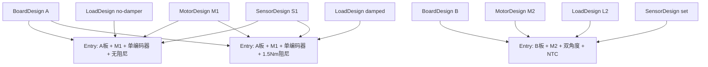

# 新硬件、新电机与新传感器快速适配指南

本指南说明如何用统一 `ProductConfig` 配置不同关节项目，同时把控制算法与 MCU、板卡和器件协议解耦。统一标定步骤见 [`unified_motor_commissioning_guide.md`](unified_motor_commissioning_guide.md)，完整分层见 [`architecture/firmware_architecture.md`](architecture/firmware_architecture.md)。

## 1. 先理解四个对象

| 对象 | 回答的问题 | 主要文件 |
| --- | --- | --- |
| Product | 这个量产组合选择哪块板、哪台电机、哪种负载、哪些传感器与策略？ | `Firmware/Core/Config/product_catalog.*` |
| Board | 这块 PCB 实际有哪些 PWM、采样、传感器、通信和存储资源？ | `Firmware/Bsp/Boards/<board>/` |
| Platform | 这些通用硬件语义怎样映射到某个 MCU/HAL？ | `Firmware/Platform/<mcu>/` |
| Driver | 某个外设芯片的协议怎样编解码？ | `Firmware/Drivers/<class>/<device>/` |

不要把四者合成一个巨型配置文件：

- `ProductConfig` 是产品意图和设计值；
- Board capability 是物理事实；
- Platform 是 MCU 实现；
- Driver 是器件协议实现。

启动时由 `Firmware/Bsp/Boards/<board>/Bootstrap/firmware_composition.c` 取得当前 entry，先做 ProductConfig 校验，再做 Board endpoint/binding 校验，最后才创建接口并启动周期中断。任一条件不满足都保持电机输出关闭。

## 2. endpoint 到底是什么

endpoint 是稳定的逻辑资源 ID，用来把“产品所需资源”映射到“板上实际资源”。它不是：

- GPIO 编号；
- ADC Rank；
- SPI/FDCAN 实例号；
- Product 数组下标；
- 传感器型号 ID。

例如当前 entry 的逻辑资源：

```text
0x0100  主 motor-drive
0x0101  A 相电流采集
0x0102  B 相电流采集
0x0103  C 相电流采集
0x0201  主角度传感器
0x0301  MCU 内部温度
0x0401  CAN 控制总线
0x0402  USB service stream
```

映射过程：


以相电流为例，`channel_roles[]` 明确 A/B/C/DC-link，`channel_endpoints[]` 选择资源，`channel_polarities[]` 指定符号，`current_a_per_count[]` 指定正幅值。即使数组顺序改变，A 相也必须通过 role 和 endpoint 找到正确 acquisition index，不能用 `channel 0 == ADC rank 1 == phase A` 这种隐含耦合。

endpoint ID 一经量产应保持稳定。更换 ADC Rank 只改板级/Platform 映射；产品物理语义发生变化才分配新 endpoint。

## 3. 配置的单一来源

| 文件 | 职责 |
| --- | --- |
| `Firmware/Core/Config/product_config.h` | 配置类型、最大实例数、拓扑、反馈、功能和标定策略 |
| `Firmware/Core/Config/product_config_validator.c` | 完整结构与跨字段校验 |
| `Firmware/Core/Config/product_config_runtime.c` | 目标端低成本运行前门禁 |
| `Firmware/Core/Config/product_capabilities.c` | 从实例、反馈和策略派生能力/标定步骤 |
| `Firmware/Core/Config/product_catalog.h` | 稳定 component/variant/endpoint ID 与构建选择 |
| `Firmware/Core/Config/product_catalog.c` | Board/Motor/Load/Sensor design 和完整 entry |
| `Firmware/Core/Config/product_manifest.*` | 固件、硬件、参数 schema 与 fingerprint 元数据 |
| `Firmware/Bsp/Boards/<board>/` | endpoint、物理能力、Flash 布局、绑定与 Bootstrap |

叶模块不调用 `ProductCatalog_GetCurrent()`。Bootstrap 把完整配置投影成电流、角度、控制、温度、标定、持久化和通信各自需要的窄配置。

## 4. 多个项目如何同时配置

一个“项目”对应一个完整 `ProductCatalogEntry`，而不是运行时零散拼装：



共享 design 对象，entry 只组合指针和项目级策略。每个 entry 必须拥有唯一且稳定的：

- `variant_id`；
- 兼容性需要变化时的新 `configuration_fingerprint`；
- Board/Motor/Encoder/Load/Control/Storage compatibility tuple；
- 明确的 legacy migration 授权，默认关闭。

生产构建只选择一个 entry：

```text
PRODUCT_CATALOG_ACTIVE_VARIANT=<variant macro>
```

建议为每个量产项目建立独立 Keil target/CI job 和独立输出目录，target 只改变选择宏，不复制算法源码。不要在设备运行时根据 Flash 或 CAN 命令任意切换硬件产品身份。

当前两个变体：

| 变体 | 宏 | variant/fingerprint | 关键差异 |
| --- | --- | --- | --- |
| 无阻尼 | `PRODUCT_CATALOG_VARIANT_NO_DAMPER` | `0x00010000` / `0x9C501110` | 轻载速度与标定参数、位置摩擦辅助关闭、拒绝 erased fingerprint |
| 约 1.5 Nm 阻尼 | `PRODUCT_CATALOG_VARIANT_DAMPED` | `0x00010001` / `0x9C501111` | 阻尼启动/标定参数、位置摩擦辅助打开、保留已部署 legacy 授权 |

Keil 当前默认选择 Damped。Host 必须分别编译并运行两个活动分支：

```powershell
pwsh -NoProfile -File tests/host/build_and_run_host_tests.ps1 -ProductVariant Damped
pwsh -NoProfile -File tests/host/build_and_run_host_tests.ps1 -ProductVariant NoDamper
```

`PRODUCT_CATALOG_INCLUDE_ALL=1` 只用于 host catalog/matrix 测试，不加入量产 target。

## 5. 一个 ProductConfig 需要配置什么

| 字段 | 内容 | 主要约束 |
| --- | --- | --- |
| `identity` | product/variant/platform/fingerprint/hardware revision | 非零、与 Manifest/BSP 一致 |
| `board` | PWM 频率、motor endpoint、电流拓扑、母线比例、板级上限和通信能力 | 必须与 Board capability 一致 |
| `motor` | 极对数、R、Ld/Lq、磁链、电流、速度 | SI 单位、有限且不超过板上限 |
| `motor_acceptance` | R/L/磁链设计验收范围 | 范围有效，包含设计值 |
| `load` | 传动比、输出速度、允许的辨识能力 | 与控制/标定策略一致 |
| `angle_sensors[]` | design、instance、source、role、endpoint | 0..2、ID/role/endpoint 不重复 |
| `temperature_sensors[]` | design、instance、source、zone、endpoint、毫秒周期、保护 | 0..3；当前 target 另有限制 |
| `safety` | 过流、欠压、过压、滤波和确认周期 | 与板/电机上限一致 |
| `control` | 环路频率、带宽、默认值/边界、observer、位置摩擦辅助 | 慢环频率必须整除快环 |
| `commissioning_tuning` | 各阶段电流、速度、时间、样本和验收阈值 | 不超过板/电机/控制上限 |
| `feedback` | 电角度、速度、转子/输出位置、标定参考、fallback 来源 | 来源能力和实例索引有效 |
| `features` | 必需/可选/关闭的功能和热区 | required 能力必须存在 |
| `commissioning` | 必需/自动/关闭的标定步骤 | 步骤前置能力必须存在 |
| `can` / `service_stream` | endpoint、模式、速率、payload、节点、心跳 | Board 和协议共同允许 |

内部物理量统一采用 SI：A、V、Ω、H、Wb、rad、rad/s、s；只有协议边界按协议换算。

## 6. 适配新电机和负载

1. 在 `product_catalog.h` 分配新 motor design ID 和 variant ID；
2. 在 `product_catalog.c` 添加 `ProductMotorDesign`：极对数、相电阻、Ld/Lq、磁链、运行/标定电流、机械速度；
3. 添加 `ProductMotorAcceptanceConfig`，辨识只判断设计是否合格，不覆盖设计 R/L/磁链；
4. 配置 `ProductControlConfig`：20 kHz 之下的速度/位置/级联位置频率、PI/轨迹默认值和范围、observer 参数；
5. 添加或复用 `ProductLoadDesign`，把阻尼、传动比和允许辨识能力放在负载层；
6. 在 `ProductCommissioningTuningConfig` 中配置动作电流、速度、稳定、采样、超时和验收阈值；
7. 组合完整 entry，给出新 fingerprint，默认拒绝旧 Flash；
8. 分别验证 ProductConfig、BSP binding、参数默认、标定和闭环。

当前 HT8115-4 设计基准：

```text
pole pairs          21
phase resistance    1.905 ohm
Ld / Lq             1.635 mH / 1.635 mH
flux                17.5025 mWb
motor current limit 6 A
calibration current 3 A
motor speed limit   38.9557489 rad/s
```

这些是代码设计值，不从 Flash 恢复。observer 使用独立的 `flux_observer_resistance_scale`，它不会修改真实相电阻设计值。

## 7. 配置 0/1/2 个角度传感器

### 7.1 配置模型

| 数量 | 可表达的产品意图 | 必须同步处理 |
| ---: | --- | --- |
| 0 | 纯无感电角度/速度；没有物理位置 | 所有 angle route 用 `NONE` 或 observer；关闭位置、方向/LUT/零位等不具备能力的功能 |
| 1 | 主转子角度，或单独输出轴角度 | role、endpoint、feedback route 和标定 policy 一致 |
| 2 | 当前运行时支持 primary + output shaft | 两个 instance/endpoint 与采集状态独立；输出位置显式路由。primary + redundant 尚不支持并必须拒绝 |

每个实例包含：

- 稳定 `instance_id`；
- `ProductAngleSensorDesign`；
- `source`；
- `role`；
- endpoint。

`feedback` 单独选择电角度、motor velocity、motor position、output position、calibration reference 和 fallback。传感器存在并不自动成为控制反馈。

### 7.2 当前 VectorMiniSt 边界

当前活动 entry 只有一个板载 TLE5012B 主转子实例，design ID 为 `PRODUCT_CATALOG_ANGLE_TLE5012B`，65536 count/turn。电角度、motor velocity 和 motor position 都来自 index 0；标定参考使用 sensorless observer；`fallback_electrical_angle` 明确为 `NONE`。其他 16-bit 串行编码器必须分配新的 design ID 并增加独立 adapter case，不能复用 TLE5012B 的身份。

VectorMiniSt Bootstrap 可创建 0/1/2 个实例；两个实例时只接受 `primary + output shaft`。关键转子 route 必须指向 primary，输出位置 route 必须指向 output，两个 endpoint 和跟踪状态相互独立。schema 10 仍只保存 primary 的方向、电/机械零位和 1024 点 LUT，output 不共享或占用第二份 LUT。

`primary + redundant`、双转子对齐、自动 fallback 和第二份转子 LUT 尚未实现，相关 feature/policy 必须关闭，否则启动拒绝。Bootstrap 还会按每个实例的精确 `design_id` 选择 Driver；未知器件 ID 不会被当作当前 TLE5012B 兼容器件接受。

适配新角度器件时，先分配稳定 sensor design ID 并填写分辨率/方向/LUT/零位等真实能力，再在 `Firmware/Drivers/Angle/<device>/` 实现协议，在目标 Bootstrap 的显式 factory 中加入 `design_id -> Driver` 分支，最后补充已知 ID、未知 ID、endpoint/role/route 与独立实例状态测试。仅复用相同总线协议不等于器件兼容。

## 8. 配置可选温度传感器

配置模型最多 3 个温度实例，每个实例指定 source、thermal zone、endpoint、`sample_period_ms`、`pending_timeout_ms`、保护开关和阈值。

| 配置 | 正确做法 |
| --- | --- |
| `OFF` | 不要求该功能；无温度时 `temperature_sensor_count=0`，monitor/protection 和 required zone 均关闭 |
| `OPTIONAL` | endpoint/实例存在时接入，缺失不阻止该产品启动；常用于可选监测硬件 |
| `REQUIRED` | 对应实例、endpoint 和能力必须可绑定，否则启动失败；用于保护时还必须打开实例保护并验证 thermal zone |

当前 VectorMiniSt 没有装配功率级 NTC：

- 活动 entry 使用 MCU 内部温度 endpoint `0x0301`；
- 1 ms 请求周期、2 ms pending timeout；
- `temperature_protection=OFF`、实例 `protection_enabled=false`；
- 高温、invalid、stale、open、short 或 sensor fault 只进入监测/诊断，不触发温度 trip；
- MCU die 温度不能代表电机绕组或功率 MOSFET 温度；
- 板能力中的功率级 NTC endpoint 是 `PROVISIONED_UNPOPULATED`，不能绑定为可用资源。

当前 Bootstrap 最多接入 1 个温度实例。要使用多个 thermal zone，必须先扩展实例创建/监督聚合和故障归属，再配置多个 entry。

## 9. 标定与控制模式策略

`ProductConfig_Derive()` 将能力与 `commissioning` policy 合成为固定顺序的 `commissioning_steps`，Bootstrap 已把它投影到工作流和独立标定命令门禁。只执行 mask 中启用的阶段，不能重排阶段。全部步骤为 `DISABLED` 时产品仍可启动，但 Mode 21 和各单项标定命令拒绝；Mode 8/9 的参数加载/保存维护能力不受该 mask 关闭。

`features` 同样真实决定运行时准入。速度、位置、输出位置和无感功能设为 `OFF` 时，对应控制模式请求会被拒绝；`OPTIONAL` 只有在反馈/observer 能力存在时才开放；`REQUIRED` 缺少前置能力会使配置校验或启动失败。

## 10. 配置 3/2/1-shunt 电流采样

| 拓扑 | Product/算法框架要求 | 当前 VectorMiniSt |
| --- | --- | --- |
| inline 3-shunt | A/B/C 三个 role/endpoint，三相直接观测 | 物理 capability 未声明，启动拒绝 |
| low-side 3-shunt | A/B/C 三个通道、PWM 同步、固定或有效窗口采样 | 唯一已接通路径：固定同步采样，每 PWM 一组，三相直接有效 |
| low-side 2-shunt | 两个物理通道、有效相 mask、缺相重构与不可观测窗口策略 | 纯策略可表达，板级 acquisition/验证未接通，启动拒绝 |
| DC-link 1-shunt | 单通道、每 PWM 至少两个采样点、扇区、窗口补偿、PWM+ADC trigger 原子提交 | BSP 契约/纯策略可表达，当前 Platform 无动态采样实现，启动拒绝 |

切换拓扑不能只改 enum。必须同时完成：

1. Board capability 的 topology、容量、endpoint 与 sampling mode；
2. Product channel role、polarity、endpoint、正 scale、offset 与有效范围；
3. Platform 的 ADC trigger/window、采样序号和原子 `commit_cycle()`；
4. 相重构的 valid mask/quality/failure 行为；
5. offset 标定、过流保护、20 kHz 时序和示波器验证。

当前 VectorMiniSt 三下管三分流配置：

```text
physical channels      3 (A/B/C)
polarity               all INVERTED
scale                   0.0134310134 A/count
default offsets         2048 / 2048 / 2048
valid offset range      1948 .. 2148
nominal shunt           6 mOhm
control frequency       20 kHz
sampling                synchronized FIXED, 1 set/PWM
reliable range          20 A
command/calibration max 10 A / 10 A
software overcurrent    18 A
```

## 11. 适配新板与新 MCU

### 11.1 新板，同 MCU

1. 新建 `Firmware/Bsp/Boards/<new_board>/`；
2. 定义 board ID、binding fingerprint、真实 endpoint 能力和 memory map；
3. 复用或新增 `Firmware/Platform/Stm32G431/` Adapter；
4. 在 `<new_board>/Bootstrap/` 创建该 target 唯一组合根；
5. 建立对应 BoardDesign 和 Product entry；
6. 为 BSP 正/反 binding、safe-state 和 endpoint 重排添加测试；
7. 更新 CubeMX/Keil target，但不修改 Core 算法。

### 11.2 新 MCU

1. 保持 `Firmware/Bsp/Api/` 不变；
2. 新建 `Firmware/Platform/<new_mcu>/`，实现 motor drive、angle bus、temperature、communication、time、critical section、storage、reset 等接口；
3. 新建板包和 Bootstrap，不能在旧 Platform 堆积板型条件；
4. 设置新的 `platform_id`、BoardDesign、Manifest 和 Flash 布局；
5. 建立独立工程/链接配置；
6. 重做 PWM、ADC 同步、故障关闭和 20 kHz deadline 实测。

## 12. CAN/USB 配置

`ProductCanConfig` 选择 endpoint、Classic/FD、nominal/data bitrate、BRS、最大 payload、node ID 与 heartbeat。当前活动 entry 是 Classic CAN、1 Mbit/s、data bitrate 0、BRS 关闭、8-byte payload。

板能力声明支持 FD/BRS 不等于活动固件正在使用 FD。启用 FD 时必须同时满足 Product validator、Board capability、Platform timing 和 USB-CAN 工具设置，并重新执行真实总线测试。

USB service stream 由独立 endpoint 配置。CAN 与 USB 的外层报文不同，但均路由到同一 Application API；不得让产品配置复制两份命令业务规则。

当前 VectorMiniSt Bootstrap 要求 CAN 与 USB service stream 都启用并成功绑定。把其中任一项关闭会在该 target 上拒绝启动；这是 Vector target 的组合限制，不是通用 Core 不能支持无 CAN 或无 USB 产品。

## 13. Flash/兼容性边界

VectorMiniSt：

```text
Application       0x08000000 .. 0x0801BFFF (114688 B)
Parameter storage 0x0801C000 .. 0x0801FFFF (16 KiB)
Slot 0 / Slot 1   各 8 KiB
Erase             2048 B
Program alignment 8 B
```

schema 10 的 `ParameterSnapshot` payload 已部署为 2464 B；关键偏移 shunt=2172、friction=2188、cogging=2208。只恢复：

- 三相电流 offset；
- 当前单转子编码器方向、电/机械零位和 1024 点 LUT；
- 摩擦模型；
- 128 点齿槽表。

R/L/磁链、极对数、控制增益/限值、CAN 默认值和标定动作参数始终来自代码 entry。历史结构中仍有同名字段只是 ABI 保留，不能把它们重新变成运行权威。

新 entry 必须使用新 fingerprint，默认 `allow_erased_fingerprint_migration=false`。只有明确证明 tuple 相容并编写迁移测试后才允许兼容读取。

## 14. 最短适配清单

```text
明确产品组合与物理能力
→ 分配稳定 design/variant/endpoint ID
→ 填 Board/Motor/Load/Sensor design
→ 填实例映射、反馈、功能和标定策略
→ ProductConfig validator
→ BSP endpoint/binding validator
→ 投影窄配置并创建 Adapter
→ Damped/NoDamper/新变体 host 构建
→ 架构门禁、Keil link、Flash/RAM 检查
→ 母线断开检查启动与 fail-closed
→ 重新确认母线电压/限流/接线/负载/急停
→ PWM/ADC/保护实测
→ 统一标定、保存、断电恢复
→ 电流→速度→位置逐级升能量验证
```

每次开始实机操作都必须重新确认当下电源状态。聊天中的“母线已断开”“28 V/1 A”或“可以带电下载”只描述当时状态，不能作为下一次会话的授权或安全依据。
