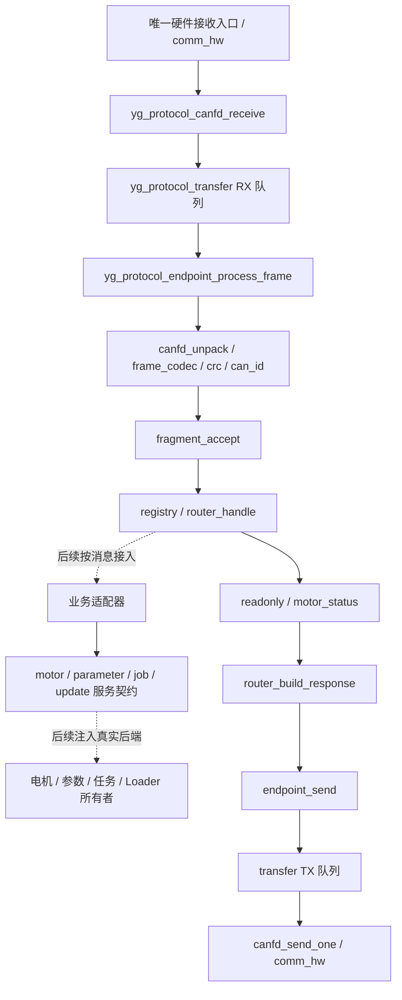

# yg_protocol 核心接口契约 v0.1

日期：2026-09-22，内部接口修订 2。状态：核心接口、后台链路及 MCU 构建已实现；不是整套业务或实机通信验收。
线格式依据项目评审稿 [motor_protocol_v1.md](motor_protocol_v1.md)，公司正式 type/flags 勘误仍待冻结。

## 1. 当前范围与文件关系



| 文件组 | 已实现接口 | 边界 |
| --- | --- | --- |
| `wire_types.h`、`crc.{h,c}` | 消息视图、结果、CRC | 不使用 packed struct |
| `frame_codec.{h,c}`、`can_id.{h,c}` | 应用帧与 CAN ID encode/decode | 单帧 payload≤46B |
| `transfer.{h,c}` | init/push/peek/pop/count/dropped | 固定内存、串行队列，不是 ISR 安全队列 |
| `fragment.{h,c}` | init/reset/accept | 单会话重组与片间超时；完整传输策略尚未验收 |
| `message_registry.{h,c}` | init/find | 只有 type、allow_fragment、periodic，不含权限与去重策略 |
| `router.{h,c}` | init/handle/build_response | handler+context；自动响应缓冲为 46B |
| `can/yg_protocol_canfd.{h,c}` | pack/unpack/receive/send_one | DLC/地址/填充与平台 API 边界 |
| `can/yg_protocol_endpoint.{h,c}` | init/send/process_one/process_frame/reset | 串行组装以上模块，长 TX 消息按46B分片；`process_frame` 接收已安全出队的副本 |
| `readonly.{h,c}`、`readonly_payload.{h,c}` | 只读 provider 注册、字段编解码 | 校验请求方向、拒绝广播；不是能力已实现声明 |
| `motor_status.{h,c}` | convert/feedback_encode/provider | 现有 MotorStatus 值副本转换；无硬件取样 |
| `service.h` | 内部状态码与结果 | status/token/revision/value/detail，不直接序列化 |
| `motor.{h,c}` | request/service/call | STOP、DISABLE、ENABLE、模式、目标的后端边界 |
| `parameter.{h,c}` | request/service/call | READ、WRITE、SAVE、恢复默认的后端边界 |
| `job.{h,c}` | request/service/call | START、CANCEL、QUERY、READ_RESULT 的后端边界 |
| `update.{h,c}` | request/service/call | OPEN、MANIFEST、BEGIN、WRITE、QUERY、VERIFY、ACTIVATE、ABORT |

表中省略的模块前缀均为 `yg_protocol_`，未标 `can/` 的代码位于
`firmware/communication/protocol/`。纯头文件不需要制造空 `.c` 文件。

## 2. 组合层调用顺序

1. 用调用方提供的静态数组初始化独占 RX/TX 队列及消息 registry。
2. 为每个真实支持的 type 建立 route，绑定 handler 与 context，初始化 router。
3. 提供本机 Node、回复优先级、片间超时、重组存储，初始化 endpoint。
4. 唯一硬件接收入口把帧传给 `canfd_receive(rx, received)`；它复制整帧。
5. 主循环后台调用 `endpoint_process_frame(endpoint, frame, now_ms)`，每次至多处理一个已安全出队的 RX 帧；
   `process_one` 仅保留给无并发的串行测试/组合场景。
6. 调用 `canfd_send_one(tx)`，每次只尝试一次平台发送；忙时保持队首。
7. 主动上报或长业务输出调用 `endpoint_send(endpoint, message, priority)`；它复制全部片段。
8. bus-off/会话撤销时显式调用 `endpoint_reset` 丢弃两队列、重组和暂存应答；恢复硬件及业务
   会话由各所有者处理，不能因此恢复使能。

全部入口均为单上下文或由组合层外部串行化。ISR 无锁并发、优先级调度和1kHz调度尚未接入。
`endpoint_send` 输入最大1767B；长消息最多39片，TX必须能一次容纳全部片段。空间不足返回
QUEUE_FULL且不写入半条消息。片序从0开始，逻辑事务关联必须使用payload内的request_id。
实时/周期消息禁止分片；单帧保留原sequence。调用者不能预置分片位。

自动应答只针对有 ACK_REQ 且没有 RESPONSE 的成功路由。TX满时保留一次已经生成的结果，
后续先入队该结果，不重复调用业务。业务错误必须编码为明确的R.result；本地处理失败禁止
构造成功响应。大于46B的响应需业务适配器显式经 `endpoint_send` 提交，不能截断到46B。
回复优先级目前是端点配置值，产品必须按消息分类配置/选择，尚未自动验证每个type的优先级。

## 3. 业务后端接口与所有权

四类服务均采用相同形状但不同的请求值对象：

```c
yg_protocol_motor_service_t motor = {owner_context, motor_handler};
yg_protocol_motor_request_t request = {
    .operation = YG_PROTOCOL_MOTOR_SET_TARGET,
    .mode = 3,
    .position_mrad = 1000,
};
yg_protocol_service_reply_t reply;
yg_protocol_service_status_t status = yg_protocol_motor_call(&motor, &request, &reply);
```

这是内部调用示例，不表示线上请求通过了权限校验，也不执行真实电机。

- `call` 检查基本参数和内部操作范围，只调用一次后端。handler为NULL返回UNSUPPORTED；
  不用空函数冒充成功。后端遗漏status时保持FAILED。
- 线上解码器负责type/payload格式转换；后端拥有模式许可、会话、权限、租约、限位及故障语义。
  内部operation不是command ID，不登记到线上协议；枚举不得直接序列化。
- 所有请求借用到函数返回；异步后端须复制所需数据并返回ACCEPTED+token。OK表示该操作已完成，
  不是报文送达。Flash、复位、校准等长动作由其所有者另行执行。
- 更新data不是MCU地址，image_offset是镜像相对偏移；边界、校验、签名和掉电恢复属于Loader。
- 参数value的单位/表示由参数描述符指定；扩展blob/浮点等需求时再按实际后端修订内部契约。

## 4. 电机状态适配的已有实现

`yg_protocol_motor_status_source_t` 包含现有 `MotorStatus` 副本与调用方提供的线上元数据。
内部mode=18不等于线上mode=4，内部fault也不是线上位图，因此必须显式映射，不能照抄。
该适配器不调用 `MotorStatus_Take`，不夺取旧状态消费者的样本，不引用 `MotorControl`。

位置/速度/Iq乘1000，电压乘1000，温度乘100；半单位远离零取整。NaN、Inf、超范围和无效
传感器位分别生成对应哨兵并清除valid_bits。紧凑反馈采用i32/i16/i16，超i16范围不饱和。
例如 0.0625rad、-0.0625rad/s、1.25A 的8B黄金payload为：

```text
3F 00 00 00 C1 FF E2 04
```

GET_MOTOR_STATE provider只支持session=0、非零request_id的8B Q。成功返回12B R+34B状态，
共46B payload，封装为64B公司帧。无新鲜副本返回BUSY的12B R；
有完整Q但长度错返回BAD_LENGTH，非法session/request_id返回BAD_FIELD；短于Q则本地拒绝。
响应flags=0x10，不复制请求ACK_REQ或RETRY位。采样原子性、新鲜度和boot_id由调用方负责，
现有前台采集路径尚未证明跨快环原子一致，不宣称已实机取得同步快照。

## 5. 完成状态、兼容与后续

完成：第一版公共接口文件、四类可注入后端边界、串行端点组装、长消息TX分片、只读测试实现；
协议源文件已加入 Keil 工程，CAN FD RX 入队和主循环后台服务已接线。旧标准帧协议、FOC、Flash、
节点配置和波特率保持不变。

APP 实例当前限定 RX/TX 各 2 帧、接收重组 64B；超限返回错误，不截断。核心独立实例仍支持
1767B，不能据此假设 APP 拥有相同缓冲。队列所有访问须串行化：组合层只在入队/出队复制时
屏蔽中断，`process_frame`、业务处理和编码在临界区外运行；TX 队列由后台独占，HAL 单次提交
由平台防抢占。每次后台调用最多推进 4 次处理和 4 帧发送，不保证固定周期；五轴 1kHz 待独立验收。

尚未完成且不能因接口存在而视为完成：

1. 传输完整策略：分片冲突/重复/绝对超时、ACK关联与整消息重传、序号去重、方向/权限及优先级表。
2. 真实业务：电机控制后端、参数事务、Job状态机、Loader存储和升级恢复；真实身份/能力provider。
3. 运行集成：真实滤波器验收、快照采集和 Flash/RAM 预算仍需台架/发布验证；RX 唯一消费者、ISR
   同步和工程构建已有离线覆盖。
4. 多轴时序：至少5轴、控制及每轴反馈均1kHz的调度和同步误差实测。
5. 公司正式登记：当前沿用项目评审稿，不将type=1/2/108/124称为公司已批准的新业务定义。

GET_INFO page0完整响应48B可以经显式TX分片发送，但现有只读provider的自动结果缓冲仍为46B，
设备身份读取和自动长应答尚未接入。注册表中的allow_fragment不代表业务已实现。

本轮内部C接口新增，不修改既有线上字段布局。响应flags纠正为RESPONSE，旧的离线示例若
假设回复照搬请求flags需要更新；0x0100～0x0103已不作为候选只读编号。不得在正式公司登记前
切换运行协议。验证入口为 `tests/unit/native/test_yg_protocol_core.py` 与 PR profile；
`yg_protocol_contract_test.c` 包含替身调用、数值边界、TX背压、46B响应和48B分片往返。
