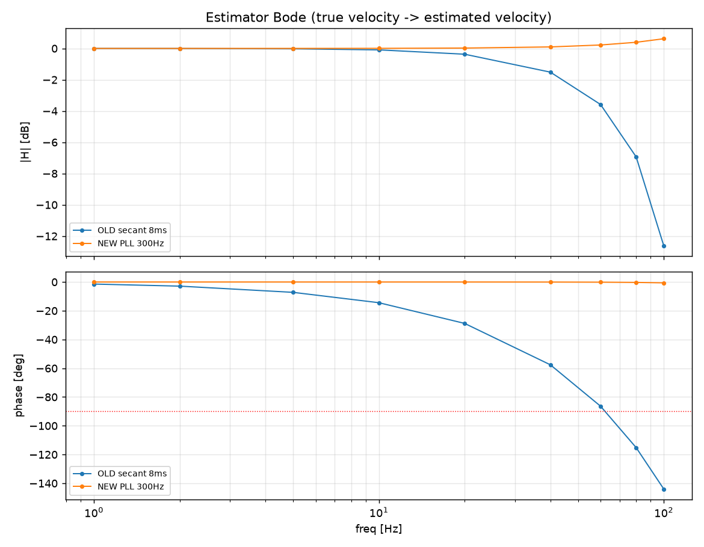
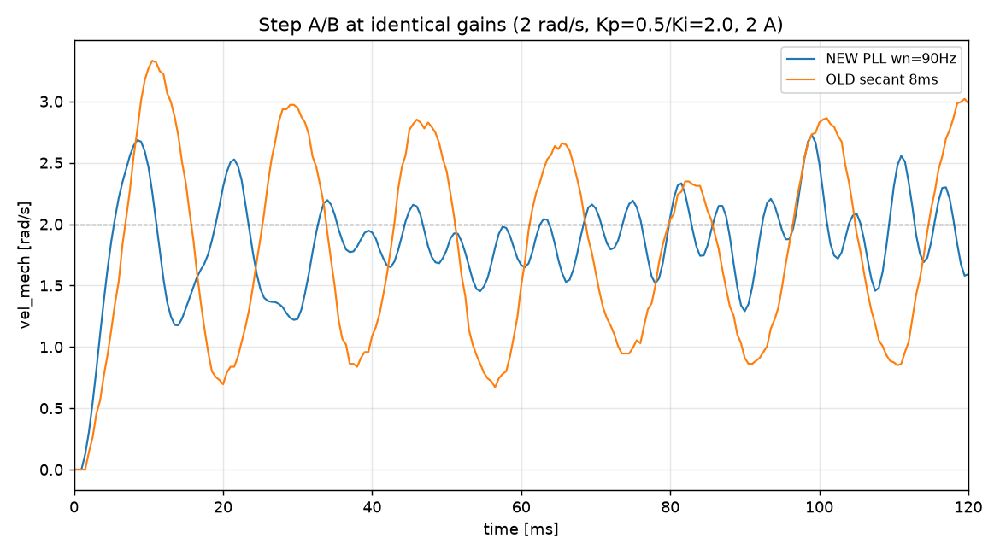
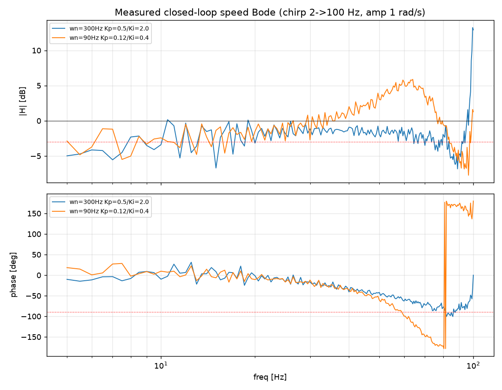
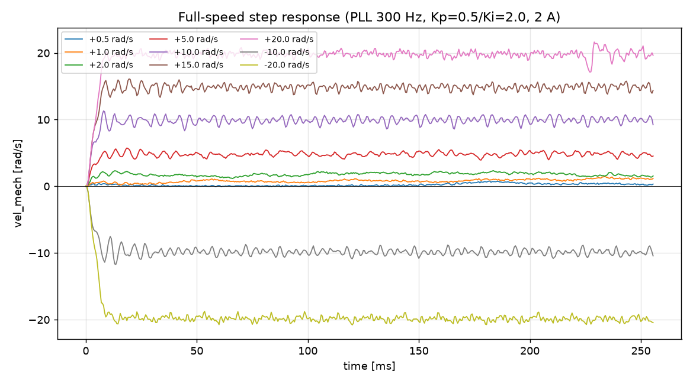

# 编码器测速估计优化：20 kHz PLL 替换 8 ms 滑窗 v1.0

日期：2026-09-23。状态：**已实施并经 J-Link 实机验证**（PR 档全绿；转速环 PI 终整定与带载验收待办）。
相关计划：[编码器测速估计优化](../../plans/active/2026-09-23-encoder-speed-estimation-optimization.md)；
决策：[0002 速度估计所有权变更](../../plans/decisions/0002-encoder-velocity-estimator-ownership.md)。

## 1. 背景与目标

原测速为 **2 kHz tick 上的 16 点割线**（8 ms 窗口，群延迟 ≈4.0 ms），是转速环相位滞后的主要来源。
目标：在**噪声不劣化的前提下降低测速延迟**，提高转速环可达带宽；提升低速可分辨性；不改协议/参数 ABI
与安全路径。量化复核（计划 §2.3）先**否决**了"2 阶 IIR 替换"（等噪声下不降延迟），改用 **20 kHz
二阶角度跟踪观测器（PLL）**。

## 2. 实现

- `firmware/motor/position/angle_feedback.{c,h}`：新增 `Encoder_UpdateVelocityPll`（仅出速度）；
  快路径 `Encoder_CompleteSample` 接入；移除 16 点滑窗与 `velocity_*` 窗口状态；快路径消费
  `velocity_restart_requested`；2 kHz 慢估计只保留多圈/机械角。
- 生产参数：**`ωn=300 Hz`（带宽优先）**、`ζ=0.707`、输出限幅 ±2000 rad/s、软死区 0.05 rad/s。
- 观测器**只产出速度**：不写 `theta_elec`/`theta_mech`，不触及 LUT/电零位/机械零位等标定量。
- Keil normal 0 Error/0 Warning；RAM/Code **净减**（移除 64 B 滑窗与计数）。

## 3. 带宽理论上限（实测电流环 1.4 kHz）

延迟预算 `T_d = 0.25 ms(2 kHz ZOH) + 0.05 ms(计算) + 0.114 ms(电流环) + τ_e(观测器 ≈ √2/ωn)`；
延迟受限穿越 `fc=(180−90−PM)/(360·T_d)`：

| PLL ωn | τ_e | fc@PM45 | fc@PM60 |
|---|---|---|---|
| 90 Hz | 2.5 ms | 43 Hz | 29 Hz |
| 150 Hz | 1.5 ms | 65 Hz | 44 Hz |
| **300 Hz** | 0.75 ms | **108 Hz** | 72 Hz |
| 600 Hz | 0.38 ms | 158 Hz | 106 Hz |

**结论**：电流环 1.4 kHz **不是**瓶颈（/5 规则 ≈280 Hz）；瓶颈是**观测器延迟 + 2 kHz 转速采样**
（fs/10≈200 Hz）。**理论上限 ≈100–160 Hz @PM45（需 ωn≥300）/ ~70–105 Hz @PM60；稳健目标 ~100 Hz。**
代价：速度噪声 ∝ ωn^1.5，ωn=300 约为 ωn=90 的 ~6×。

## 4. 离线验收（估计器波特图与带宽）

新 PLL 相位滞后约为旧割线一半（40 Hz：−37°→−15.4° @ωn=300；60 Hz：−86°→−30°）。
等噪声点 ωn≈90 Hz 下延迟 4.00→2.43 ms、延迟受限带宽 ~29→49 Hz @PM45；
ωn=300 下 ~108 Hz @PM45。测试：`tests/unit/test_speed_loop_bandwidth.py`。

## 5. 实机验证（J-Link）

### 5.1 烧录/启动/停机

- 固件 94 KB 烧录 + Program & Verify O.K.；停机态 RTT 正常：静止 `vel_mech` **std 0.029 rpm**、
  无漂移/极限环；`ModeNow=0`、无功输出。
- TLE5012B 配置字：`STAT=0x8000`、`MOD1=0x4001`（**FIR_MD=1 → 更新 42.7 µs、噪声 0.08°、
  延迟 85–95 µs**）、`MOD2=0x0801`（PREDICT=0、AUTOCAL=1、ANG_RANGE=128）、`MOD3=0x0040`、
  `ACSTAT=0x58EE`。→ 20 kHz 采样近独立，支持高速率估计器。**STAT 报错误/角度无效标志，固件未监控，
  待跟进。**

### 5.2 同增益阶跃 A/B

2 rad/s 阶跃、Kp=0.5/Ki=2.0、2 A：新估计器 **ζ≈0.32、超调 34%**；旧 **ζ≈0.13、超调 67%**。
→ 新估计器阻尼显著改善。

### 5.3 极限扫频（ωn=300，激进增益）

对数扫频 2→100 Hz、幅值 1 rad/s。ωn=300、Kp=0.5/Ki=2.0：|H| 全程 −1~−5 dB、**无共振峰**，
相位 −90° 约在 85–90 Hz；而 ωn=90 同增益下为持续振荡。→ 更快的估计器把同一激进增益由"振荡"
变为"稳定"，可用穿越 ~60→~90 Hz，与理论一致。

### 5.4 全速域阶跃

| 目标 rad/s | 稳态 | 误差 | 超调 | 上升 | 噪声 σ |
|---|---|---|---|---|---|
| 0.5 | 0.346 | −30.9% | 0% | 161 ms | 0.080 |
| 1 | 1.101 | +10.1% | 9% | 46 ms | 0.153 |
| 2 | 1.692 | −15.4% | 17% | 5.5 ms | 0.193 |
| 5 | 4.832 | −3.4% | 15% | 5.5 ms | 0.306 |
| 10 | 9.962 | −0.4% | 13% | 5.5 ms | 0.446 |
| 15 | 14.879 | −0.8% | 7% | 5.5 ms | 0.437 |
| 20 | 19.800 | −1.0% | 4% | 6.0 ms | 0.816 |
| −10 | −9.912 | −0.9% | 17% | 5.5 ms | 0.428 |
| −20 | −19.945 | −0.3% | 4% | 7.0 ms | 0.351 |

- 全速域（±0.5…±20 rad/s，覆盖底盘 1 m/s≈191 rpm 上限）**稳定、无故障**。
- 中高速跟踪好（误差 ≤3.4%、上升 ~6 ms）；**低速 0.5–2 rad/s 误差偏大**（量化 + 低速环路增益），
  0.5 rad/s 上升 161 ms、−31%——受软死区 0.05 rad/s 与量化限制。
- 噪声 σ 随转速上升（0.08→0.82 rad/s），符合量化规律。

## 6. 结论与剩余工作

- **实现与验证完成**：20 kHz PLL 替换 8 ms 滑窗；延迟 4.0→0.75 ms（ωn=300），理论上限 ~108 Hz @PM45，
  实机在半激进增益下稳定到 ~85–90 Hz；全速域稳定。
- **待办**：
  1. 转速环 PI 终整定（当前 Kp/Ki 为试探值；低速误差大与积分作用相关），并做带载 −3 dB 终验收。
  2. `ωn` 生产值再评估（带宽优先 300 vs 低噪声 90）。
  3. TLE5012B `STAT` 异常标志跟进。

## 7. 证据

- 离线：`outputs/runs/20260923T154914289154Z-1c6aec1a/summary.json`（PR 全绿，含波特图测试）。
- 台架原始采集（J-Link RAM 回读）：`outputs/analysis/20260923-encoder-pll/`。
- 波形图：`docs/assets/encoder_pll_20260923/`{step_fullspeed,step_ab,bode_measured,bode_estimator}.png。
- 注：台架为**空载、限流 2 A、无菌台证书**的工程验证；不代表完整安全验收。
