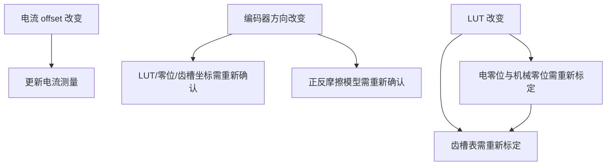

# 新电机模组统一标定与验收指南

## 1. 总体规则

新模组使用 `mode=21` 执行统一流程。阶段的相对顺序固定，ProductConfig 的能力与 commissioning policy 只能裁剪不适用阶段，不能重排前置关系。


每一阶段都遵守：

- 设计值来自当前 `ProductCatalogEntry`，不从 Flash 反向覆盖；
- 辨识结果先经过有限值、范围、平衡、样本和超时验收；
- 中间结果只在 RAM 中暂存，最后保存阶段才提交完整快照；
- 任一必需阶段失败，流程停止并记录失败阶段，不保存半成品；
- 过流、欠压、过压、功率级、采样和所需反馈故障持续有效；
- 温度 trip 只有在代表目标热区的传感器已配置为 protection-enabled 时才属于保护链。当前 VectorMiniSt 的 MCU 内部温度是 monitor-only，不会触发温度关断。

## 2. ProductConfig 如何决定流程

相关配置位于：

| 配置 | 文件 | 作用 |
| --- | --- | --- |
| 传感器/反馈能力 | `Firmware/Core/Config/product_config.h`、`product_capabilities.c` | 判断方向、LUT、零位、双传感器等步骤是否具备前置能力 |
| 产品 policy | `Firmware/Core/Config/product_catalog.c` 中 entry 的 `commissioning` | 对每一步选择 `REQUIRED`、`AUTO` 或 `DISABLED` |
| 动作与验收参数 | 同一 entry 的 `commissioning_tuning`、`motor_acceptance` | 电流、速度、时间、样本数、平衡和设计误差阈值 |
| 有序执行器 | `Firmware/Core/Application/motor_commissioning_workflow.*` | 仅按固定 stage 顺序找下一个 enabled stage |
| 实时阶段 | `Firmware/Core/Application/MotorControl/*_calibration_runtime.*`、`*_identification_runtime.*` | 在 20 kHz 路径执行当前动作并安全停车 |

`ProductConfig_Derive()` 会给出能力允许且 policy 选择的 `commissioning_steps`。工作流对象支持有序 stage mask，所以裁剪后的顺序仍固定。例如禁用摩擦后只能从零位跳到齿槽，不能把齿槽提前到方向/LUT 之前。

当前两个 VectorMiniSt entry 的统一流程均要求电流偏置、相电阻、方向、LUT、电/机械零位、摩擦、齿槽和保存；双角度对齐与 sensorless validation 关闭。Bootstrap 已把派生 mask 投影到工作流和独立标定命令门禁，裁剪策略会真实决定运行时执行阶段。

全部步骤配置为 `DISABLED` 是合法的非标定产品：固件可正常启动，但 Mode 21 与各独立标定命令会拒绝进入；Mode 8/9 是参数加载/保存维护命令，仍保持可用。当前没有生产 ServiceProcedure 的双角度对齐和 sensorless validation 必须关闭，不能被静默略过。

## 3. 固定阶段与通过条件

| 工作流阶段 | 独立模式 | 主要通过条件 | RAM/Flash 产物 |
| --- | ---: | --- | --- |
| 电流偏置 | 11 | 各配置 role 的 ADC offset 位于每通道允许范围；采样有效 | 三相 offset 候选 |
| 相电阻辨识/平衡 | 17 | 三相结果有效；最大不平衡不超过 `balance_fault_pct`；均值相对设计值误差不超过 `design_tolerance_pct` | 仅验收数据，不覆盖设计 R |
| 编码器方向 | 20 | 规定开环动作下累计角度变化充分、方向唯一、反馈连续 | `encoder_reverse` 候选 |
| 编码器 LUT | 13 | observer 标定动作完成；每 bin 样本、RMS/peak 残差、正反/验证圈和超时满足 entry | 单个 1024 点 rotor LUT 候选 |
| 电零位 + 机械零位 | 15 | 对齐电流和保持时间满足；角度采样有效 | electrical zero 与当下机械位置 zero |
| 摩擦辨识 | 19 | 正/反向各速度点稳定、样本充分、电流未持续饱和、RMSE 通过 | 正/反 Coulomb、viscous 模型 |
| 齿槽辨识 | 6 | 正/反低速扫描完成；128 个位置桶样本充分且电流受限 | 128 点电流补偿表 |
| 保存 | 9（统一流程内部发起） | A/B 槽擦写、payload/header/CRC/fingerprint 校验成功 | schema 10 完整个体快照 |
| 完成 | — | 所有 enabled stage 均完成 | 可进入闭环验收 |

独立模式用于研发定位。量产首次标定应从 `mode=21` 开始；修复失败原因后也应重新执行统一流程，避免把来自不同机械状态的候选拼成一个快照。

### 当前相电阻验收参数

当前 entry 的关键值：低/高测试电流 1 A / 2 A，测试范围 0.5..3 A，三相不平衡 warning 3%、fault 5%，均值相对 1.905 Ω 设计值 tolerance 20%。结果不合格时应检查绕组、接插件、功率路径补偿、采样方向/比例和设计值，不能用辨识结果覆盖 ProductMotorDesign 来规避故障。

## 4. 设计值与个体标定边界

### 4.1 始终来自代码的设计值

| 类别 | 当前来源 | 示例 |
| --- | --- | --- |
| 板卡与电流采样 | `Firmware/Core/Config/product_catalog.c` 的 `ProductBoardDesign` | topology、endpoint/role/polarity、A/count、offset 范围、母线比例、20 kHz、板级限值 |
| 电机 | 同文件的 `ProductMotorDesign` | 极对数、R、Ld/Lq、磁链、标定/运行电流和速度 |
| 验收范围 | entry 的 `motor_acceptance` | R/L/磁链允许范围 |
| 控制 | entry 的 `control` | 环路频率、PI/轨迹默认与上限、observer、位置摩擦辅助 |
| 标定动作 | entry 的 `commissioning_tuning` | 相阻、方向、LUT、零位、摩擦、齿槽的电流/速度/样本/超时 |
| 传感器与流程 | entry 的 sensor/feedback/features/commissioning | 实例 endpoint、反馈来源、必需功能和步骤 |
| 产品兼容 | `ProductCatalogEntry.persistence` 与 `ProductManifest` | compatibility tuple、schema、fingerprint、迁移授权 |

### 4.2 schema 10 只恢复的个体量

- 三相电流 ADC offset；
- 当前单转子编码器方向；
- 单转子 1024 点线性化 LUT；
- 电零位与默认初始机械零位；
- 正/反向 Coulomb 与 viscous 摩擦模型及有效标志；
- 128 点齿槽电流补偿表及有效标志。

极对数、R/L/磁链、控制器增益、标定/运行限值、轨迹参数、CAN 默认节点/心跳和标定动作参数不会从 Flash 恢复。`ParameterSnapshot` 中为旧格式兼容保留的历史字段也不是运行权威。

### 4.3 物理 Flash 边界

唯一来源：`Firmware/Bsp/Boards/VectorMiniSt/vector_mini_st_memory_map.h`。

```text
Application       0x08000000 .. 0x0801BFFF  (114688 B)
Parameter storage 0x0801C000 .. 0x0801FFFF  (16384 B)
Slot 0            0x0801C000 .. 0x0801DFFF  (8192 B)
Slot 1            0x0801E000 .. 0x0801FFFF  (8192 B)
Erase size        2048 B
Program alignment 8 B
```

schema 10 payload 固定为 2464 B，关键偏移为 shunt 2172、friction 2188、cogging 2208。改变结构大小/偏移、产品 fingerprint 或兼容 tuple 必须有显式 migration 与断电测试。

当前无阻尼 entry 拒绝 erased fingerprint；只有已部署的 Damped entry 保留 erased-fingerprint legacy 授权。二者不得交叉加载对方记录。

## 5. 标定失效关系



统一流程按此依赖排列，前序阶段完成后才允许产生后序候选。当前 schema 只有一份 rotor LUT；双转子独立 LUT 不能通过复用这一字段实现。

## 6. 安全联锁

### 6.1 每个带功率阶段持续检查

- 采样调用、样本序号和相电流重构状态；
- 三相软件过流与板级硬件故障；
- 母线欠压/过压；
- 当前阶段需要的编码器/observer 反馈；
- 生命周期、取消请求、动作超时和算法数据有效性；
- protection-enabled 温度 zone 的高温/invalid/stale/open/short/fault。

故障优先于控制。阻断故障成立时，本周期不继续控制计算，首先立即关闭 motor drive，并进入失败路径。

### 6.2 当前温度限制

VectorMiniSt 当前只有 MCU 内部温度监测，`temperature_protection=OFF`、实例 `protection_enabled=false`、`temperature_invalid_is_fault=false`。因此它用于遥测和诊断，不参与过温 trip；也不能替代绕组或 MOSFET NTC。完成真实 NTC 装配、zone 映射、开短路注入、阈值与热响应验证后，才可在新 entry 中开启温度保护。

## 7. 发起与观察

### 7.1 USB

```text
\w_mod=21
```

| USB ID | 含义 |
| --- | --- |
| `mod` | 当前协议动作/模式 |
| `cst` | stage；失败为 `0x80 | failure_stage` |
| `cpr` | 已启用阶段的总进度百分比 |
| `rsp` | 三相相电阻最大不平衡百分比 |
| `rde` | 相电阻均值相对设计值误差百分比 |
| `err` | 当前主故障码 |
| `vbs` / `i_a` / `i_b` / `i_c` / `tmp` | 母线、电流和监测温度 |

### 7.2 CAN

通过 `CAN_SET_MODE (0x00)` 写入浮点值 `21.0`。统一流程只读参数：

| 参数 ID | 含义 |
| ---: | --- |
| `0x63` | stage；失败为 `0x80 | failure_stage` |
| `0x64` | 总进度百分比 |
| `0x65` | 相电阻不平衡百分比 |
| `0x66` | 相电阻设计误差百分比 |

CAN/USB 返回的数值只是观察面；它们不能绕过 Application 生命周期、控制权或安全条件直接启动某个内部 Context。

## 8. 实机执行计划

每一次实机操作前都必须重新确认电源和机械状态，不能沿用聊天记录中的历史状态。

1. 保持母线断开，核对烧录镜像的 `product_id`、`variant_id`、fingerprint、硬件修订和 CAN 模式；
2. 验证 motor drive 初始化为 safe/disarmed，PWM 引脚无意外导通；
3. 核对电机/阻尼器安装、可转空间、急停和探头位置；
4. 连接限流电源后重新记录实际母线电压与限流值；
5. 在 mode 0 检查三相 offset、母线、MCU 温度和编码器连续性；
6. 清除故障，启动 `mode=21`，连续记录 `cst/cpr/err`、Ia/Ib/Ic、Vbus、速度、位置和 fast-loop deadline；
7. 任一阶段失败立即保持停止，读取失败阶段和故障快照，排除根因后从头再跑；
8. 完成后先回到安全状态，再断电重启；
9. 核对 offset、方向、LUT、零位、摩擦和齿槽从兼容 Flash 恢复，设计参数仍等于当前 catalog；
10. 从低限流开始，依次验证小电流、低速正反转、位置和带载速度闭环，逐级增加能量。

## 9. 适配新项目的标定检查

- Product capability 与 commissioning policy 能派生出预期步骤；
- 被裁剪步骤不会破坏后续前置条件，保存始终是最后一步；
- 新电流 topology 的 offset 与相阻流程已经适配对应 role/valid mask；
- 0-angle 产品不启用方向/LUT/零位/位置相关步骤；
- 2-angle 当前只允许 `primary + output shaft`；output 具有独立采集状态但不占用/共享 primary LUT。冗余、自动切换和独立第二转子 LUT 未实现时必须拒绝相关配置；
- 无温度产品关闭 temperature required zone；monitor-only 产品不因高温/无效样本 trip；
- 新温度保护产品证明高温及所有传感器故障能安全关断；
- 全空 commissioning mask 能启动且拒绝 Mode 21/单项标定，Mode 8/9 维护命令仍可用；
- 新传感器 `design_id` 由目标 Bootstrap 精确分派，未知 ID 必须 fail-closed；
- 新 fingerprint 不误加载既有产品记录；
- A/B 槽在擦除、payload 写入、header commit 各阶段断电后至少保留一份有效记录；
- 20 kHz 实机最大耗时低于 deadline 且超限计数为 0。
