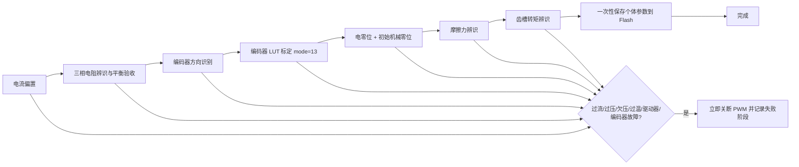

# 新电机模组统一标定与验收指南

## 1. 目标与原则

新电机模组统一使用 `mode=21` 执行一次完整标定。流程顺序固定为：



执行原则：

- Product Profile 是硬件和电机设计值的唯一来源，每次启动都从固件文件加载。
- 辨识结果只用于检验实物是否符合设计，不反写相电阻、电感、磁链、极对数、控制器增益或限值。
- 只有模组个体差异显著的标定量写入 Flash。
- 完整流程的中间结果只保留在 RAM；七个运动/测量阶段全部成功后才执行一次 Flash 保存。任一步失败都不保存半成品。
- 编码器方向或 LUT 发生变化时，依赖旧角度坐标的电零位、机械零位和齿槽补偿数据自动失效；方向变化还会使正/负向摩擦模型失效。

## 2. 固定流程与通过条件

| 阶段值 | 阶段 | 独立模式 | 主要通过条件 | 产物 |
|---:|---|---:|---|---|
| 1 | 电流偏置 | 11 | 三相 ADC 偏置均在板级允许范围 | 三相电流偏置 |
| 2 | 相电阻辨识/平衡 | 17 | 三相均有效、最大不平衡小于阈值、均值相对设计值误差小于阈值 | 仅验收数据，不修改设计相电阻 |
| 3 | 编码器方向识别 | 20 | 开环磁场正向转过一机械圈，原始编码器累计变化量绝对值大于半圈 | `encoder_reverse` |
| 4 | 编码器 LUT | 13 | 复用已经实机验证的 observer 标定，候选 LUT 通过完整性和误差验收 | 1024 点编码器线性化 LUT |
| 5 | 电零位/机械零位 | 15 | 转子对齐后采样有效；同一位置同时设为电零位和默认初始机械零位 | 电零位、机械零位 |
| 6 | 摩擦力辨识 | 19 | 正反向数据充分且拟合有效 | 正反向 Coulomb/viscous 摩擦模型 |
| 7 | 齿槽转矩辨识 | 6 | 低速正反向各扫指定圈数，每个位置桶样本充分 | 128 点电流域齿槽补偿表 |
| 8 | 保存 | 9（内部自动执行） | 双槽参数存储写入和校验成功 | 完整个体标定快照 |
| 9 | 完成 | — | 所有阶段位均完成 | 可进入闭环验证 |
| 10 | 失败 | — | 任一阶段验收或安全检查失败 | 保留失败阶段和原因，不保存半成品 |

独立模式保留用于研发定位；生产/新模组验收应只发起 `mode=21`，避免跳步和遗漏保存。

## 3. 设计值与 Flash 数据边界

### 3.1 固件文件中的设计值

| 类别 | 配置文件 | 示例内容 |
|---|---|---|
| 硬件板 | `Firmware/Product/vector_mini_st_profile.h`、`board_profile.c` | ADC 比例、母线电压比例、采样电阻、过流/过压/欠压/温度阈值、默认 CAN 参数 |
| 电机 | `Firmware/Product/motor_profiles.c` | 极对数、设计相电阻、Ld/Lq、磁链、额定标定电流、速度/电流/位置限制和环路参数 |
| 编码器 | `Firmware/Product/encoder_profiles.c` | 类型、默认方向/零位、采样配置 |
| 标定算法 | `Firmware/Product/control_tuning_profile.c` | 方向识别、零位、observer/LUT 的动作参数 |
| 机械负载 | `Firmware/Product/mechanical_load_profiles.c` | 摩擦辨识和齿槽辨识速度、圈数、稳定时间、超时和电流上限 |
| 产品组合 | `Firmware/Product/product_variant.c` | 将板、电机、编码器、负载和调参 Profile 组合并做启动校验 |

相电阻验收阈值分为两类：

- `phase_resistance_balance_fault_pct`：三相之间最大不平衡允许值；
- `phase_resistance_design_tolerance_pct`：三相均值相对设计相电阻的允许偏差。

若辨识不通过，应检查电机绕组、接插件、功率级、采样和 Profile 设计值，不应直接用辨识结果覆盖 Profile 来规避故障。

### 3.2 允许写入 Flash 的个体参数

- 三相电流 ADC 偏置；
- 编码器方向；
- 编码器 1024 点线性化 LUT；
- 编码器电零位；
- 默认初始机械零位；
- 正反向 Coulomb/viscous 摩擦参数及有效标志；
- 128 点齿槽转矩电流补偿表及有效标志；
- 参数 schema、产品兼容性信息和电流采样电阻身份信息。

明确不从 Flash 恢复：极对数、R/L/磁链、控制器增益、标定电流、运行限值、速度/位置斜坡、CAN 节点和心跳等设计/产品配置。旧版本 Flash 中即使存在这些字段，新固件也忽略它们，并始终加载当前 Product Profile。

## 4. 安全联锁

完整标定期间，对所有带电阶段持续检查：

- 三相软件过流；
- 母线过压、欠压；
- 温度过高；
- 功率级硬件故障锁存；
- 需要编码器反馈的阶段中的编码器离线/连续坏帧；
- 各辨识算法自己的动作超时和数据有效性。

任一故障成立后，当周期立即强制关闭功率级并终止统一流程。当前板没有外部 NTC，温度保护临时使用 MCU 内部结温作为代理；它能够发现 MCU/板内异常升温，但不能替代电机绕组和 MOSFET NTC。未来增加 NTC 后应只替换板级温度采集与 `BoardProfile` 传感器类型，不改变统一流程。

## 5. 发起与观察

### 5.1 USB

发起完整流程：

```text
\w_mod=21
```

关键只读量：

| USB ID | 含义 |
|---|---|
| `mod` | 执行中保持为 21；独立调试时显示对应模式 |
| `cst` | 当前阶段：0 空闲、1..8 执行、9 完成；失败为 `0x80 | 失败阶段` |
| `cpr` | 总进度百分比 |
| `rsp` | 三相电阻不平衡百分比 |
| `rde` | 相电阻均值相对设计值误差百分比 |
| `err` | 当前主故障码 |
| `vbs` / `i_a` / `i_b` / `i_c` / `tmp` | 安全监控量 |

### 5.2 CAN

发起流程仍通过 `CAN_SET_MODE(0x00)` 写入浮点值 `21.0`。新增只读参数：

| CAN 参数 ID | 含义 |
|---:|---|
| `0x63` | 当前阶段；失败为 `0x80 | 失败阶段` |
| `0x64` | 进度百分比 |
| `0x65` | 相电阻不平衡百分比 |
| `0x66` | 相电阻设计误差百分比 |

## 6. 推荐实机验收顺序

1. 固件编译后先保持电机母线断开，检查产品 Profile、目标板型和固件版本。
2. 接通限流电源，确认静态母线电压、三相电流和 MCU 内部温度合理，编码器在线。
3. 保证电机可以自由旋转且负载满足当前 MechanicalLoadProfile 的识别条件。
4. 清除已有故障并发起 `mode=21`。
5. 连续记录 `cst/cpr/err` 和电流、电压、温度、速度、位置。
6. 成功后断电重启，确认故障为 0，编码器方向/LUT/零位、摩擦模型和齿槽表均从 Flash 恢复。
7. 依次执行小电流闭环、低速正反转、额定工作点和带载速度闭环验证；检查齿槽补偿开启前后的低速电流纹波和速度纹波。

若流程失败，从 `cst & 0x7F` 取得失败阶段，再读取 `err` 和故障快照。修复原因后必须从 `mode=21` 重新开始，以保证最终 Flash 数据来自同一次完整且一致的标定。
